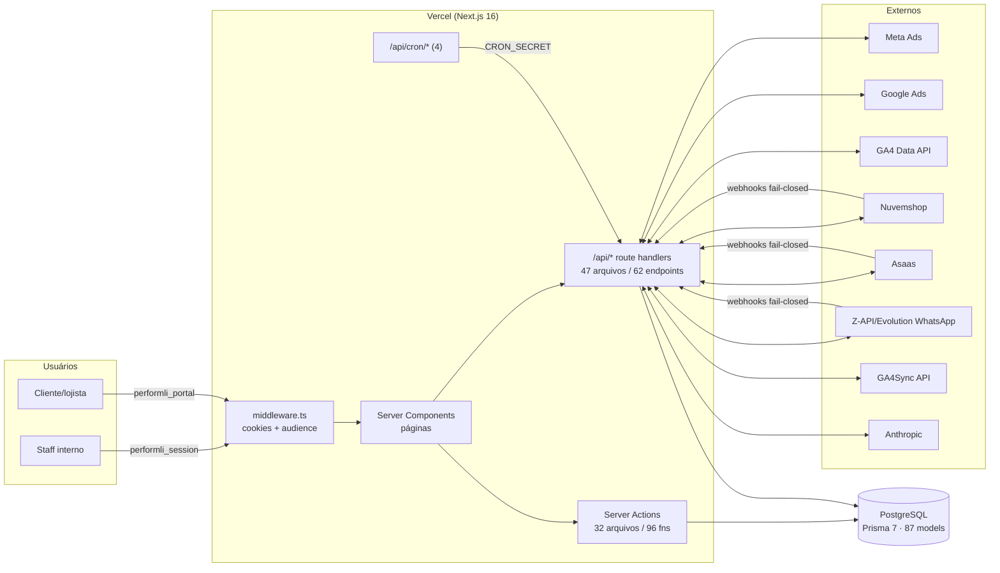
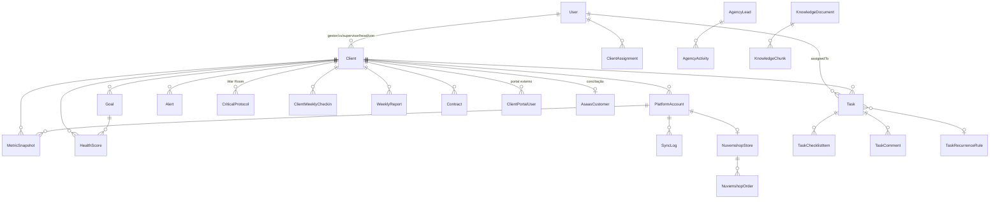

# DOSSIÊ TÉCNICO — PERFORMLI

> Fonte canônica do projeto. Consultar SEMPRE antes de integrar qualquer coisa nova.
> Última atualização: 2026-07-13 | Gerado a partir do commit: `cf74b39`
>
> **Regra de precisão:** todo o conteúdo foi extraído do código real (exploração forense
> multi-agente: banco, endpoints, auth/RBAC, integrações/crons, frontend/infra). O que não
> pôde ser confirmado no código está marcado com `⚠️ NÃO CONFIRMADO NO CÓDIGO — VERIFICAR`.
>
> **Números de verificação:** 87 models · 58 enums · 72 migrations · 47 arquivos `route.ts` ·
> 62 endpoints HTTP · 32 arquivos de server actions · 96 actions · 10 integrações externas ·
> 4 crons · 4 webhooks de entrada · 43 páginas.

---

## 1. VISÃO GERAL E PROPOSTA

**O que é.** O Performli é o sistema operacional interno da **Arkza** (agência de tráfego pago,
foco em e-commerce de moda e negócios locais, ~30 clientes ativos). Frase-guia: *"Arkza em
processo, não em memória"*. Visão final: o Marcos abre UMA única tela e entende a agência
inteira — o que está saudável, em atenção, crítico, e o que pode quebrar silenciosamente.

**Problema que resolve.** Tirar a operação da cabeça do Marcos e do WhatsApp/planilhas:
saúde de clientes, metas, tarefas recorrentes, check-ins, War Room, financeiro, CRM comercial
e alertas viram processo auditável dentro do sistema.

**Quem usa.**
- **Staff interno** (ADMIN, CS, supervisores/analistas/gestores de tráfego) — dashboard interno.
- **Clientes/lojistas** — portal externo `/portal` (namespace de auth totalmente separado).

**Contexto ClickUp.** O Performli está substituindo gradualmente o ClickUp como hub operacional
(diretriz completa no `CLAUDE.md`). O estado canônico vive no PostgreSQL; o ClickUp foi fonte
de migração (rastreabilidade via `externalId` em `User`, `Client`, `TaskList`).

**Módulos existentes (mapa de alto nível):**
| Módulo | Rotas principais |
|---|---|
| Cockpit / central de comando | `/cockpit`, `/dashboard` |
| Clientes (Client 360, saúde, metas) | `/clients`, `/clients/[slug]` |
| Tarefas / Central Operacional | `/operacional`, `/t/[taskId]`, `/meu-dia`, `/recorrencias`, `/validacoes`, `/processos` |
| Check-ins e relatórios | `/check-ins`, `/reports` |
| Anti-churn / War Room | `/anti-churn`, `/operations`, `/alerts` |
| Comercial (CRM + propostas) | `/comercial`, `/comercial/proposta`, `/pipeline` |
| Financeiro (Asaas, DRE) | `/financeiro` |
| Jurídico (contratos) | `/juridico` |
| Equipe / gestores | `/team`, `/managers`, `/agency` |
| Conhecimento (RAG) + IA | `/knowledge`, `/ai-agents` |
| Portal do cliente | `/portal` (externo), `/portal-acessos` (admin) |
| Configurações / integrações | `/settings`, `/canais` |

---

## 2. STACK TECNOLÓGICA

Pacote raiz: `"marcos"` v0.1.0, private. Versões exatas do `package.json`:

| Tecnologia | Versão | Função |
|---|---|---|
| Next.js | `16.2.1` | Framework (App Router, Server Components/Actions) |
| React / react-dom | `19.2.4` | UI |
| TypeScript | `^5` | Linguagem (`strict: true`) |
| Prisma (`prisma`, `@prisma/client`) | `^7.5.0` | ORM + migrations |
| `@prisma/adapter-pg` + `pg` | `^7.5.0` / `^8.20.0` | Driver adapter Postgres (serverless-friendly) |
| jose | `^6.2.2` | JWT HS256 (auth staff e portal) |
| bcryptjs | `^3.0.3` | Hash de senha (custo 12) |
| `@anthropic-ai/sdk` | `^0.80.0` | IA (chat, insights, relatórios, ingestão RAG) |
| resend | `^6.9.4` | E-mail |
| pdf-parse | `^2.4.5` | Parsing de PDF (knowledge) |
| recharts | `^3.8.0` | Gráficos |
| lucide-react | `^0.577.0` | Ícones |
| Radix UI (`@radix-ui/react-*`) | 11 primitivos | UI acessível (dialog, select, tabs, toast…) |
| `@hello-pangea/dnd` | `^18.0.1` | Drag-and-drop (kanban) |
| CVA / clsx / tailwind-merge | `0.7.1` / `2.1.1` / `3.5.0` | Composição de classes |
| Tailwind CSS | `^4` (devDep, via `@tailwindcss/postcss`) | Estilo (config via CSS, sem tailwind.config) |
| ESLint | `^9` (flat config, `eslint-config-next`) | Lint |
| tsx | `^4.21.0` | Runner de scripts (seed) |
| next-auth | `^5.0.0-beta.30` | ⚠️ Instalado, mas a auth em uso é JWT próprio (jose) — uso do next-auth NÃO CONFIRMADO NO CÓDIGO |

**Scripts npm:** `dev` · `build` = `prisma generate && migrate:deploy && next build` (migra no
build, com 2 retries por cold-start do banco) · `start` · `lint` · `seed` (`tsx prisma/seed.ts`).

**Sem** lib de estado global (zustand/redux/etc.), **sem** axios (fetch nativo), **sem** Prettier
configurado, **sem** runner de testes automatizado.

---

## 3. ARQUITETURA DO SISTEMA

### 3.1 Fluxo geral



### 3.2 Estrutura de pastas

```
src/
├─ app/
│  ├─ (auth)/login/           # Login staff (layout próprio)
│  ├─ (dashboard)/            # Sistema interno (~40 rotas + @modal paralelo)
│  │  ├─ @modal/(.)t/[taskId] # Drawer de tarefa (intercepting route)
│  │  └─ dev/components/      # Playground do design system (ADMIN)
│  ├─ portal/                 # Portal externo do cliente (auth separada)
│  ├─ actions/                # 32 arquivos de Server Actions ('use server')
│  ├─ api/                    # Route handlers: cron, sync, webhooks, settings, admin, ai…
│  └─ globals.css             # Tokens do design system (Tailwind v4 via @theme)
├─ components/                # 163 componentes .tsx por domínio (+ ui/ base)
├─ lib/                       # dal.ts (DAL), session.ts, rbac/, portal/, audit.ts,
│                             #   rate-limit.ts, cron-auth.ts, cron-heartbeat.ts, metas/, churn/…
└─ services/                  # Integrações (meta-ads, ga4, ga4sync, nuvemshop, asaas,
                              #   zapi, evolution, windsor, google-ads) + engines
                              #   (churn-scorer, recurrence-engine, warroom-monitor…)
```

### 3.3 Padrões e convenções
- **Leitura** via DAL (`src/lib/dal.ts`) quando aplicável; **mutação** valida autenticação +
  papel + posse (regras técnicas do `CLAUDE.md`).
- Server Components `async` por padrão; mutação por Server Actions; `/api/*` para cron, sync,
  webhooks, settings e consumo client-side.
- Erros para o usuário em **linguagem operacional pt-BR** (nunca "Erro"/"Pendente" sem porquê).
- `AuditLog` append-only para automações críticas; `SyncLog` + heartbeat para rotinas.
- Chamada externa sempre com timeout (`AbortSignal.timeout`).
- Path alias único: `@/*` → `./src/*`.

---

## 4. BANCO DE DADOS

**Fonte:** `prisma/schema.prisma` (1950 linhas) + `prisma/migrations/`.
**Números exatos: 87 models · 58 enums · 72 migrations.** Provider `postgresql`, sem
previewFeatures; conexão via driver adapter `@prisma/adapter-pg` (singleton em `src/lib/prisma.ts`).

### 4.1 Multi-tenant no nível de dados
- Tenant efetivo = **Client** (isolamento por `clientId`). Models com `clientId`: PlatformAccount,
  MetricSnapshot, CampaignSnapshot, Goal, HealthScore, ClientStatusStreak, ChurnRiskScore,
  CriticalProtocol, Alert, Task (opcional), ClientInteraction, ClientAssignment,
  ClientWeeklyCheckin, WeeklyReport, MonthlyReport, Contract, ClientProductChange,
  ClientPortalUser, ClientChat, ClientInsight, AuditLog (opcional), entre outros.
- Tenancy multi-workspace é **aditiva e parcial** (comentário no schema:665-667): tabelas novas
  nascem com `workspaceId`; `Task`/`Client`/`TaskList` ficam para fase posterior.
- **Portal externo:** isolamento duro staff × cliente — model próprio `ClientPortalUser`,
  cookie próprio, **nunca** adicionar `CLIENT` ao enum `Role`.

### 4.2 Models por domínio (resumo; campos-chave)

**AUTH/TEAM:** `User` (role, operationalRole, externalId ClickUp, hub de ~20 relações),
`Workspace`, `WorkspaceMember` (unique workspace+user).

**CLIENTES (núcleo):** `Client` — model central: `slug @unique`, `status` (ACTIVE/PAUSED/CHURNED
— PAUSED só silencia crons, não cancela contrato), `businessType` (ECOMMERCE/LOCAL/B2B),
`pipelineStage`, ficha CS manual (nps, curva, possivelChurn, salaDeGuerra,
fechouSemanaEmRisco), FKs de responsáveis (gestor/cs/supervisor/head/crm, SetNull), metas de
mídia (roasMinimo, investimentoMeta/Google/Tiktok, faturamentoEsperado), cache financeiro
desnormalizado (Contract é a fonte da verdade). `ClientPortalUser` (portal, lockout por
failedAttempts/lockedUntil), `ClientInteraction`, `ClientAssignment` (carteira do gestor),
`ClientStatusStreak`, `ClientProductChange`.

**PLATAFORMAS/MÉTRICAS:** `PlatformAccount` (`@@unique([clientId, platform, externalId])`,
tokens OAuth), `MetricSnapshot` (agregado diário, `@@unique([platformAccountId, date])`,
campos spend/clicks/conversions/conversionValue/roas/newUsers/addToCarts/checkoutsStarted…),
`CampaignSnapshot` (por campanha/adset), `SyncLog`, `NuvemshopStore` (`storeId @unique`),
`NuvemshopOrder` (status triplo + UTMs + match GA4).

**METAS/SAÚDE:** `Goal` (`@@unique([clientId, metric, period, startDate])`), `HealthScore`,
`ChurnRiskScore` (score 0-100 + factors Json, por semana).

**WAR ROOM:** `CriticalProtocol` — `exitCriteria` obrigatório por regra de negócio, escalação
para o Marcos em 3 semanas (idempotente via `escalatedAt`), documentos zod-validados
`diagnosticoGestor`/`decisoesCs`.

**AUDITORIA/ALERTAS:** `AuditLog` (append-only, actor SetNull, metadata Json), `Alert`
(20 tipos, SLA via `acknowledgedAt` distinto de `read`).

**TAREFAS (maior agregado):** `Task` (status customizável via `Status`/`StatusSet`, orderIndex
fracionário, SLA, `idempotencyKey @unique`, TaskCompletionGuard: requiresEvidence/
requiresReview/enforceChecklist trava conclusão, Hub de Suporte) + satélites
TaskAuxAssignee/Watcher/ChecklistItem/Comment/Attachment/Activity/Dependency/Approval/
CustomFieldValue; estrutura TaskArea/POPProcess/POPStep/TaskList/TaskTemplate(+Step/Field);
automação TaskRecurrenceRule (13 frequências; `archivedAt` nunca roda), TaskAutomationRule,
AutomationLog, TaskSavedView, OperationalRoutine, TaskSLA.

**CHECK-INS/RELATÓRIOS:** `WeeklyChecklist`, `ClientWeeklyCheckin` (workflow CS
PENDENTE→PREENCHIDO→APROVADO/REPROVADO, unique client+weekStart), `WeeklyReport` (funil
sentAt/deliveredAt/firstReplyAt — deliveredAt aguarda callback Z-API), `MonthlyReport`.

**IA/CONHECIMENTO:** `AIConversation`/`AIMessage`, `ClientInsight`, `ClientChat`/
`ClientChatMessage` (mentions[]), `KnowledgeDocument` (tags ALL/ECOMMERCE/LOCAL/CS) /
`KnowledgeChunk`.

**FINANCEIRO:** `AsaasCustomer` (conciliação via razaoSocial, `clientId @unique` SetNull),
`AsaasPayment`, `AsaasSubscription`, `AsaasTransfer`, `FinancialCategory`, `Expense` (DRE),
`IntegrationSetting` (KV de credenciais dinâmicas).

**CRM/CONTRATOS:** `AgencyLead` (UTMs, soft delete via deletedAt), `AgencyActivity`,
`Contract` (self-relation de renovação, noticeDays, autoRenew).

**CONVERSAS (CRM conversacional — Fase 1, fundação):** 16 models novos, todos com `clientId`
+ cascade (isolamento por tenant). Canal/contato/funil: `ConversationChannel` (credenciais
cifradas AES-256-GCM, unique client+type+phoneNumberId), `ConversationContact` (opt-in LGPD,
soft delete), `ConversationPipeline`/`ConversationStage`, `ConversationLead` (índice crítico
client+pipeline+stage; utm/ctwaClid/referral). Inbox: `Conversation` (índice crítico
client+lastMessageAt; janela 24h via lastInboundAt), `ConversationMessage` (`waMessageId
@unique` p/ idempotência de webhook). Ingestão outbox: `ChannelEvent` (`externalId @unique`,
status PENDING→PROCESSED/FAILED/DEAD). Automação: `ConversationAutomation`/
`ConversationAutomationRun` (reusa enum `AutomationLogStatus`). Bot: `BotFlow`/`BotSession`.
Broadcast: `ConversationTemplate`/`ConversationBroadcast`. Atribuição: `ConversionEvent`
(CAPI, `eventId @unique`), `ConversationNote`. Soft relations (String sem FK): pipelineId/
stageId/ownerUserId em Lead; leadId/assignedUserId em Conversation; `Task.conversationLeadId`.

**INFRA:** `RateLimit` (fixed-window serverless-safe).

### 4.3 Diagrama ER (agregados principais)



Relações "soft" (String sem FK, fora do ER): `Task.leadId`/`contractId`,
`AgencyLead.ownerId`/`convertedClientId`, `WeeklyReport.sentBy`.

### 4.4 Enums (58) — principais

`Role` (ADMIN, CS, SUPERVISOR_TRAFEGO, ANALISTA_TRAFEGO, GESTOR_TRAFEGO + legados deprecados
MANAGER/ANALYST) · `OperationalRole` (HEAD/SUPERVISOR/GESTOR/CRM/CS/ACOMPANHAMENTO — NÃO
governa autorização) · `ClientStatus` · `BusinessType` · `PipelineStage` · `Platform`
(META_ADS, GOOGLE_ADS, TIKTOK_ADS, GA4, NUVEMSHOP, GA4SYNC) · `MetricType` (25 valores: ROAS, CPL, CPA,
INVESTMENT, CONVERSIONS, SALES, CTR, CPC, IMPRESSIONS, REACH, FREQUENCY, CLICKS, SPEND,
FATURAMENTO, TICKET_MEDIO, TAXA_CONVERSAO, CPS, CPM, CAC, MENSAGENS, VISITAS_PERFIL,
LIGACOES, AGENDAMENTOS, LEADS, SEGUIDORES) · `GoalPeriod` · `HealthStatus` (OTIMO/REGULAR/RUIM)
· `AlertType` (20 valores) · `TaskStatus` (11) · `TaskType` (22) · `TaskOrigin` ·
`RecurrenceFrequency` (13) · `CheckinStatus` · `SyncStatus` · `CriticalProtocolStatus` ·
`WarRoomOutcome` · Asaas/Nuvemshop/CRM/Contract/Expense enums · **Conversas (13 novos):**
`ConversationChannelType`, `ConversationChannelStatus`, `ConversationOptIn`,
`ConversationLeadStatus`, `ConversationStatus`, `MessageDirection`, `ConversationMessageType`,
`MessageDeliveryStatus`, `ChannelEventStatus`, `ConversationTriggerType`, `BotSessionStatus`,
`TemplateMetaStatus`, `BroadcastStatus` (o run de automação reusa `AutomationLogStatus`). Lista
integral no schema (`prisma/schema.prisma`, contagem: 58 `^enum`).

### 4.5 Migrations
73 no total, baseline `20260321113638_init`. 5 mais recentes:
`20260713160000_nav_space_access`, `20260713150000_conversas_foundation`,
`20260713140000_platform_ga4sync`, `20260706130000_client_portal_users`,
`20260704120000_checkin_form_and_chat_mentions`.
Regra do projeto: migrations preferencialmente **aditivas**.

---

## 5. API — CATÁLOGO COMPLETO DE ENDPOINTS

**Contagem: 47 arquivos `route.ts` · 62 handlers HTTP** (nenhum `PUT`).
Rotas `/api/*` **não passam pelo middleware** — cada rota se protege sozinha.

### 5.1 Cron (auth: `isCronAuthorized` — `CRON_SECRET` timing-safe, fail-closed)
| Método | Path | Descrição |
|---|---|---|
| GET, POST | `/api/cron/daily` | Master diário: Asaas → Meta → GA4 → Google Ads → Nuvemshop → metas → health → churn → watchdogs → alertas → relatórios → contratos (cada step em try/catch isolado) |
| GET, POST | `/api/cron/recurrences` | Motores de recorrência (templates por cliente + schedule por task); `?force=1` |
| GET, POST | `/api/cron/digest` | Digest WhatsApp + watchdog do daily |
| GET, POST | `/api/cron/resultados` | Resultado semanal (ROAS/GA4) + Etapa (segundas) |
| GET, POST | `/api/cron/conversas` | Drena o outbox de Conversas (ChannelEvent PENDING/FAILED, batch 50) a cada 1 min; retry + dead-letter; heartbeat `CRON_CONVERSAS_LAST_RUN` |

### 5.2 Sync (auth: `x-cron-secret` OU sessão; posse por atribuição p/ não-ADMIN)
| Método | Path | Descrição | Roles |
|---|---|---|---|
| POST | `/api/sync/meta` | Sync Meta Ads | ADMIN tudo; gestor só carteira |
| POST | `/api/sync/ga4` | Sync GA4 Data API | idem |
| POST | `/api/sync/google-ads` | Sync Google Ads | idem |
| POST | `/api/sync/nuvemshop` | Sync pedidos Nuvemshop | idem |
| POST | `/api/sync/health` | Recalcula HealthScores + alertas | idem |
| GET | `/api/sync/stream` | SSE sync geral (pool 6) | **ADMIN** |
| POST | `/api/asaas/sync` | Sync Asaas manual | **ADMIN** |

### 5.3 Webhooks de entrada (sem sessão; todos fail-closed)
| Método | Path | Validação | O que faz |
|---|---|---|---|
| POST | `/api/webhooks/whatsapp` | header `client-token` = `ZAPI_CLIENT_TOKEN` (503/401) | Mensagem de desconhecido vira `AgencyLead` + `AgencyActivity`; sempre 200 |
| POST | `/api/webhooks/whatsapp/test` | sessão **ADMIN** | Simula inbound |
| POST | `/api/asaas/webhook` | header `asaas-access-token` = `ASAAS_WEBHOOK_TOKEN` | Processa eventos PAYMENT_* (500 → Asaas reentrega) |
| POST | `/api/nuvemshop/webhooks` | HMAC-SHA256 body vs `x-linkedstore-hmac-sha256` | Upsert `NuvemshopOrder` + `MetricSnapshot` do dia |
| GET | `/api/webhooks/meta-whatsapp` | handshake `hub.verify_token`=`META_WA_VERIFY_TOKEN` (DB-first/env); 503 sem token, 403 sem match | Retorna `hub.challenge` (texto puro) |
| POST | `/api/webhooks/meta-whatsapp` | `X-Hub-Signature-256`=`sha256=`+HMAC do RAW body com `META_WA_APP_SECRET` (DB-first/env), timing-safe; 503 sem secret, 401 inválida | WhatsApp Cloud API: grava cada mensagem/status em `ChannelEvent` (outbox, dedup por externalId), 200 imediato, processa inline best-effort; cron drena o resto |

### 5.4 Nuvemshop OAuth
| Método | Path | Auth |
|---|---|---|
| GET | `/api/nuvemshop/auth` | sessão (gera state assinado HMAC) |
| GET | `/api/nuvemshop/callback` | sem sessão; exige `verifySignedState` (403 se inválido) |
| GET | `/api/nuvemshop/install` | público na entrada; efeitos só com state válido OU ADMIN |
| GET, POST | `/api/nuvemshop/reconciliation` | sessão; ADMIN ou atribuição |

### 5.5 Financeiro (todos **ADMIN only**)
| Método | Path | Descrição |
|---|---|---|
| GET | `/api/financeiro/summary` | KPIs do período |
| GET | `/api/financeiro/cashflow` | Fluxo mensal |
| GET, POST | `/api/financeiro/expenses` | Lista/cria despesa (zod) |
| PATCH, DELETE | `/api/financeiro/expenses/[id]` | Edita/remove despesa |

### 5.6 Settings de integração (todos **ADMIN only**)
| Método | Path | Descrição |
|---|---|---|
| GET, POST, DELETE, PATCH | `/api/settings/whatsapp` | Config Z-API + QR/status |
| GET, POST, DELETE | `/api/settings/asaas` | Config Asaas (chave mascarada; POST testa) |
| GET, POST, DELETE | `/api/settings/ga4sync` | Config GA4Sync (POST testa `/stores`) |

### 5.7 Comercial
| Método | Path | Auth/Roles |
|---|---|---|
| GET, POST | `/api/comercial/leads` | sessão (qualquer autenticado) |
| PATCH, DELETE | `/api/comercial/leads/[id]` | **ADMIN** |
| POST | `/api/comercial/leads/[id]/convert` | **ADMIN** |
| POST | `/api/comercial/activities` | sessão |
| POST | `/api/leads/capture` | **PÚBLICO** (captura de landing; CORS via `LEAD_CAPTURE_ALLOWED_ORIGINS`, default `*`) |

### 5.8 Clientes / equipe / IA / admin
| Método | Path | Auth/Roles |
|---|---|---|
| PATCH | `/api/clients/[clientId]/budget` | sessão + `can('update','clientes')` + posse |
| GET | `/api/team/members` | sessão |
| POST | `/api/ai/chat` | sessão (gestor com escopo de carteira) |
| POST | `/api/ai/dashboard-chat` | sessão |
| GET | `/api/ai/clients` | sessão (scopeClients) |
| GET | `/api/admin/knowledge` | **ADMIN** |
| POST | `/api/admin/knowledge/upload` | sessão (⚠️ checagem explícita de ADMIN não confirmada nas primeiras linhas — VERIFICAR) |
| DELETE | `/api/admin/knowledge/[id]` | **ADMIN** |
| POST | `/api/admin/contract-fee` | **ADMIN** |
| POST | `/api/admin/seed-contracts` | sessão (⚠️ role exato não confirmado — VERIFICAR) |
| POST | `/api/admin/seed-operacao` | **ADMIN** |
| POST | `/api/admin/trigger-digest` | **ADMIN** |
| POST | `/api/whatsapp/test-digest` | **ADMIN** |
| GET | `/api/whatsapp/groups` | **ADMIN** |
| POST | `/api/seed` | 404 em produção + `SEED_SECRET` (dev only) |

### 5.9 Server Actions (32 arquivos · 96 funções)
Padrão: `requireSession()` + `assertClientMutationAccess(session, clientId, { allowCS })` para
posse; RBAC fino via `can()`/`normalizeRole()`. Públicas apenas: `auth.ts` (login/logout staff)
e `portalAuth.ts` (portalLogin/portalLogout — lockout 5×15min, dummy bcrypt). `portalAccess.ts`
exige ADMIN. Detalhe por arquivo: tasks.ts (10 fns), operacional.ts (8), platformAccounts.ts
(9), updateClient.ts (6), warRoom.ts (5), contracts.ts (5), goals.ts (4), team.ts (4),
interactions.ts (4), recurrences.ts (4), weeklyReports.ts (4), alerts.ts (3), portalAccess.ts
(3), protocols.ts (3), checkin.ts (2), chat.ts (2), profile.ts (2), weeklyChecklist.ts (2),
portalAuth.ts (2), auth.ts (2), e 1 fn cada: progress, campaignInsights, fichaCs, clients,
antiChurn, task-recurrence, operations, search, suporte, assignments, insights, planoAcao.

---

## 6. AUTENTICAÇÃO, AUTORIZAÇÃO E RBAC

### 6.1 Fluxo de autenticação — staff
1. `login()` (`src/app/actions/auth.ts`): rate limit **10 tentativas/5min** por email+IP;
   `verifyCredentials` (bcrypt compare, usuário `active`); mensagem genérica.
2. `createSession` (`src/lib/session.ts`): JWT **HS256** (jose) com claims userId/name/email/
   role/operationalRole, **`aud: performli-staff`**, exp 7 dias → cookie **`performli_session`**
   (httpOnly, secure em prod, sameSite lax).
3. `middleware.ts` (edge): verifica assinatura + audience nos prefixos protegidos; redireciona
   `/login?callbackUrl=` (callback validado anti-open-redirect).
4. `getSession` valida audience + shape (userId/role) antes do cast.

### 6.2 Fluxo de autenticação — portal do cliente
1. `portalLogin` (action pública): lockout **5 tentativas / 15 min** (contadores no banco),
   mensagem única anti-enumeração, **dummy bcrypt** para tempo constante.
2. JWT com claims portalUserId/clientId, **`aud: performli-portal`**, cookie
   **`performli_portal`** (7 dias).
3. Guard **`getAuthorizedClient()`** no topo de toda página/action do portal: revalida no banco
   (usuário ativo + coerência clientId sessão↔registro); divergência destrói cookie e
   redireciona.
4. Middleware: só `/portal` e `/portal/*` (match preciso — `/portal-acessos` é rota de staff).

**Anti-confusão de token:** os dois namespaces compartilham `SESSION_SECRET`; o discriminador é
o claim `audience` verificado nos dois lados de cada namespace + validação de shape. Token de
um namespace é rejeitado no outro.

### 6.3 RBAC (policy engine `src/lib/rbac/`)
Composição: `normalizeRole` → `can` → `scope` → `stripSensitive` → `assertTaskPatchAllowed`.
**Deny-by-default.** 5 papéis canônicos (`ADMIN`, `SUPERVISOR_TRAFEGO`, `ANALISTA_TRAFEGO`,
`CS`, `GESTOR_TRAFEGO`); legados MANAGER≡GESTOR_TRAFEGO e ANALYST≡ANALISTA_TRAFEGO
normalizados na fronteira (`normalizeRole` lança em papel desconhecido).

**Matriz de permissões (fiel a `rbac/permissions.ts`):**

| Módulo | ADMIN | SUPERVISOR_TRAFEGO | ANALISTA_TRAFEGO | CS | GESTOR_TRAFEGO |
|---|---|---|---|---|---|
| tarefas | CRUD | CRUD | CRUD | CRUD | view + update_status_only |
| cockpit | view | view | view | view | view (carteira) |
| clientes | CRUD | CRUD | CRUD | CRUD | CRUD (carteira) |
| operacao | CRUD | CRUD | CRUD | CRUD | CRUD (carteira) |
| warRoom | CRUD | CRUD | CRUD | CRUD | CRUD (carteira) |
| comercial | CRUD | 🔒 | 🔒 | 🔒 | 🔒 |
| financeiro | CRUD | 🔒 | 🔒 | 🔒 | 🔒 |
| juridico | CRUD | 🔒 | 🔒 | 🔒 | 🔒 |
| gestaoEquipeVisaoGestor | CRUD | view | view | view | view (só o próprio) |
| gestaoEquipeMetas | CRUD | view (sem receita) | view (sem receita) | view (sem receita) | 🔒 |
| gestaoEquipeEquipe | CRUD | 🔒 | 🔒 | 🔒 | 🔒 |
| inteligencia | view | view | view | view | view (carteira) |

**Escopo (linhas):** `scopeClients`/`scopeTasks` — GESTOR filtra por `ClientAssignment`; demais
sem filtro (`{}` — nunca usar como única barreira de mutação, aviso no próprio código).
**Colunas sensíveis:** `stripSensitive` remove para não-ADMIN: `Client.contractValue/feeAmount/
billingDueDay`; `Contract`/`AsaasPayment`/`AsaasSubscription`/`Expense` inteiros; `Goal.targetValue`
quando métrica de receita (FATURAMENTO/TICKET_MEDIO/SALES/CAC). **Campo:** GESTOR só pode
alterar `status` em tarefas (`assertTaskPatchAllowed`). **Posse de mutação:**
`assertClientMutationAccess` (ADMIN/staff amplo; CS via allowCS; GESTOR só carteira).

### 6.4 Isolamento multi-tenant (mecanismo exato)
- **Staff:** recorte por carteira (`ClientAssignment`) aplicado na DAL em toda query relevante;
  `clientId`/`slug` da URL sempre refiltrado no banco com o scope.
- **Portal:** `clientId` SEMPRE da sessão assinada (JAMAIS de param/body/header), revalidado no
  banco a cada request; toda query do portal filtra `clientId` explicitamente; cache
  (`unstable_cache`) sempre com `clientId` na chave (`['portal-kpis', clientId, period]`,
  `['portal-ga4sync', resource, clientId, periodKey]`).

---

## 7. INTEGRAÇÕES EXTERNAS

**Total: 11.** Padrões de credencial: DB-first (`IntegrationSetting`) + fallback env →
Asaas, GA4Sync, Z-API, Evolution, WhatsApp Cloud API (verify token/app secret); token
por canal cifrado (AES-256-GCM) → `ConversationChannel.credentials`; só env → Meta
(system token), Google (Service Account),
GA4, Windsor, Nuvemshop (app), Anthropic; token por conta → `PlatformAccount.accessToken`
(Meta) e `NuvemshopStore.accessToken` (OAuth por loja).

| Integração | Propósito | Auth | Endpoints consumidos | Aterrissa em | Jobs |
|---|---|---|---|---|---|
| **Meta Ads** | Insights diários de anúncios | Token por conta / `META_SYSTEM_TOKEN` | Graph `v22.0` `/insights`, `/me/adaccounts`, `/debug_token` | MetricSnapshot, CampaignSnapshot | daily, sync/meta |
| **Google Ads** | Métricas por campanha (GAQL) | Service Account JWT + developer token | `googleads.googleapis.com/v17 :search` | snapshots | daily, sync/google-ads |
| **GA4** | Sessões, e-commerce, novos usuários | Service Account (fallback OAuth refresh) | Data API v1beta `:runReport` | MetricSnapshot | daily, sync/ga4 |
| **Windsor.ai** | Conector GA4 legado | `WINDSOR_API_KEY` em query | `connectors.windsor.ai/googleanalytics4` | snapshots | legado |
| **GA4Sync** | KPIs autoritativos de e-commerce Nuvemshop (canais/produtos/categorias/regiões/retenção) | Bearer `GA4SYNC_API_KEY` (DB-first) | `/stores`, `/stores/{id}/{recurso}` | live + cache 60s (portal) | portal (live) |
| **Nuvemshop** | Pedidos e loja | OAuth por loja (`NuvemshopStore`) | `/orders`, `/webhooks`, OAuth | NuvemshopOrder, MetricSnapshot | daily, sync/nuvemshop, webhook |
| **Asaas** | Financeiro (cobranças, DRE) | header `access_token` (DB-first) | `/payments`, `/customers`, `/subscriptions`, `/transfers`, `/finance/*` | Asaas* models | daily Step 0, webhook |
| **Z-API** | WhatsApp (digest, chat, leads) | instance/token/client-token (DB) | `/send-text`, `/qr-code`, `/status`, grupos | AgencyLead (webhook) | digest, webhook |
| **Evolution** | WhatsApp alternativo (Baileys) | `EVOLUTION_URL/KEY/INSTANCE` (DB) | `/instance/*`, `/message/sendText` | — | — |
| **WhatsApp Cloud API** (Meta) | CRM Conversas: inbox oficial por cliente + envio de texto (janela 24h) + CTWA→Lead | token por canal cifrado em `ConversationChannel.credentials`; webhook `META_WA_VERIFY_TOKEN`/`META_WA_APP_SECRET` (DB-first) | Graph `v23.0` ⚠️ TODO conferir doc `POST /{phone_number_id}/messages` | ChannelEvent → Conversation/ConversationMessage/ConversationContact/ConversationLead | webhook meta-whatsapp, cron conversas (1min) |
| **Anthropic** | IA: chat consultor, insights, relatórios, plano de ação, ingestão RAG | `ANTHROPIC_API_KEY` | Messages API (`claude-sonnet-4-6`, `claude-haiku-4-5-20251001` p/ PDF/insights) | AIConversation, ClientInsight, relatórios | daily (relatórios), api/ai/* |

**RAG é lexical, não vetorial:** `knowledge-search.ts` busca por palavras-chave (stopwords pt,
sem acentos) em `KnowledgeChunk` com filtro por tags; ingestão de PDF via Claude Haiku
(chunking ~850-900 chars). Não há embeddings.

**Pontos de falha conhecidos:** GA4Sync pode indisponibilizar (portal degrada em 4 estados
honestos); `ads` do GA4Sync pode vir `hasData=false` (depende do Windsor); Windsor é caminho
legado; `WeeklyReport.deliveredAt` aguarda callback Z-API (TODO no schema).

---

## 8. JOBS, CRONS E AUTOMAÇÕES

Agendamento no `vercel.json` (Vercel Cron = **UTC**; horários BRT nos comentários).
Auth: `CRON_SECRET` timing-safe fail-closed. Heartbeat: `CRON_<NAME>_LAST_RUN` em
`IntegrationSetting` (limiar de atraso 26h; banner no Cockpit via `getCronHealth`).

| Job | Agenda | TZ | O que faz | Dependências |
|---|---|---|---|---|
| daily | `0 11 * * *` (08:00 BRT) | UTC | Step 0 Asaas+conciliação+inadimplência → Meta → GA4 → Google Ads → Nuvemshop → weekly-goals (seg) → projeção de metas (dia 1) → health → oscilação → churn v1+v2 → watchdogs (anti-churn silencioso, retenção, paused-stale, SLA de alertas, radares) → entrega de relatórios → check-ins → follow-ups/atrasos/escalações → budget/critical/War Room → relatórios+checklists (dom) → rituais seg/ter/sex → contratos. Cada step em try/catch isolado | todas as integrações de dados |
| digest | `30 11 * * *` (08:30 BRT) | UTC | Watchdog do daily + digest WhatsApp por gestor | Z-API |
| recurrences | `0 10 * * *` (07:00 BRT) | UTC | 2 motores de recorrência (templates por cliente + schedule por task), idempotentes | Prisma, AutomationLog |
| resultados | `0 9 * * 1` (seg 06:00 BRT) | UTC | Resultado semanal ROAS/GA4 + Etapa (janela dom-sáb fechada, idempotente) | dados já sincronizados |
| conversas | `* * * * *` (cada 1 min) | UTC | Drena o outbox `ChannelEvent` (PENDING/FAILED, batch 50, ordem `receivedAt`); processa em série com try/catch por evento; retry até 5 tentativas → DEAD + AuditLog; heartbeat `CRON_CONVERSAS_LAST_RUN` | Postgres (sem fila externa — decisão R1) |

`maxDuration`: `api/sync/**` e `api/cron/**` 300s; `api/nuvemshop/**` 60s;
`api/admin/knowledge/**` 120s.

---

## 9. FRONTEND E DESIGN SYSTEM

**43 páginas** (38 no grupo `(dashboard)` incl. modal interceptado, 1 login staff, 2 portal,
1 raiz, 1 playground dev). **163 componentes** em ~26 pastas de domínio + `ui/` base.

**Design system "ARKZA · Central Operacional"** (direção Apple/iOS dark, tokens `--ak-*` em
`src/app/globals.css`, Tailwind v4 via `@theme inline`):
- **Superfícies:** `#0a0e13` (s0 app) · `#10151c` (s1 sidebar) · `#161d26` (s2 card) ·
  `#1e2832` (s3 elevado); fios rgba(255,255,255,.09/.055).
- **Texto:** `#f2f6fa` (hi) · `#a3b2c2` (mid) · `#647488` (low).
- **Marca:** ciano-petróleo `#22c2d6` / `#54e0ee` / deep `#0f7d8c`.
- **Status:** verde `#34c97a` · âmbar `#e3ad45` · vermelho `#ff5e6a` · laranja `#f0922b` ·
  violeta `#a98cff` (utilitários `bg-danger/warning/success/info`, `text-text-hi/mid/low`).
- **Paleta legada** (hex crus `#0A1E2C`, `#38435C`, `#95BBE2`, `#EBEBEB` etc.) retematizada por
  override; **lista congelada** — telas novas devem usar utilitários semânticos.
- **Tipografia:** SF Pro (system) + Inter fallback; base 13px, tracking negativo; mono tabular.
- **Liquid Glass:** blur só em superfícies fixas (`.lg-sidebar`, `.lg-topbar`, `.lg-overlay`);
  cards sem blur (perf); fallback `@supports`; `prefers-reduced-motion` respeitado.
- **Base UI:** Radix (11 primitivos), lucide-react, Recharts, @hello-pangea/dnd (kanban),
  button/card/badge/input/progress/Skeleton/EmptyState/Toast em `components/ui/`.
  Playground em `/dev/components` (ADMIN).
- **Estado:** Server Components + Server Actions; `useState` local; sem lib global.

**Regras de UX (CLAUDE.md):** toda tela responde às 6 perguntas (o que ver / o que está errado /
o que fazer agora / quem é o responsável / qual o prazo / qual o impacto); linguagem
operacional pt-BR; portal mobile-first (390px) com layout próprio.

---

## 10. SEGURANÇA

### 10.1 Práticas implementadas
- **Validação de input:** zod em 18 arquivos (actions e rotas); whitelists manuais
  (anti-open-redirect no login, whitelist de período no portal, guard de campos de tarefa).
- **Rate limiting:** helper `checkRateLimit` (fixed-window no Postgres, **fail-open** por
  decisão consciente); login staff 10/5min; portal lockout 5×15min + dummy bcrypt.
- **Timeouts:** `AbortSignal.timeout`/`AbortController` em TODOS os clients externos
  (15-30s); GA4Sync com retry/backoff só em 429/5xx respeitando `Retry-After`.
- **Webhooks fail-closed:** sem secret configurado → 503; token/HMAC inválido → 401.
- **Cron:** `CRON_SECRET` comparado com `crypto.timingSafeEqual`.
- **Headers globais** (`next.config.ts`): X-Frame-Options DENY, nosniff, Referrer-Policy,
  Permissions-Policy, HSTS preload; `poweredByHeader: false`.
- **Auditoria:** `writeAuditLog` append-only, nunca lança, usado em ~40 arquivos; senhas e
  chaves jamais em metadata/log; chaves de integração exibidas sempre mascaradas.
- **Senhas:** bcryptjs custo 12 em todos os fluxos. **Seed** bloqueado em produção.

### 10.2 Env vars e chaves (nome | propósito | onde — SEM valores)

| Nome | Propósito | Onde é usada |
|---|---|---|
| `SESSION_SECRET` | JWT staff **e** portal | lib/session.ts, lib/portal/session.ts, middleware.ts |
| `DATABASE_URL` | Postgres | lib/prisma.ts |
| `CRON_SECRET` | Auth de cron/sync | lib/cron-auth.ts, api/sync/* |
| `SEED_SECRET` / `VERCEL_ENV` / `NODE_ENV` | Seed dev-only / flags de prod | api/seed, cookies |
| `ANTHROPIC_API_KEY` | IA | api/ai/*, actions, services |
| `RESEND_API_KEY` / `FROM_EMAIL` | E-mail | lib/email.ts |
| `NEXT_PUBLIC_APP_URL` | Base URL pública | OAuth callbacks, e-mail |
| `META_SYSTEM_TOKEN` / `META_APP_ID` / `META_APP_SECRET` | Meta Ads | services/meta-ads |
| `GOOGLE_SERVICE_ACCOUNT_EMAIL` / `_KEY` | GA4 + Google Ads (SA) | services/ga4, google-ads |
| `GOOGLE_CLIENT_ID` / `_SECRET` / `GOOGLE_REFRESH_TOKEN` | GA4 OAuth fallback | services/ga4 |
| `GOOGLE_ADS_DEVELOPER_TOKEN` / `_LOGIN_CUSTOMER_ID` | Google Ads | services/google-ads |
| `WINDSOR_API_KEY` | Windsor.ai | services/windsor |
| `NUVEMSHOP_APP_ID` / `_APP_SECRET` / `_USER_AGENT` / `NUVEMSHOP_STATE_SECRET` | OAuth + HMAC Nuvemshop | services/nuvemshop, api/nuvemshop |
| `ASAAS_API_KEY` / `ASAAS_SANDBOX` / `ASAAS_WEBHOOK_TOKEN` | Asaas | services/asaas, webhook |
| `ZAPI_INSTANCE_ID` / `ZAPI_TOKEN` / `ZAPI_CLIENT_TOKEN` | Z-API | lib/whatsapp, webhook |
| `WHATSAPP_GROUP_ID` / `WHATSAPP_NOTIFY_NUMBERS` | Destinos do digest | lib/whatsapp, digest |
| `GA4SYNC_API_KEY` / `GA4SYNC_API_BASE` | API GA4Sync | services/ga4sync |
| `LEAD_CAPTURE_ALLOWED_ORIGINS` | CORS da captura de leads | api/leads/capture |
| `SENHA_TESTE_RBAC` | Seed de teste RBAC | services/seed-rbac-test |
| `CONVERSAS_ENCRYPTION_KEY` | Chave AES-256-GCM (32 bytes base64) p/ cifrar credenciais de canal | lib/conversas/crypto.ts |
| `META_WA_VERIFY_TOKEN` | Handshake GET do webhook Meta (fallback; DB-first em `IntegrationSetting`) | api/webhooks/meta-whatsapp |
| `META_WA_APP_SECRET` | Assinatura `X-Hub-Signature-256` do webhook Meta (fallback; DB-first) | api/webhooks/meta-whatsapp |

**Chaves em `IntegrationSetting` (DB, configuráveis em `/settings` sem redeploy):**
`ASAAS_API_KEY`, `ASAAS_SANDBOX`, `GA4SYNC_API_KEY`, `GA4SYNC_API_BASE`, `ZAPI_INSTANCE_ID`,
`ZAPI_TOKEN`, `ZAPI_CLIENT_TOKEN`, `EVOLUTION_URL/KEY/INSTANCE`, heartbeats `CRON_*_LAST_RUN`.

### 10.3 Riscos e débitos identificados (constatados no código)
1. `SESSION_SECRET` compartilhado entre staff e portal (mitigado por `audience` + shape check;
   comprometer o segredo derruba os dois namespaces).
2. Timing residual no login **staff**: usuário inexistente retorna sem bcrypt dummy (o portal
   tem dummy; o staff não) — enumeração por tempo, atenuada pelo rate limit.
3. Rate limit global **fail-open** (falha de DB desliga a proteção silenciosamente).
4. Sem rate limit em `/api/ai/*` (custo Anthropic), `/api/leads/capture` (público) e webhooks.
5. **CSP ausente** (backlog declarado em `next.config.ts`).
6. CORS da captura de leads default `*` quando `LEAD_CAPTURE_ALLOWED_ORIGINS` não setada.
7. Comparação de token de webhook Asaas/Nuvemshop com `!==` (não timing-safe; cron usa
   timingSafeEqual).
8. Middleware não cobre `/api/*` — rota nova sem guard próprio nasce desprotegida.
9. Portal sem troca de senha pelo cliente (senha definida pelo admin é permanente até reset).
10. `scopeClients` retorna `{}` para papéis amplos — jamais usar como única barreira.
11. Enum legado MANAGER/ANALYST exige `normalizeRole` em toda fronteira.
12. ⚠️ `getClientsList` usa `unstable_cache` com chave fixa `['getClientsList']` recebendo
    userId/role como args — VERIFICAR se o Next segrega o cache por argumentos (risco
    potencial de vazar lista entre gestores na janela de 30s).

---

## 11. INFRAESTRUTURA E DEPLOY

- **Hospedagem:** Vercel (crons + `maxDuration` no `vercel.json`). Domínio de produção:
  ⚠️ NÃO CONFIRMADO NO CÓDIGO (não hardcoded).
- **Build/deploy:** `prisma generate` → `prisma migrate deploy` (2 retries p/ cold-start) →
  `next build`. Sem GitHub Actions (`.github/workflows` inexistente) — CI é o build da Vercel.
- **Banco:** PostgreSQL via `DATABASE_URL`, driver adapter pg com singleton. Provedor
  compatível com Neon (retry de cold-start), mas ⚠️ provedor exato NÃO CONFIRMADO NO CÓDIGO.
- **Storage de arquivos:** inexistente (sem blob/S3/uploadthing); evidências são texto/link.
- **Monitoramento:** interno — `AuditLog`, `SyncLog`, heartbeats de cron (banner no Cockpit),
  watchdogs (cron-watchdog, alert-sla-watchdog, retention-watchdog). Sem Sentry/Datadog.
- **Testes:** sem runner; `tests/portal-tenant-isolation.test.md` é prova estática + roteiro
  manual.
- Serviço auxiliar externo: GA4Sync em `https://project-g09fp.vercel.app/api/v1`.

---

## 12. COMPORTAMENTO DO SISTEMA

### 12.1 Fluxos críticos ponta a ponta
- **Métrica → KPI → tela:** cron `daily` sincroniza Meta/GA4/Google/Nuvemshop →
  `MetricSnapshot` (agregado diário por conta) → `aggregateSnapshots` (health-scorer) é a
  **fonte única de "realizado"** → metas (`Goal` + `getRealizado`), `HealthScore`, dashboards
  internos e portal (`getPortalKpis`).
- **Meta mensal → semanal:** `upsertMonthlyGoals` → `syncWeeklyGoalsFromMonthly`; projeção
  automática no dia 1 (ecom +15%, local +20%).
- **Check-in semanal:** gestor preenche formulário (Q1-Q6) → status PREENCHIDO → CS revisa
  (APROVADO/REPROVADO) → relatório gerado → postado no chat do cliente mencionando a CS.
- **War Room:** alerta/critério ativa `CriticalProtocol` → plano com `exitCriteria`
  obrigatório → monitor diário → escalação ao Marcos em 3 semanas → encerramento com outcome.
- **Anti-churn:** churn-scorer v1+v2 semanais (score 0-100 + fatores) + radares/watchdogs de
  silêncio → alertas com dono e SLA.
- **Financeiro:** Asaas sync (Step 0) + webhook → conciliação automática com Task/Client via
  `razaoSocial` → inadimplência vira alerta/task.
- **Lead → cliente:** captura pública/WhatsApp → `AgencyLead` → pipeline → `convert` (ADMIN)
  → `Client`.
- **Portal do cliente:** login isolado → `getAuthorizedClient` → 10 KPIs + funil + projeção
  (MetricSnapshot) + quebras GA4Sync (live + cache 60s, degrade honesto em 4 estados).

### 12.2 Regras de negócio embutidas no código
- PAUSED silencia crons mas NÃO cancela contrato/financeiro.
- `exitCriteria` do War Room é obrigatório; escalação idempotente.
- `enforceChecklist`/`requiresEvidence` travam conclusão de tarefa (nenhuma tarefa "concluída"
  sem evidência mínima).
- Recorrência arquivada (`archivedAt`) nunca roda; motores idempotentes
  (`idempotencyKey`, `DUPLICIDADE_EVITADA`).
- Resultado semanal deriva Etapa (ESCALA/MONITORAMENTO/OTIMIZACAO) sobre janela dom-sáb fechada.
- `fechouSemanaEmRisco`: 1º feedback negativo da semana seguinte escala direto.
- Fuso canônico America/Sao_Paulo (`saoPauloDateString`/`saoPauloDayStart`);
  `MetricSnapshot.date` é `@db.Date`.
- Score de priorização 0.30 e 21 POPs: ver `CLAUDE.md`.

### 12.3 Bugs conhecidos e limitações atuais
- Dashboard/portal: "Atualizado em" usa hora da renderização, não do dado (cache pode servir
  dado mais antigo que o carimbo).
- Projeção run-rate subestima no início do dia corrente; cache da projeção sem mês na chave
  (stale de rótulo por até 15 min na virada de mês).
- Quebras GA4Sync incluem o dia corrente; KPIs de MetricSnapshot fecham em ontem (divergência
  documentada e deliberada).
- Tipos do GA4Sync modelados a partir do spec; conferência contra `/openapi.json` real
  pendente (egress bloqueado no ambiente de dev).
- `WeeklyReport.deliveredAt` aguarda callback Z-API.
- Faixa etária/gênero no portal: sem dado no schema (pendência de ingestão dimensional).
- **A-112/A-113 (pendente de VALIDAÇÃO do dono):** a interpretação conservadora
  do P8=B (grant financeiro = "visão resumida" só-agregados) está implementada,
  mas o recorte exato (quais agregados são aceitáveis para um não-ADMIN com
  grant) aguarda o OK do Marcos — ver §15 (2026-07-17, Lotes 5/6). Se ele
  quiser MAIS ou MENOS estripado, ajustar `getFinanceiroData(fullAccess)` e o
  gate das rotas de leitura.
- **`/api/financeiro/summary` e `/api/financeiro/cashflow` sem consumidor
  conhecido:** nenhum `fetch` no front os chama (a página `/financeiro` usa RSC
  direto). Após A-115 estão coerentes com a página, mas são candidatos a
  remoção — decidir se viram API pública/externa ou se saem do código.
- Riscos de segurança listados na seção 10.3.

---

## 13. GUIA PARA NOVAS INTEGRAÇÕES

### 13.1 Checklist obrigatório ANTES de integrar
1. **Leia este dossiê** e o `CLAUDE.md` (regras inegociáveis).
2. Verifique se um dos **71 models existentes** serve — nenhum model novo sem justificar por
   que nenhum atende.
3. Credencial: `IntegrationSetting` DB-first + fallback env (padrão Asaas/GA4Sync). NUNCA
   hardcoded, NUNCA em log/URL; exibição sempre mascarada; card em `/settings` p/ ADMIN.
4. Client HTTP: fetch nativo + `AbortSignal.timeout` (15-30s); retry só em 429/5xx com
   `Retry-After`/backoff e teto de tentativas; erro tipado; log só host+recurso+status.
5. Direção da sincronização classificada (`x→performli`, `performli→x`, bidirecional) +
   estratégia de saída (diretriz ClickUp do CLAUDE.md).
6. Se tem cron: try/catch por cliente, `SyncLog`, heartbeat, step isolado no `daily` ou cron
   próprio no `vercel.json` + `isCronAuthorized`.
7. Se tem webhook: fail-closed (503 sem secret, 401 inválido), preferir HMAC, comparação
   timing-safe, sempre 200 p/ eventos ignoráveis.

### 13.2 Onde criar o quê
- Serviço externo: `src/services/<nome>/{config,types,client,sync}.ts`.
- Rota interna: `src/app/api/<domínio>/route.ts` — **toda rota nova DEVE ter guard próprio**
  (middleware não cobre `/api/*`): `getSession` + `can()` + posse, ou `isCronAuthorized`,
  ou token de webhook.
- Mutação de UI: server action em `src/app/actions/` com `requireSession` +
  `assertClientMutationAccess`.
- Portal: TODA página/action chama `getAuthorizedClient()` no topo; `clientId` só da sessão;
  query filtra `clientId`; cache com `clientId` na chave; KPIs só via `kpi-registry.ts`;
  dado inexistente NÃO é inventado (vira pendência documentada).
- UI: tokens semânticos do design system (sem hex cru novo — lista congelada); pt-BR
  operacional; 6 perguntas; mobile-first no portal.

### 13.3 Como manter este dossiê
**Após qualquer mudança estrutural (endpoint, model, role, integração, env var, cron), atualize
a seção correspondente deste dossiê no MESMO PR/commit.** Atualize também os números de
verificação do cabeçalho (models/endpoints/integrações) e a data/commit.

---

## 14. GLOSSÁRIO E REFERÊNCIAS

**Termos internos:**
- **POP** — Procedimento Operacional Padrão (21 no total, 7 áreas: CAP/ONB/OPE/CSX/WAR/CRM/FIN).
- **War Room** — protocolo de conta crítica (`CriticalProtocol`) com critério de saída.
- **Check-in** — formulário semanal do gestor por cliente, validado pela CS.
- **SINC / realizado** — fonte única de valor realizado (`aggregateSnapshots`/`getRealizado`).
- **Motor A / Motor B** — recorrência por template+regra (fan-out por cliente) / por task.
- **Carteira** — clientes atribuídos a um gestor (`ClientAssignment`).
- **Liquid Glass** — camada visual Apple/iOS (blur restrito a superfícies fixas).
- **GA4Sync** — API externa read-only de KPIs de e-commerce Nuvemshop (nosso microserviço).
- **DB-first** — credencial lida de `IntegrationSetting` com fallback em env.

**Docs internas relevantes:** `CLAUDE.md` (regras canônicas), `DECISIONS.md` (decisões D-001+),
`docs/AREA_CLIENTES.md` (portal), `docs/DIAGNOSTICO_AREA_CLIENTES.md`,
`docs/ux/PROMPT_UX_DESIGN_SYSTEM_ARKZA.md` (design system),
`tests/portal-tenant-isolation.test.md` (prova de isolamento), `MIGRATION_CLICKUP.md`.
⚠️ Docs de auditoria anteriores a 03/07 podem citar RBAC v1 (MANAGER/ANALYST) — o código e
este dossiê refletem o RBAC v2; em divergência, o código é a verdade.

**Dependências (docs oficiais):** Next.js · React · Prisma · Tailwind v4 · Radix UI ·
Recharts · jose · Anthropic SDK · Vercel Cron.

**Repositório:** `marcosliossi-del/performli-sistema-geral`.

---

## 15. HISTÓRICO DE MUDANÇAS

Registro cronológico de upgrades, correções e bugs. **Toda** mudança entra aqui
no mesmo PR (regra do topo deste dossiê e do `CLAUDE.md`). Correções derivadas
da `AUDITORIA-PERFORMLI.md` citam o ID do achado.

### 2026-07-22 — Diagnóstico de Fontes: debug do selo mensal (metas cruas + eleição)
Caso: locais com meta principal salva na grade `/agency/metas` (print do Marcos)
seguiam caindo no fallback FATURAMENTO no Cockpit mesmo após o deploy da eleição
(`electPrimaryLocalGoal`) e o recálculo. Estaticamente o caminho está correto —
a resposta está nos dados de produção, inacessíveis ao desenvolvimento. Nova
seção ADMIN em `/diagnostico-fontes` (cliente selecionado): tabela das Goals
MONTHLY cruas do banco (métrica, alvo, início/fim, updatedAt), o resultado de
`electPrimaryLocalGoal` sobre elas e o que `getUnifiedClientHealth` devolve no
`monthlyPacing` (métrica medida, meta, realizado). Evidência direta para cravar
se o bug é dado (meta ausente/mês errado) ou código (eleição/janela). Leitura
pura, 2 queries (findMany take 40 + health de 1 cliente), sem mutação.

### 2026-07-22 — Receita LÍQUIDA canônica de e-commerce (régua Marcos) — AGUARDANDO GUARDIÃO
Diretriz do Marcos: "quem for e-commerce, calcular sobre receita LÍQUIDA; clientes
COM GA4Sync medem líquido, sem GA4Sync seguem bruto". Divergência dele com o Looker
= bruta×líquida (o sistema rotulava explicitamente "faturamento bruto" em
`realizado.ts`) + inclusão de frete no caminho Nuvemshop.

**Fase A (fontes reais, evidência):**
- `ga4sync/types.ts` — bloco `/kpis` entrega `netRevenue`, `newCustomers`, `orders`
  (AGREGADO do período); `/timeline` (o que era persistido) entrega SÓ `revenue`
  BRUTO + `orders` por dia. Receita líquida diária NÃO existia na fonte consumida.
- `nuvemshop/transformers.ts` — pedido tem `total` (inclui frete), `shippingCost`,
  `discount`; só PAID entra. Líquido real = `total - frete` por pedido.
- `dal.ts`/`health-scorer.ts` — FATURAMENTO e-commerce = `conversionValue` (BRUTO)
  com precedência GA4SYNC>GA4 por dia; NUVEMSHOP era IGNORADO no faturamento.

**Fase B (implementação, ADITIVA):**
- Migration `20260722120000_metric_snapshot_net_revenue`: `MetricSnapshot.netRevenue`
  (Decimal) + `newCustomers` (Int), ambos nullable. Nada removido/alterado.
- `nuvemshop/sync.ts`+`transformers.ts`: persiste `netRevenue = total - frete`
  (PAID) por dia; ticket médio agora líquido.
- `ga4sync/sync.ts`: além do bruto do timeline, busca `/kpis` e deriva o líquido
  diário pela razão real `netRevenue/revenue` do período (soma MTD bate com o
  líquido do GA4Sync); `newCustomers` rateado por participação de pedidos. Falha do
  /kpis não derruba o sync (netRevenue null → cai no bruto).
- `health-scorer.ts::aggregateSnapshots`: receita/pedidos de e-commerce por dia com
  precedência de FONTE **NUVEMSHOP(líquido) > GA4SYNC(líquido, senão bruto) > GA4(bruto)**.
  FATURAMENTO/ROAS/TICKET_MEDIO viram LÍQUIDO onde há dado real; onde não há
  `netRevenue` capturado, comportamento 100% idêntico ao anterior (sem regressão).
  Consumidores atualizados para trazer `netRevenue` no select: `dal.ts` (toAgg +
  selects), `resultado-engine.ts`, `progress.ts`, `sync/stream/route.ts`; os que usam
  `include` (realizado.ts, cron de health) já recebem o campo.
- Locais (`electPrimaryLocalGoal`, caminho Meta/`isLocalLike`) INTACTOS.

**Lacunas honestas (para o guardião):** (1) o líquido diário do GA4Sync é DERIVADO
por razão do período — o total MTD é fiel, mas a distribuição por dia é aproximada
(margem uniforme); um campo `netRevenue` por ponto no /timeline (se existir no
openapi, egress bloqueado em dev) o tornaria exato. (2) Backfill: dado histórico só
recebe netRevenue no próximo sync; até lá cai no bruto. (3) New Man (GA4 puro) mostra
R$29 mil no Performli × R$185 mil no Looker: como é GA4 puro, é BURACO DE DADOS
(sync parado / cron novo de 7 dias), NÃO conceito bruto×líquido — precisa backfill.

### 2026-07-22 — Onda autocrítica: 10 correções de coerência entre telas — AGUARDANDO GUARDIÃO
Auditoria adversarial (aprovada pelo Marcos: "verificar mais bugs… corrija")
encontrou 10 incoerências onde a MESMA grandeza aparecia com número/percentual/
fonte divergente entre telas, ou com janela temporal distorcida. Todas
corrigidas via fonte canônica e linguagem operacional; nenhuma feature removida.

1. **`src/app/(dashboard)/clients/[slug]/page.tsx` — card "Metas da Semana".**
   O número (`actual`) vinha da SEMANA_FECHADA (`getRealizadoForMetrics`), mas o
   `%` vinha de `HealthScore.achievementPct` (semana ATUAL, congelada no cron) —
   número e % de semanas diferentes. Agora o `%` é recalculado sobre o MESMO
   `actual`/semana via a régua canônica `computeAchievementPct(actual, target,
   LOWER_IS_BETTER.has(metric))` (importada de `@/services/health-scorer`;
   métricas lowerIsBetter dividem `target/actual`). O badge de saúde segue do
   HealthScore (inalterado, por design). *Divergência do descrito:* a linha do
   `actual` e o comentário SEMANA_FECHADA já estavam corretos; só o `pct` mudou.

2. **`src/lib/dal.ts` `getDreTotals` — deltas mês parcial × mês cheio.** `duration
   = to − from` usava o mês INTEIRO (o `to` é o 1º dia do mês seguinte), então o
   delta comparava os ~N dias corridos do mês atual contra 30/31 dias do mês
   anterior. Agora `duration = min(to, agora) − from` (duração DECORRIDA) e a
   janela anterior `[from − duration, from)` cobre a MESMA duração. Período
   passado fechado (seletor) não muda (`to < agora` ⇒ compara cheio × cheio).

3. **`src/components/financeiro/ReceitaMediaChart.tsx` — rótulo colidia com o
   KPI.** Gráfico e KPI usavam "Receita média por cliente" com fórmulas
   diferentes (gráfico = entradas do mês ÷ clientes ativos; KPI = MRR ÷
   assinaturas). Gráfico renomeado para **"Entradas médias por cliente ativo"**
   + subtítulo com a fórmula ("Entradas do mês ÷ clientes ativos · últimos 6
   meses") e label do tooltip alinhada ("Entradas médias").

4. **`src/app/(dashboard)/financeiro/page.tsx` — "Tempo médio do cliente"
   diluído.** O numerador somava só quem tinha `contractStart`, mas o
   denominador era `allClients.length` (quem não tinha data somava 0 e puxava a
   média para baixo). Agora divide só por `clientesComData` (`|| 1` guard) e
   expõe a base. *Divergência do descrito:* `FinanceiroKpiCard` não tinha
   subtítulo — adicionado prop **opcional** `sub?: string` (aditivo, não afeta os
   demais cards) e passado `sub={"média de N cliente(s) com data de início"}`.

5. **`EntradaSaidaChart.tsx` + `ReceitaMediaChart.tsx` — gráficos fixos em 6
   meses ignoram o seletor de período dos KPIs.** Correção mínima (não plugar o
   seletor agora): subtítulo fixo esclarecendo — EntradaSaída "Últimos 6 meses —
   não segue o período selecionado acima"; ReceitaMédia já carrega "· últimos 6
   meses" no subtítulo do item 3.

6. **`src/services/critical-account-detector.ts` — War Room de ROAS/Faturamento
   para LOCAL/B2B.** O `findMany` pegava todos os `status:'ACTIVE'`; os gatilhos
   (ROAS 2 semanas / Faturamento <70%) são conceito de e-commerce. Adicionado
   `businessType:'ECOMMERCE'` no where (mesma regra de `resultado-engine.ts:62`).
   `clientsChecked` (campo só de log no cron daily) passa a contar só ecom.

7. **`src/lib/dal.ts` `getDashboardData` — "Oscilações de hoje" em fuso do
   servidor.** `new Date(); setHours(0,0,0,0)` marcava o dia no fuso do servidor,
   não o dia-parede SP. Trocado por `startOfTodaySaoPaulo(new Date())` (helper já
   usado no mesmo arquivo, ex.: linha ~1588), alinhando o boundary de "hoje".

8. **`src/app/(dashboard)/agency/page.tsx` — legenda "fonte: GA4" errada.** A
   "Receita Total MTD" (`getAgencyOverview`) é canônica por tipo: ECOMMERCE =
   GA4SYNC>GA4 por dia (loja real > atribuído); LOCAL/B2B = Meta (`META_ADS`).
   Sub trocado para **"e-commerce: loja · local: Meta"** (linguagem operacional).

9. **`src/components/agency/MetasDashboard.tsx` — "Total Carteira" incoerente.** O
   numerador somava a receita de TODOS os clientes (inclui locais) e o
   denominador só as metas de FATURAMENTO (ecom), inflando o total. Agora ambos
   percorrem o MESMO conjunto `faturamentoClients` (`c.goalFaturamento != null`).
   `totalGoal` mantém o mesmo valor (locais já somavam 0); só o numerador muda.

10. **`src/app/(dashboard)/agency/metas/page.tsx` — `suggestedCpa`/
    `prevTicketMedio` divergiam do canônico.** Vinham de uma query própria de
    `HealthScore` TICKET_MEDIO do mês anterior, diferente do `prevTicketMedio`
    que o `MetasDashboard` exibe (via `fetchMonthProgress` → `getRealizadoBatch`,
    prevRevenue/prevPurchases GA4SYNC>GA4 por dia). *Divergência do descrito
    (encanamento):* removida a query `prevHealthScores` inteira + `prevStart`/
    `prevEnd` (evita var órfã) e `prevTicket` passa a derivar do `progress` já
    buscado (`progress.map((p) => [p.id, p.prevTicketMedio])`). O CPA sugerido
    (10% do TM anterior) e o TM prev na grade passam a bater com o dashboard.
    Nenhuma modificação em `progress.ts` (apenas consumo do campo já existente).

Áreas em QA já pronta (goals/budget/metricOptions/health-derive/ClientHealthViews/
ClientesTable/lista de clients/cockpit/oscillation-detector/metas-reconcile/
sync-health/RecalcularTudo/progress) NÃO foram tocadas. Sem migration.

### 2026-07-22 — BUG (Marcos, caso DonnaSo): detector de oscilações reescrito — alertas contraditórios
Print do Cockpit "Oscilações de hoje": DonnaSo Pastelaria com **"Conversões
caiu 80%" + "Faturamento caiu 62%" + "ROAS subiu 318%"** simultâneos. Três
defeitos no `src/services/oscillation-detector.ts` (rotina do cron daily,
step 4), todos corrigidos na reescrita:

1. **Comparava HOJE (dia PARCIAL — o cron roda 08:00) contra ontem completo** →
   quedas falsas de 60-80% toda manhã. Agora compara **ontem × anteontem**
   (dois dias-parede SP COMPLETOS), janelas em UTC-midnight via
   `spDayInfo().spDayStartUtc` contra `MetricSnapshot.date @db.Date` — nunca
   `setHours(0,0,0,0)` no fuso do servidor.
2. **Cada KPI tinha agregação própria e inconsistente** (`extractKPIValue`:
   FATURAMENTO preferia GA4, ROAS somava tudo) → contradições matemáticas no
   mesmo card. Agora **TODOS os KPIs saem de `aggregateSnapshots`** (fonte
   canônica, regra 0), com precedência GA4SYNC>GA4 por dia e roteamento por
   `businessType`.
3. **Monitorava ROAS/FATURAMENTO em negócio local** (pastelaria com alerta de
   ROAS). Agora o conjunto de KPIs é por tipo: ECOMMERCE =
   FATURAMENTO/ROAS/CONVERSIONS; LOCAL/B2B = LEADS/MENSAGENS/CONVERSIONS/CPL/CPA.

Títulos passam de "nas últimas 24h" para "**subiu/caiu X% ontem**" (corpo cita
anteontem→ontem). Dedupe por título/24h e resiliência por cliente (regra 7)
preservados. API pública (`detectOscillationsForClient/ForAll`) inalterada —
caller único é o cron daily.

### 2026-07-22 — BUG (Marcos): "Resultado do mês" ignorava a métrica principal dos locais/B2B — AGUARDANDO GUARDIÃO
Print do Cockpit → Saúde por cliente → "Resultado do mês": clientes LOCAL/B2B
(Brazolli, DonnaSo, Dr. Auyber, Draft, Duplo Sentido, Family, Lalolli, Svn,
Tuca, Via Miami…) apareciam **"Sem meta definida"** mesmo com metas recém-
cadastradas na grade `/agency/metas` (MENSAGENS/LEADS/CONVERSIONS + CPL/CPA +
SPEND). Alguns mostravam realizado em R$ com meta "—". **Causa:** o
`monthlyPacing` de `getUnifiedClientHealthBatch` só olhava a Goal de FATURAMENTO;
locais medem a **métrica-resultado principal**, não faturamento.

- **Fonte canônica da métrica principal (REUSO, sem campo novo):** ela é
  DERIVADA da `Goal`, não um campo do `Client`. Regra: entre as Goals MONTHLY do
  mês cuja métrica ∈ `LOCAL_RESULT_METRIC_SET`
  (CONVERSIONS/LEADS/MENSAGENS/AGENDAMENTOS/LIGACOES/SEGUIDORES/VISITAS_PERFIL,
  em `src/lib/metas/metricOptions.ts`) com alvo > 0, vence a **mais recente**
  (`updatedAt`). A eleição vivia INLINE em `progress.ts` (`fetchMonthProgress`) e
  em `goals.ts` (`fetchMonthlyGoals`).
- **Correção (regra 0 · DADO AMARRADO — uma eleição só):** extraída a fonte
  única `electPrimaryLocalGoal(goals)` + `pacingMetricLabel`/`isMonetaryMetric`
  em `src/lib/metas/metricOptions.ts`. `getUnifiedClientHealthBatch`
  (`src/lib/health-derive.ts`) passa a rotear o selo mensal por `businessType`:
  ECOMMERCE = FATURAMENTO (R$); LOCAL/B2B = métrica principal eleita (meta = Goal
  MONTHLY; realizado = `getRealizadoBatch(metric,'MTD')` → `aggregateSnapshots`
  roteia LEADS/MENSAGENS/CONVERSIONS por businessType; projeção/pró-rata via
  `pace.ts`, que já proratiza essas métricas em `PRORATE_METRICS`). LOCAL/B2B sem
  métrica principal cai em FATURAMENTO (fallback); "Sem meta definida" só quando
  não há NENHUMA das duas. Batch sem N+1 (UM `getRealizadoBatch` por métrica
  distinta). Diagnóstico `semReceitaComGasto` segue ECOMMERCE-only.
- **`monthlyPacing` ganhou** `metric`/`metricLabel`/`isMonetary` (aditivo).
  `progress.ts` passou a consumir `electPrimaryLocalGoal` (mesma eleição do
  Cockpit — o mesmo cliente não tem "Mensagens" numa tela e "Leads" noutra).
- **UI (`ClientHealthViews.tsx` · linha mensal):** valores NÃO monetários
  formatados como número (`Math.round(v).toLocaleString('pt-BR')`), não R$; linha
  operacional rotulando a métrica ("Mensagens: 84 de 150 · projeção 92% da
  meta"). E-commerce permanece como está (R$, só a barra).
- **Arquivos:** `src/lib/metas/metricOptions.ts` (+helpers),
  `src/lib/health-derive.ts` (routing monthlyPacing + 3 campos),
  `src/app/(dashboard)/cockpit/page.tsx` (passa metricLabel/isMonetary),
  `src/components/dashboard/ClientHealthViews.tsx` (formatação/rótulo),
  `src/app/actions/progress.ts` (adota a eleição única). Sem `npm`/`tsc` (npm
  bloqueado; revisão estática: strict-null, Decimal→Number, imports conferidos).
  **NÃO commitado — pendente `guardiao`.**
- **Pendência p/ guardião:** `ClientHealthGrid.tsx` (código MORTO — não renderiza
  desde a troca por `ClientHealthViews`, ver entrada 2026-07-21) ainda formata
  `monthlyPacing` como R$ via `PacingCell`; se for RE-ligado, precisa respeitar
  `isMonetary`. `goals.ts` (`fetchMonthlyGoals`) mantém eleição inline
  equivalente — NÃO tocado (outro agente edita `upsertMonthlyGoals`/`updateClient`
  agora); convergir para `electPrimaryLocalGoal` numa fatia futura.

### 2026-07-22 — DADO AMARRADO: metas de /agency/metas ⇄ budget/ROAS da aba Clientes (ciclo completo) — AGUARDANDO GUARDIÃO
Pedido do Marcos (verbatim): "GARANTA que essas mesmas metas cadastradas em
agency/metas estejam em sinergia com a aba de clientes… alterado em qualquer
lugar, altera nas outras telas." Decisão complementar: "deixe exatamente iguais
nas duas telas, o dado mais correto é o da aba clientes — preenchido por último".
E: "os locais deveriam ter campo espelho já que e-commerces têm."

**O ciclo agora fecha nas DUAS direções (fonte única = Goal MONTHLY + campos de
budget/roasMinimo da ficha, sem campo novo — regra 0):**

- **CLIENTES → METAS (já existia).** `updateClient`/`clientInline` edita budget
  por plataforma (`Client.investimentoMeta/Google/Tiktok`) + `roasMinimo` →
  `computeMetasFromBudget` (`src/lib/metas/budget.ts`) deriva SPEND=soma,
  FATURAMENTO=soma×roasMin, ROAS=roasMin → upsert Goals MONTHLY do mês corrente.

- **METAS → CLIENTES (NOVO).** `upsertMonthlyGoals` (`src/app/actions/goals.ts`)
  passou a sincronizar, para as metas do MÊS CORRENTE de cada cliente:
  1. **ROAS da ficha (`Client.roasMinimo`):** se a grade enviou FATURAMENTO **e**
     SPEND, `roasMinimo = FATURAMENTO ÷ SPEND` (inverso legítimo — no e-commerce
     os inputs humanos são faturamento + budget e o ROAS é a razão); senão usa o
     Goal ROAS enviado. **Regra de consistência do trio:** a grade
     (`MetasBulkTable.calcAutoFieldsEcommerce`) já mantém `spend×roas ≈
     faturamento` (auto-preenche o campo que falta), então FATURAMENTO÷SPEND == o
     ROAS enviado; escolhemos FATURAMENTO÷SPEND como autoritativo para não
     depender de qual campo o usuário digitou por último.
  2. **Budget por plataforma:** `syncBudgetToTotal(current, novoSPEND)` distribui
     o novo total — **reescala proporcional** se o cliente já tem breakdown
     (preserva a proporção que o Marcos definiu), senão joga tudo em
     `investimentoMeta` (**convenção: Meta é a plataforma dominante da agência**).
     Resíduo de arredondamento vai ao maior canal p/ a soma bater EXATO.
  3. `faturamentoEsperado` (cache da ficha) = SPEND × roasMinimo.
  4. Só mês CORRENTE mexe na ficha (os campos representam o mês vigente); metas de
     meses passados/futuros só gravam a Goal.
  5. `AuditLog` `client.budget.sync_from_goals` + `revalidatePath('/clients')` e
     `/agency/metas` (já havia).
  6. Locais/B2B: SPEND sincroniza o budget (mesma regra); métrica-principal e
     CPL/CPA **não têm espelho no Client** — nada além da Goal.

- **RECONCILIAÇÃO EM MASSA (aba Clientes é a verdade de hoje).**
  `reconcileMonthlyGoalsFromBudget()` (`src/services/metas-reconcile.ts`) regenera
  as Goals MONTHLY do mês corrente a partir do budget/roasMinimo da ficha de TODOS
  os clientes ativos (mesmo fluxo do `updateClient`, try/catch por cliente,
  `AuditLog` `goals.reconcile_from_budget`). **Disparo pelo Marcos:** botão
  **"Recalcular saúde (todos)"** na tela `/clients` (`RecalcularTudoButton` →
  `POST /api/sync/health` com `recalcResultado:true`), acoplado ao recálculo geral
  ADMIN/CRON. Revalida `/agency/metas` também.

- **ESPELHO LOCAL na aba Clientes (NOVO).** Clientes LOCAL/B2B agora exibem, nas
  4 colunas que no e-commerce são Meta/Google/TikTok/ROAS, o espelho da grade:
  **Métrica principal · Meta · Custo-alvo (CPL/CPA) · Budget** — fonte de leitura
  = Goal MONTHLY do mês corrente (`getClientesData` em
  `src/app/(dashboard)/clients/page.tsx` lê as Goals; `LocalMetasCells` em
  `src/components/clientes/ClientesTable.tsx` renderiza). Edição inline (ADMIN,
  espelhando o gate da grade) grava via a MESMA `upsertMonthlyGoals` →
  bidirecional com `/agency/metas`. Cabeçalhos das 4 colunas ganharam rótulo duplo
  (linha 2 = uso local) por a tabela misturar tipos. Rodapé: budget-por-plataforma
  soma só e-commerce; budget dos locais soma à parte na coluna Budget (métrica
  principal não soma entre métricas diferentes → sem total).

**Convenções/limitações registradas:** (a) sem breakdown → budget total em
`investimentoMeta`; (b) valor null/0 numa célula local NÃO limpa a Goal (herdado
da grade — "sem meta" não é enviado); (c) edição de metas locais é ADMIN-only por
usar `upsertMonthlyGoals` (mesmo gate da grade). Testes: `src/lib/metas/budget.test.ts`
cobre `syncBudgetToTotal` (reescala, sem-breakdown, resíduo exato) + o trio.

### 2026-07-22 — /clients: cards de Tempo de casa/LTV médio e Taxa de churn (12m) — AGUARDANDO GUARDIÃO
Pedido do Marcos: dois cards novos na grade do topo de `/clients` — (1) tempo
médio de casa dos cancelados + LTV médio em R$; (2) taxa de churn.

- **DAL (ponto único de leitura):** `getChurnLtvStats()` em `src/lib/dal.ts`
  (logo após `getAgencyOverview`). Retorna `ChurnLtvStats`. Cacheada com
  `cache()` (padrão da DAL).
- **Fonte da DATA de cancelamento (não existe `Client.churnedAt`):** ordem de
  confiança — (1) `AuditLog` `action='client.offboarding'` (gravado por
  `runClientOffboarding` no momento da transição p/ CHURNED — confirmado em
  `updateClient.ts` bulk/inline); (2) fallback `Contract.cancelledAt` (Jurídico).
  Cliente cancelado SEM nenhuma das duas datas (ex.: churned migrado do ClickUp
  antes do fluxo de offboarding) é EXCLUÍDO das médias — nunca inventamos data.
  A base real vai no subtítulo ("média de N cancelados com histórico").
  LIMITAÇÃO documentada: cancelados históricos sem audit/contract não entram na
  média de tenure/LTV (mas entram no denominador da base via status).
- **Início do tenure:** `contractStart ?? createdAt`.
- **Fonte do LTV (mais real primeiro):** (1) soma dos `AsaasPayment`
  `RECEIVED/CONFIRMED` do cliente (via `AsaasCustomer.payments`) = dinheiro
  realmente pago, usado quando há ≥1 pagamento; (2) estimativa =
  `tenureMeses × (feeAmount ?? contractValue)` só quando não há pagamento real.
  `ltvComAsaas` expõe quantos usaram a fonte real. Decisão: preferir Asaas por
  ser a verdade financeira.
- **Taxa de churn (12m):** `cancelados12m ÷ (ativosHoje + cancelados12m)`, 1 casa.
  NÃO reusa `AgencyOverview.churnRate` (regra 0 checada) porque aquele é
  ALL-TIME (`churnedTotal` sobre toda a base) — métrica diferente. Esta é a
  derivação canônica da janela de 12m; **poderia ser consumida também em
  `/agency`** se o Marcos quiser padronizar 12m lá (anotado como ponto de reúso).
- **Página:** `src/app/(dashboard)/clients/page.tsx` — dois cards no mesmo
  componente visual dos existentes. **Gate: só ADMIN** (mesmo recorte de
  "Receita média/recorrente"); fora do ADMIN o valor é "—" e nem consulta o DAL.
- **Bônus (mesma fatia):** `src/app/(dashboard)/diagnostico-fontes/page.tsx` — o
  cartão RESULTADOS usava a régua diária `CRON_STALE_HOURS` (26h), mas o cron é
  SEMANAL (`0 9 * * 1`, segundas 09:00 UTC). Corrigida a régua de "ATRASADO"
  desse cartão para ~170h (7 dias + folga); demais cartões inalterados.
- Sem model novo · sem migration · migrations aditivas N/A.

### 2026-07-21 — Identidade do cliente: fantasia + razão social em TODA superfície — AGUARDANDO APROVAÇÃO
Padrão de UI aprovado pelo Marcos: onde o nome do cliente aparece, exibir o
**nome fantasia** em destaque e a **razão social** abaixo em texto menor/muted
(igual à conciliação Asaas × Performli). Fonte canônica: `Client.razaoSocial`
(migration `20260702050000_client_razao_social`, preenchido = razão exata do
Asaas, chave de conciliação). NENHUM campo novo criado.

- **Componente canônico (reutilizado, não duplicado):**
  `src/components/clients/ClientIdentity.tsx` — props `{ name, razaoSocial?, href?, size? }`.
  Server-safe (sem hooks; usável em Client Components). Refinado nesta fatia:
  razão social só renderiza quando existe E é diferente do fantasia
  (case-insensitive, trim); subtexto agora `text-[11px] text-[#647488]` truncado
  com `title`. (Descartada a criação de `ClientName.tsx` — seria duplicação; o
  `ClientIdentity` já cobre o padrão pedido.)
- **DAL (leituras já existentes, mudança aditiva — sem query paralela):**
  `AntiChurnQueueRow`, `ChurnExposureRow`, `OverdueInvoiceRow`,
  `ManagerClientRow`, `AssignmentClientRow` ganharam `razaoSocial`/`clientRazaoSocial`
  no shape e no `select`. `getClientsForSelect` já retornava `razaoSocial`.
- **Telas cobertas nesta fatia:** Fila anti-churn (`AntiChurnQueue`),
  Exposição a churn do Cockpit (`ChurnExposureSection`), Fila de cobrança
  FIN-19 (`InadimplenciaFila`), Atribuição de gestores (`AssignmentsClient`),
  Acessos do Portal (`PortalAcessosManager` + query da page), select de canal
  WhatsApp (`ChannelModal`, padrão `Fantasia — Razão` na `<option>`).
  Já cobertas em fatia anterior (handoff `identidade-cliente.md`): lista
  `/clients`, header Client 360, `/financeiro` (Movimentações), Suporte,
  `TaskPanel`, selects de Jurídico e Suporte.
- **PENDENTE (conflito com a fatia "Saúde única" — NÃO editado):** componentes
  de saúde do Cockpit em edição pelo outro agente — `ManagerCards`,
  `ClientHealthGrid`, `OperationalClientTable`, `OperationalTableWithFilter`,
  `HealthSummaryCards`. `ManagerClientRow`/`AssignmentClientRow` já expõem
  `razaoSocial` na DAL; basta trocar o render por `ClientIdentity` quando a
  fatia da Saúde fechar. Sem `npm`/`tsc` (revisão estática). NÃO commitado.

### 2026-07-21 — Saúde única: duas visões (Últimos 7 dias × Resultado do mês) — AGUARDANDO APROVAÇÃO
Fatia "Operação Fundação · Bloco 1" aprovada pelo Marcos. A seção "Saúde por
cliente" do Cockpit (`/cockpit`, tela canônica da Saúde única) ganha um toggle
client-side entre duas visões operacionais, com design limpo (veredito dominante,
sparkline/barra de progresso, resumo de 5 segundos). Sem `npm`/`tsc` (revisão
estática). NÃO commitado — pendente `guardiao`.

- **Visão "Últimos 7 dias" (tendência):** faturamento dos últimos 7 dias
  COMPLETOS vs os 7 anteriores. Novo helper batch
  `getWeeklyTrendBatch` (`src/lib/health-derive.ts`) — janelas UTC-midnight
  sobre `MetricSnapshot.date @db.Date`, ancoradas no dia-parede SP via
  `spDayInfo` (NUNCA `saoPauloDayStart`). Agregação canônica via
  `aggregateSnapshots` (precedência GA4SYNC>GA4 por dia); UMA query de snapshots
  fatiada por dia (sparkline 14d) — sem N+1. Vereditos: Subindo (+>10%),
  Estável (±10%), Decaindo (<-10%). `hasRevenueSource` (GA4/GA4SYNC p/ ecom,
  ad platform p/ local) → "Sem fonte de receita conectada" em vez de fingir zero.
  Ordena Decaindo (maior queda) → Estável → Subindo → sem dados/fonte.
- **Visão "Resultado do mês":** REUSA `getUnifiedClientHealthBatch`
  (monthlyPacing: realizado/meta/esperadoAteHoje/projecao via `pace.ts`). NENHUM
  cálculo paralelo (regra 0). Vereditos: Vai bater a meta / No ritmo / Abaixo do
  ritmo (projeção X% da meta) / Sem meta definida. Barra realizado×meta com
  marcador pró-rata ("onde deveria estar hoje"). Ordena pior projeção primeiro.
- **Ambas:** selo de saúde canônico (`getUnifiedClientHealthBatch`), linha
  clicável p/ `/clients/[slug]`, escopo por papel herdado de `getDashboardData`
  (GESTOR vê só a carteira), carimbo "Atualizado em" (regra 10).
- **Arquivos:** `src/components/dashboard/ClientHealthViews.tsx` (novo, `use client`);
  `src/lib/health-derive.ts` (+`getWeeklyTrendBatch`, +`WeeklyTrend`);
  `src/app/(dashboard)/cockpit/page.tsx` (fetch batch + render).
- **Substituição registrada (regra 12):** o render `ClientHealthGrid` na seção
  "Saúde por cliente" do Cockpit foi trocado por `ClientHealthViews`. O componente
  `ClientHealthGrid.tsx` NÃO foi removido (segue exportado). Justificativa:
  diretriz de UX do dono (visualização limpa, veredito dominante, menos poluição).
  Nenhum dado/fonte canônica mudou — só a apresentação.

### 2026-07-21 — Tela Clientes: edição inline estilo ClickUp (todas as colunas) + "Em renovação" derivado — AGUARDANDO APROVAÇÃO
Fatia aprovada pelo Marcos (ADMIN). Todas as colunas da tela de Clientes viram
editáveis in-place (clicar na célula abre o editor; Enter/blur salva, Esc cancela;
sem lápis, sem modal). O `EditClientModal` continua existindo como caminho
alternativo. Sem `npm` (revisão estática). NÃO commitado — pendente `guardiao`.

- **Actions REUSADAS (sem caminho paralelo — regra 0 DADO AMARRADO):**
  - Campos nativos do Client (nome/classificação/modelo/investimentos/ROAS) →
    `updateClientField(clientId, patch)` (novo `src/app/actions/clientInline.ts`),
    action FINA que DELEGA 100% para `updateClient` — mantém
    `requireSession + assertClientMutationAccess` e a derivação de metas
    (`computeMetasFromBudget` → upsert Goals MONTHLY + AuditLog).
  - Tipo de Serviço → `updateClientProdutos` (já existente; versiona histórico +
    gatilho de downgrade).
  - Responsável (gestor) → `updateClientPrimaryManager` (assignments.ts; ADMIN;
    `ClientAssignment.isPrimary` = fonte única; reatribui tarefas/War Rooms).
  - Período/Valor do contrato → `updateClientContractInline` (novo, ADMIN only,
    espelha o gate de `contracts.ts`): edita o Contract VIGENTE do Jurídico
    (fonte única) e sincroniza o cache do cadastro
    (`contractStart/contractEndDate/contractValue/feeAmount`); se não há contrato
    vigente (`fonteContrato = cadastro`), edita só o cadastro (a UI avisa via
    tooltip). AuditLog `contract.inline_update` / `client.contract_cadastro_update`.
- **Extensão de `updateClient`:** passa a aceitar `curva?: ClientCurva|null`
  (classificação Ouro/Prata/Bronze = A/B/C — sem campo `classificacao` paralelo).
- **`ClientCurva` como fonte da Classificação:** o select grava a CURVA canônica;
  o mapa OURO/PRATA/BRONZE ↔ A/B/C continua único.
- **RBAC na UI (espelho, servidor manda):** `canEditFields` (ADMIN/SUPERVISOR/
  ANALISTA/GESTOR — GESTOR só vê seus clientes, já escopados) libera nome/serviço/
  classificação/modelo/ROAS; financeiros (investimentos, valor, período) e
  responsável só ADMIN. CS/leitura não editam.
- **Salvamento OTIMISTA:** `saveField` genérico aplica override na linha, chama a
  action e faz rollback + `toast(msg,'err')` em falha; sucesso → `toast(msg,'ok')`.
  Rodapé (somas ADMIN) recalcula sobre a visão otimista quando filtrado; sem filtro
  usa o total do servidor até o `revalidatePath('/clients')`.
- **"Em renovação" DERIVADO do Contract (sem depender do cron):**
  `clients/page.tsx` estende `emRenovacao` para cobrir DOIS casos quando a fonte é
  o Jurídico: (a) Contract `RENOVACAO`, e (b) Contract `VIGENTE` já VENCIDO
  (`endDate < spDayInfo(now).spDayStartUtc` — dia-parede SP, nunca
  `saoPauloDayStart`). Na pill de status, cliente ACTIVE + `emRenovacao` mostra
  rótulo "Em renovação" (âmbar) — DISPLAY, não grava nada no Client. O badge da
  coluna Período segue.
- **Auto-renovação no caminho INDIVIDUAL:** a pill individual usa a MESMA action
  `updateClientsStatus` do bulk; a query de contratos a renovar em ACTIVE foi
  estendida de `status=RENOVACAO` para `RENOVACAO OR (VIGENTE e endDate < hoje SP)`,
  em `$transaction` com `computeRenewalDates` (novo início = fim anterior, mesma
  duração), `status→VIGENTE` + AuditLog. Toast "Contrato renovado até DD/MM/AAAA".
  O cron `flagExpiredContractsForRenewal` fica como redundância de notificação,
  não é mais a fonte do estado visual.
- **Coluna PLATAFORMA:** mantida somente-leitura (fonte = `PlatformAccount` ativa;
  editar inline criaria acoplamento a credenciais/integração). Edição segue no
  cadastro do cliente. Ponto sinalizado ao guardião.
- **Arquivos:** `src/app/actions/clientInline.ts` (novo), `updateClient.ts`
  (+curva, +auto-renovação VIGENTE vencido), `assignments.ts` (reuso),
  `src/components/clientes/ClientesTable.tsx` (editores inline reutilizáveis),
  `src/app/(dashboard)/clients/page.tsx` (staff + responsavelId/curva/produtos +
  `emRenovacao` derivado + `canEditFields`).

### 2026-07-21 — Operação Fundação: Budget mensal → Metas automáticas → Health Score — AGUARDANDO APROVAÇÃO
Fatia aprovada pelo Marcos: o INVESTIMENTO (budget mensal por plataforma) passa a
ser a métrica-mãe editável no início de cada mês; a partir dela derivam-se as
metas do mês (SPEND/FATURAMENTO/ROAS), que o health score já consome. Sem `npm`
(revisão estática). NÃO commitado — pendente veredito do `guardiao`.

- **Discovery:** `Client.roasMinimo Decimal?(8,2)` JÁ EXISTIA no schema (nenhuma
  migration necessária). `investimentoMeta/Google/Tiktok` também já existiam.
- **Fonte única de derivação** (`src/lib/metas/budget.ts`, módulo PURO):
  `computeMetasFromBudget({investimentoMeta,Google,Tiktok,roasMinimo})` →
  `spendGoal = soma dos canais`, `faturamentoGoal = spendGoal × roasMinimo`,
  `roasGoal = roasMinimo`. Nulls tratados: nenhum canal → `spendGoal null`;
  sem/`≤0` roasMinimo → só `spendGoal`. Testes em `budget.test.ts` (node:test).
- **INVERSÃO DE DIREÇÃO (regra 12 — mudança registrada):** antes, a action de
  edição do cliente DERIVAVA `roasMinimo = faturamentoEsperado ÷ investimento`
  (`projection.roasEsperado`). Agora o `roasMinimo` é INPUT humano e o
  faturamento é DERIVADO dele. O bloco antigo em `src/app/actions/updateClient.ts`
  foi substituído. Justificativa: definição literal do Marcos ("com base no
  investimento, calcular a meta + faturamento/roas esperado").
- **UPSERT de Goals** (`updateClient`): ao mudar budget OU roasMinimo, faz upsert
  das Goals MONTHLY do MÊS CORRENTE (SPEND/FATURAMENTO/ROAS) com os valores
  derivados (só não-null/>0), mesma convenção de data da projeção
  (`parseDateInput` → meio-dia UTC) para colidir na chave única. AuditLog
  `goals.auto_from_budget`. `Client.faturamentoEsperado` atualizado como cache.
- **Convivência com o cron `projetarMetasDoMes`:** a Goal derivada de budget e a
  projetada usam a MESMA chave `clientId_metric_period_startDate` do mês corrente
  → o ÚLTIMO a escrever vence. Regra decidida: **budget (decisão humana)
  SOBRESCREVE a projeção automática do mês corrente**. Meses futuros continuam na
  projeção. O cron NÃO foi alterado.
- **Health score:** nada a mudar — `health-derive.ts` já lê `Goal FATURAMENTO
  MONTHLY.targetValue`; passa a receber a meta derivada do budget.
- **UI tela Clientes** (`ClientesTable.tsx` + `page.tsx`): coluna única
  "Invest. Anúncios" virou 4 colunas do print — Invest. Meta · Invest. Google ·
  Invest. TikTok · ROAS mín. Rodapé com soma dos 3 investimentos (ADMIN); ROAS
  mín. não soma (é taxa). ROAS mín. visível a todos (meta operacional, não
  financeiro sensível). Valores vêm do `Client` (fonte única).
- **Edição início do mês** (`EditClientModal.tsx`): 4 campos editáveis com rótulos
  pt-BR ("Budget Meta Ads (mês)", "Budget Google Ads (mês)", "Budget TikTok Ads
  (mês)", "ROAS mínimo") + preview ao vivo de "Faturamento-alvo do mês (derivado)".
  Salvar dispara a derivação/upsert de Goals no backend.
- **Tipo de Serviço:** sugestões canônicas atualizadas para "Tráfego Pago", "CRM",
  "Traqueamento" (campo `produtos` segue livre, não quebra valores existentes).

### 2026-07-21 — Operação Fundação: tela Clientes reformatada (print do Marcos) — AGUARDANDO APROVAÇÃO
Ajuste da lista `/clients` para o layout pedido pelo Marcos (referência: ClickUp).
Sem `npm` (revisão estática). NÃO commitado — pendente veredito do `guardiao` +
certificação do Marcos.

- **Colunas na ordem do print** (`ClientesTable.tsx`): Status · Nome · Tipo de
  Serviço · Classificação (OURO/PRATA/BRONZE) · Período do Contrato · Modelo de
  Negócio · Plataforma (badges) · Responsável · Investimento em anúncios · Valor
  do Contrato. Rodapé (`<tfoot>`) fixo com CONTAGEM N + SOMA investimento + SOMA
  contrato — valores financeiros só ADMIN (stripSensitive mantido); recalcula
  sobre o subconjunto filtrado quando há busca/filtro ativo.
- **Amarração Jurídico (regra nova do Marcos: "dado amarrado"):** período e valor
  do contrato vêm do CONTRATO VIGENTE (`Contract` status VIGENTE|RENOVACAO, mais
  recente por `startDate`) — fonte única. Editar em `/juridico` reflete aqui
  (as actions em `src/app/actions/contracts.ts` já faziam `revalidatePath('/clients')`).
  Fallback documentado: sem Contract vigente usa `Client.contractStart` /
  `contractEndDate` / `feeAmount|contractValue` (cache do cadastro) com flag
  `fonteContrato: 'cadastro'` exibida na UI ("do cadastro").
- **Vencimento** calculado em dia-parede SP (`spDayInfo` de `src/lib/metas/pace.ts`):
  vencido (fim < hoje) em vermelho com "Vencido há Xd"; vence em <30d em âmbar com
  "Vence em Xd" (regra UX: dizer o porquê). Plataformas = `PlatformAccount` ativas.
  Responsável = `ClientAssignment.isPrimary` (fallback `gestor`). Sem N+1 (includes
  batelados numa única query).
- **Lacunas reportadas (dado honesto, nada inventado):**
  - *Classificação OURO/PRATA/BRONZE* não existe no schema; derivada do enum
    `ClientCurva` A/B/C (A→OURO, B→PRATA, C→BRONZE). Proposta: manter mapeamento
    OU migration aditiva `classificacao` se o Marcos quiser desacoplar da curva.
  - *Tipo de Serviço* não tem campo dedicado; usa `Client.produtos[]` (ex.
    "Tráfego Pago"), com rótulo padrão "Gestão de Tráfego" quando vazio.
  - *Investimento em anúncios* = soma de `investimentoMeta+investimentoGoogle+
    investimentoTiktok` (metas de investimento existentes no cadastro), não gasto
    realizado. Reavaliar com Marcos se ele quer SPEND real (MetricSnapshot) no lugar.

### 2026-07-18 — Saúde única (A-009 fatia 2/2) — UI + Radar operacional no Cockpit
Fatia de FRONTEND da "Saúde única" (consome o contrato de `health-derive.ts` da
fatia 1). Decisão do Marcos: a saúde vive num LUGAR SÓ (o quadro canônico no
Cockpit); as demais telas apenas linkam para lá. Sem `npm` (revisão estática).

- **Quadro canônico** (`src/components/dashboard/ClientHealthGrid.tsx`, alimentado
  pelo Cockpit via `getUnifiedClientHealthBatch`, batch sem N+1): "Atingimento
  geral" = `overallAchievementPct` (SEM SPEND); SPEND vira barra própria
  "Consumo do budget" (não pinta o atingimento). Card ganhou pacing mensal
  compacto (realizado × meta × esperado até hoje × projeção), linha "ROAS
  {semana passada}: Xx (Ótimo/Péssimo)" (o antigo Resultado), selo "GA4Sync ✓" /
  "⚠️ Loja não vinculada", aviso operacional quando `semReceitaComGasto`
  ("R$ 0 de receita com anúncios rodando…") e carimbo "Atualizado em"
  (`calculatedAt`, regra UX #10). Status = mesmo enum `HealthStatus` (sem escala
  nova).
- **Remoções (concentração da saúde num lugar só):**
  - `AssignmentsClient.tsx`: removidas as colunas ATINGIMENTO e SAÚDE; no lugar,
    link discreto "ver saúde →" (→ Client 360). Cliente/gestor/plataformas
    mantidos.
  - `ClientesTable.tsx`: removida a coluna "RESULTADO (ROAS · sem. passada)"
    inteira; no lugar, coluna enxuta "SAÚDE" com link "saúde →" (→ Client 360),
    sem selo nem %. Decisão registrada: concentrar, não repetir sinal.
  - `MetasDashboard.tsx`: sem alteração — a tela NÃO tinha selo de saúde
    duplicado; seus indicadores são de pacing (função da tela). Gestores "—"
    permanecem (dado, não bug).
  - Client 360 (`clients/[slug]/page.tsx`): cabeçalho usa o selo único do
    unified (`headerStatus`); a faixa `ResultadoStrip` troca o par confuso
    (Resultado GA4-only) por "ROAS {semana} + rótulo (Ótimo/Péssimo)" do unified.
    Etapa (Escala/Otimização/Monitoramento) PERMANECE (ciclo de vida, não saúde).
- **Radar operacional no Cockpit** (escopo adicional aprovado 2026-07-18): o
  Aceite Operacional passa a viver DENTRO do Cockpit
  (`src/components/cockpit/RadarOperacional.tsx`, reusa `getAceiteOperacional` —
  nenhum recálculo). Só crítico/atenção viram cards de ação; "Sob controle" vira
  linha discreta expansível ("✓ N verificações em dia"). Carimbo "Atualizado
  em" mantido. `/aceite` continua como drill-down ("ver tudo →") e SAIU do menu:
  leaf removida do `NAV_TREE_SEED` (`nav-tree-shared.ts`). ATENÇÃO OPERACIONAL:
  o seed só roda em banco vazio — em produção o Marcos deve ocultar a leaf
  "Aceite Operacional" via kebab "Ocultar da navegação" (sem migration de dados).

### 2026-07-18 — Saúde única (A-009 fatia 1/2 · A-121) — camada de dados
Decisão do Marcos (2026-07-18): concentrar o health score numa visualização
única e correta; UM selo de saúde por cliente em TODAS as telas; aposentar o
eixo paralelo "Resultado" (A-009, decisão 3=A). Sem migration (revisão estática,
`npm` bloqueado). Esta é a fatia de BACKEND; a UI (grid/lista/Client 360) muda
na fatia 2.

- **A-121 (novo achado) — SPEND inflava o "atingimento geral".** A média de
  `achievementPct` incluía métricas de consumo de orçamento (SPEND/INVESTMENT).
  Uma meta de SPEND com 694% (estouro de budget) puxava a média p/ cima: cliente
  com ROAS 31% + FATURAMENTO 4% + SPEND 694% aparecia com "243% atingimento
  geral" e selo Crítico. Correção na FONTE:
  - `src/services/health-scorer.ts`: nova constante canônica
    `BUDGET_CONSUMPTION_METRICS = {SPEND, INVESTMENT}` (ao lado de
    LOWER_IS_BETTER/PRORATE_METRICS).
  - `src/lib/health-derive.ts`: novo helper puro `overallAchievementPct(scores)`
    = média EXCLUINDO budget; retorna `null` quando não há métrica de
    performance na janela.
  - `src/lib/dal.ts`: os 5 sites que faziam a média inline agora passam pela
    fonte única — `getDashboardData`, `_fetchClientsList`, `getManagersOverview`,
    `getManagerStats`, `getAssignmentsData`. SPEND continua como meta individual
    (barra própria, semântica "consumo do budget") na lista `metrics`.
- **A-009 fatia 1/2 — saúde unificada (backend).** `src/lib/health-derive.ts`:
  `getUnifiedClientHealth(clientId)` + `getUnifiedClientHealthBatch(clientIds)`
  (batch SEM N+1: healthScores 1 findMany, goals 1 findMany, GA4SYNC presença 1
  findMany, getRealizadoBatch × FATURAMENTO/SPEND/ROAS). Contrato
  `UnifiedClientHealth`: `{ status (HealthStatus, MESMO enum — sem escala nova),
  overallAchievementPct (sem SPEND), weeklyRoas {value,label,resultado}
  (Resultado ANTIGO vira sub-informação), monthlyPacing {realizado,meta,
  esperadoAteHoje,projecao,pct,semReceitaComGasto}, ga4sync {connected},
  calculatedAt }`. Diagnóstico dos zerados: `monthlyPacing.semReceitaComGasto`
  (ECOMMERCE, realizado=0, spend>0) + `ga4sync.connected` p/ a UI distinguir
  "loja GA4Sync não vinculada?" de "sem vendas mesmo". Reusa fontes únicas
  (aggregateSnapshots via getRealizadoBatch; pace.ts) — nenhum cálculo novo
  inline. DAL legada intacta (compat de tipos); a fatia 2 troca os consumidores.

### 2026-07-17 — Auditoria Sistêmica · Lotes 5 e 6 (Grant × strip financeiro; DRE único; riscos latentes)
Achados A-112, A-113, A-114, A-115 (Lote 5) e A-100, A-110 (Lote 6). Sem migration
(revisão estática — `npm` bloqueado). Decisões do Marcos: P8=B, P9=B, P10=B.

- **A-115 / P10=B — DRE canônico único** (`src/lib/dal.ts` `getDreTotals(from,to)`):
  extraído o cálculo do DRE para função ÚNICA na DAL — saídas = `Expense +
  asaasTransfer(status=DONE)`, entradas = `netValue` (fallback `value`), deltas do
  período anterior (mesma duração, exclusivo). Consumida pela página `/financeiro`
  e pelo endpoint `/api/financeiro/summary` (que somava só `Expense` e usava
  `value`). Lógica divergente aposentada. **Endpoint `/api/financeiro/summary`
  e `/cashflow` estão SEM consumidor conhecido no front** (nenhum `fetch` os
  chama; a página usa RSC direto). Mantidos, agora coerentes; candidatos a
  remoção futura (ver §12.3).
- **A-114 / P9=B — inadimplentes = clientes distintos** (`src/lib/dal.ts`
  `countInadimplentes()`): conta CLIENTES DISTINTOS (`distinct: customerId`) com
  `status=OVERDUE` e `dueDate<=hoje` (00:00Z do dia-parede SP). Fonte única em
  `/clients` (antes contava FATURAS via `asaasPayment.count` — divergia),
  `/financeiro` e `summary`.
- **A-112/A-113 / P8=B — Grant financeiro (INTERPRETAÇÃO CONSERVADORA — VALIDAR
  COM MARCOS):** a decisão B ("dados estripados/somente-leitura coerentes com
  /clients") foi implementada como: **usuário com grant (`hasSpaceGrant(
  'administrativo.financeiro')`, NÃO ADMIN) vê `/financeiro` em modo VISÃO
  RESUMIDA / somente leitura.** O que ele VÊ: os AGREGADOS da agência — DRE total
  (entradas/saídas/lucro/margem), entradas/saídas previstas, MRR, nº de clientes
  recorrentes/inadimplentes, inadimplência AGREGADA, receita média por cliente,
  gráficos de fluxo/receita média (mensais) e distribuição de saídas por
  CATEGORIA. O que ele NÃO VÊ: tabela de movimentações por cliente (`Principais
  entradas/saídas`), donut "Distribuição de entradas" (top clientes), fila de
  inadimplência NOMINAL (`InadimplenciaFila`), e os botões de mutação (lançar
  despesa / sincronizar Asaas). Banner "Visão resumida" no topo.
  - Implementação: flag `fullAccess = session.role === 'ADMIN'` propagada a
    `getFinanceiroData(from, to, fullAccess)`; queries por-cliente só rodam com
    acesso pleno. Rotas de LEITURA (`summary`, `cashflow`) passam a aceitar o
    grant retornando o MESMO recorte estripado (`distribuicaoEntradas` por
    cliente = [] no summary). Rotas de MUTAÇÃO (`expenses` POST/GET) seguem ADMIN
    estrito; a UI esconde os botões (defesa em profundidade).
  - **Ambiguidade resolvida pelo conservador:** onde a decisão não deixava claro
    se agregados podiam aparecer, optou-se por MOSTRAR só agregados de agência e
    OCULTAR todo breakdown por cliente/contrato. Aguarda validação do Marcos.
- **A-100 — `Task.statusId` write-only** (`src/lib/tasks/panel.ts`,
  `src/lib/tasks/statusMap.ts`): removida a leitura da coluna espelho no
  `loadTaskPanel` (fora do `select`); o `statusId` do payload passa a ser
  derivado do enum via `statusIdFor(task.status)`. NENHUMA leitura depende mais
  da coluna (fim da fonte dupla viva); o espelho segue sendo ESCRITO pelas
  mutações até D-004 decidir a fonte canônica. Nota registrada no `statusMap.ts`.
- **A-110 — prefs de board por usuário + KPI honesto** (`src/components/
  operacional/taskBoard.ts`, `OperacionalBoard.tsx`): `VIEW_KEY/FILTERS_KEY/
  KANBAN_GROUP_KEY` ganham sufixo `:${userId}` (load/save recebem `userId` de
  `currentUser.id`) — filtros/visão não vazam mais entre contas no mesmo
  navegador; migração suave herda 1x a chave global legada. KPIs do topo
  (server, contam a carteira INTEIRA de propósito): adicionada a nota "Mostrando
  N de M tarefas (filtro ativo — os indicadores acima contam a carteira inteira)"
  no board quando há filtro, eliminando a leitura errada sem mexer no KPI global.

### 2026-07-17 — Auditoria Sistêmica · Lote 1 (Precedência GA4SYNC nos cálculos inline)
Achados A-001, A-003, A-004, A-005, A-006, A-010 (ver `MATRIZ.md`). Sem migration.
Decisão do dono (Pergunta 1 = A): investimento/ROAS = SÓ plataformas de anúncio;
a definição do health-scorer (`aggregateSnapshots`) é a ÚNICA fonte de verdade.
- **A-001 — Resultado semanal canônico** (`src/services/resultado-engine.ts`
  ~94-148): substituído o cálculo inline GA4-only por `aggregateSnapshots`
  (FATURAMENTO com precedência GA4SYNC>GA4 por dia; SPEND só de plataformas de
  anúncio). O branch `!hasGa4 → FALHA/pular` virou `hasRevenueSource` (GA4 **OU**
  GA4SYNC). **⚠️ `Client.resultadoRoas` MUDA de valor para clientes com dados
  GA4Sync — esperado e desejado** (loja real > atribuído): o número passa a bater
  com /agency/metas, Client 360 e o realizado. Clientes ECOMMERCE **só-GA4Sync**,
  que antes ficavam sem Resultado (`resultado.semDados`), agora são classificados
  e entram em War Room/alertas quando o ROAS real fica abaixo da meta.
- **A-003/A-004/A-005 — progress.ts sem ramos GA4-only** (`src/app/actions/progress.ts`):
  purchases/ticket, mês anterior e meses históricos passam pela mesma fonte
  canônica do mês corrente. `getRealizadoBatch` foi ampliado para aceitar janela
  explícita (`realizado.ts:149`), servindo meses passados com a MESMA agregação
  (fim da divergência com o gráfico de 6 meses). Padrão batch preservado (sem N+1).
- **A-006 — definição única de spend** (`NON_AD_PLATFORMS`/`isAdPlatform`
  exportados de `health-scorer.ts`): aplicada em `dal.ts:468` (monthSpend),
  `progress.ts:207` (localSpend) e no próprio `aggregateSnapshots`. Antes
  `!== 'GA4'` deixava GA4SYNC/NUVEMSHOP no conjunto "ads" (hoje spend nulo, mas
  divergente por design de `monthRoas`).
- **A-010 — funil do portal fecha com o faturamento** (`src/lib/portal/kpis.ts`):
  etapa "Compraram" via `aggregateSnapshots('CONVERSIONS', 'ECOMMERCE')`
  (GA4SYNC>GA4/dia); topo do funil (sessões/carrinho/checkout) segue GA4-only por
  não ter análogo canônico — fonte única POR MÉTRICA, não homogeneização cega.
- **Fora de escopo (reportado, não corrigido):** os demais `!== 'GA4'` em cálculos
  de spend (`dal.ts:698,984,1052,2287`, `api/sync/stream/route.ts:159`,
  `weekly-report-generator.ts:761`) são a mesma classe do A-006, mas hoje
  numericamente inertes (GA4SYNC/NUVEMSHOP têm spend nulo). Candidatos a
  padronizar via `isAdPlatform` num lote futuro.

### 2026-07-17 — Auditoria Sistêmica · Lotes 2 e 3 (pró-rata/projeção/fuso + badges=telas)
Achados A-002, A-007, A-008, A-109, A-116, A-117, A-118, A-119 (Lote 2) e
A-104, A-105, A-106, A-107, A-108 (Lote 3) — ver `MATRIZ.md §2.2`. Sem migration.
Decisões do dono: P2=A, P4=B, P5=B, P6=A, P7=alinhar (status+scope).
- **FONTE ÚNICA de dia/pró-rata/projeção — `src/lib/metas/pace.ts` (novo).**
  `spDayInfo(ref)` → `{ spDayStartUtc (00:00Z do dia-parede SP), daysElapsedInMonth,
  totalDaysInMonth, daysRemaining }`; `projectMonth(actual, daysElapsed, totalDays)`
  (run-rate); `periodElapsed(start, end, ref)` (espelha a matemática do scorer p/
  qualquer período); `proRataExpected(metric, target, daysElapsed, totalDays)` e
  `liveAchievementPct(...)`. Reusam `PRORATE_METRICS`/`LOWER_IS_BETTER`/
  `computeAchievementPct` — agora **exportados** de `health-scorer.ts` (o scorer
  NÃO foi alterado no cálculo; só ganhou `export`).
- **A-007/A-008 — 4 fórmulas de daysElapsed/projeção unificadas:** `getGoalPaceMetrics`
  (`dal.ts:2851,2922`), KPI projection (`dal.ts:829-838`: no mês corrente usa SP;
  MTD explícito mantém daysInRange), `progress.ts:76-83,252-255,279` (SP + projectMonth
  + proRataExpected), `portal/kpis.ts` loadProjection (SP + projectMonth).
- **A-002 (P2=A) — alvo pró-rata "esperado até hoje" + pct ao vivo:** Client 360
  "Metas do Mês" passa a usar `paceExpected`/`paceAchievement` de `getGoalPaceMetrics`
  (não mais `HealthScore.achievementPct` congelado); meta cheia vira secundária;
  status/health inalterados (`clients/[slug]/page.tsx:211,633-675`). `getReportData`
  (weekly, `dal.ts:1264-1281`) ganha `expected` (pró-rata da semana via
  `periodElapsed`) e `pct` ao vivo (`liveAchievementPct`); UI `/reports` atualizada
  (`reports/page.tsx:160-171`). **Pendências:** carimbo de atualização por-linha
  não adicionado (evitar redesign); rótulo "dia N" do Client 360 ainda em
  `kpis.daysElapsed` (server) — cosmético.
- **A-109/A-117/A-118 — boundary "hoje" das tarefas no dia-parede SP:**
  `getSidebarCounts.meuDia` e `getMinhaSemana` passam a usar
  `startOfTodaySaoPaulo(now)` + 24h (antes fuso do servidor deslocava 1 dia entre
  21–24h SP; operacional/cockpit/aceite já eram SP).
- **A-116/A-119 — financeiro no mesmo boundary:** `getOverdueInvoices` e
  `getFinanceiroData` usam `spDayInfo().spDayStartUtc` (00:00Z do dia SP) como
  `today` (colunas financeiras são `@db.Date`). `api/financeiro/summary/route.ts`
  reescreve from/to no padrão SP da página (`saoPauloDayStart`, `to` EXCLUSIVO =
  dia seguinte) e troca todos os `lte`→`lt` (fim do "corta o último dia" e do DRE
  divergente do endpoint). Fontes de saída do DRE seguem para o Lote 5 (A-115).
- **Lote 3 — badges = telas (predicados compartilhados em `dal.ts`):**
  `taskScopeFor(userId, role)` (assignedTo OR carteira), `OPEN_SUPPORT_STATUSES`,
  `EXCLUDED_ALERT_TYPES`, `pendingCheckinCount(userId, role)`.
  - **A-104 (P4=B):** badge check-ins = `pendingCheckinCount` (ativos − submetidos
    da semana), o MESMO número de `getCheckinStats.semCheckin` (antes contava Task
    OPE-06, model diferente que nunca batia).
  - **A-105 (P5=B):** badge alertas exclui KPI_DROP/SPIKE_24H via `EXCLUDED_ALERT_TYPES`
    (igual ao cockpit).
  - **A-106 (P6=A):** badge alertas segue só `read:false` — mantido por decisão.
  - **A-107/A-108 (P7):** badge suporte conta `OPEN_SUPPORT_STATUSES` (abertos) com
    `taskScopeFor`; a tela `/suporte` adota o MESMO `taskScopeFor` (antes só carteira)
    e segue listando ≠CANCELADO — item atribuído fora da carteira agora aparece nos dois.

### 2026-07-17 — Auditoria Sistêmica · Lote 4 (Atomicidade conversas/streak)
Achados A-101, A-102, A-103, A-111, A-120 (ver `MATRIZ.md`). Sem migration.
- **A-101 — outbound de Conversas atômico** (`src/app/actions/conversas.ts`
  ~101-124): `conversationMessage.create` + `conversation.update({lastMessageAt})`
  passam a rodar numa única `prisma.$transaction([...])` (mesmo padrão do inbound
  em `ingest.ts:257`). O envio à Meta (`sendTextMessage`) continua ANTES da
  transação — ela cobre só a persistência local; a semântica de erro (retorno
  `{ ok:false }` por `ConversasApiError`) foi preservada. Antes, um crash entre
  os dois writes desordenava a inbox (ordenada por `lastMessageAt`).
- **A-102 — reset de não-lidas sem engolir increment concorrente**
  (`markConversationRead`, conversas.ts ~250-284): trocado `update({unreadCount:0})`
  absoluto por `updateMany` guardado pelo `lastInboundAt` lido no início da action.
  Só zera se NENHUM inbound (que faz `unreadCount:{increment:1}` no ingest) chegou
  entre a leitura e a escrita; se chegou, o guard não casa e o contador permanece
  — nunca se perde uma não-lida (auto-corrige na próxima abertura).
  **Decisão/trade-off:** não há campo "última mensagem vista pelo usuário" no
  schema; um reset exato por-mensagem exigiria essa coluna (registrado como
  PENDÊNCIA, fora deste lote — sem migration).
- **A-103 — streak atômico** (`src/services/health-scorer.ts` `updateStreak`,
  ~501-550): leitura dos `HealthScore` + escrita do `ClientStatusStreak` movidas
  para uma `prisma.$transaction` interativa, eliminando a janela em que Board e
  Client 360 liam estados divergentes. O `try/catch` por cliente do batch
  (`recalculateAllClientsHealth`, regra 7 do CLAUDE.md) foi preservado.
- **A-120 — streak no fuso SP** (mesmo arquivo/função): `today` e `sinceDay`
  passam do `new Date().setHours(0,0,0,0)` (fuso do runtime = UTC, "virava" às
  21h SP) para o UTC-midnight do dia-parede SP
  (`new Date(\`${saoPauloDateString()}T00:00:00.000Z\`)` + `setUTCHours`), padrão
  já usado na linha 337 do próprio arquivo.
- **A-111 — revalidação da tela de Conversas na ingestão**: `revalidatePath(
  '/conversas')` adicionado 1x POR BATCH nos route handlers que drenam o outbox
  (`src/app/api/cron/conversas/route.ts` após o loop, só se `processed>0`;
  `src/app/api/webhooks/meta-whatsapp/route.ts` após o processamento inline, só se
  houve evento novo — em `try/catch`, jamais derruba o 200 para a Meta). NÃO foi
  posto no `processChannelEvent` (per-evento) nem no `ingest.ts` (`server-only`).

### 2026-07-13 — Navegação editável (sidebar como no ClickUp) — backend
- **Decisão do Marcos:** a sidebar deixa de ser hardcoded e vira uma ÁRVORE
  PERSISTIDA e GLOBAL (uma só p/ a agência) que o ADMIN organiza como no ClickUp
  — arrastar p/ reordenar/mover, renomear grupos, ocultar itens ("excluir aba" =
  ocultar da navegação; a PÁGINA continua existindo), criar grupos. Profundidade
  máx = 3 níveis (setor → subpasta → item), espelhando o print do ClickUp.
- **Migration ADITIVA `20260713170000_nav_tree`:** 1 enum `NavNodeKind`
  (GROUP|LEAF) + 1 model novo `NavNode` (self-relation `parentId` onDelete
  Cascade; `spaceKey @unique`; índice `[parentId, order]`). Justificativa de
  model novo: nenhum model representa ÁRVORE de navegação editável —
  NavSpaceMode/Access são ACL (quem vê), não ESTRUTURA/ordem/hierarquia.
- **`src/lib/nav-tree-shared.ts` (puro, client-safe):** tipos (`NavTree`,
  `NavTreeNode`, `NavCountKey`, `NavLink`), `navTreeToNavLinks()` (achata só
  LEAF visível p/ o ⌘K, pulando ocultos) e o `NAV_TREE_SEED` (organização do
  ClickUp → rotas reais; countKey/alert/module/spaceKey IDÊNTICOS aos da Sidebar
  atual). `NAV_TREE_SEED_EXCLUDED` = itens do ClickUp deixados de fora c/ motivo.
- **`src/lib/nav-tree.ts` (server-only):** `ensureNavTree()` (semeia SE vazia —
  idempotente, NÃO é migração de dados) e `getNavTree()` (árvore recursiva
  ordenada, INCLUI ocultos p/ o gerenciador; `cache()` por request;
  serializável). Re-exporta os tipos/transformações puras.
- **Actions ADMIN `src/app/actions/nav-tree.ts`:** `moveNavNode`
  (valida profundidade: GROUP só raiz ou subpasta de grupo de raiz e sem
  subpastas próprias; LEAF em qualquer grupo/raiz; reordena irmãos em
  transação), `renameNavNode` (1–40), `setNavNodeHidden`, `createNavGroup`,
  `deleteNavGroup` (só se vazio; leaves nunca são deletadas), `resetNavTree`
  (escape hatch). requireSession + ADMIN estrito + `AuditLog`
  (`nav_tree.move/rename/hide/unhide/create_group/delete_group/reset`) +
  `revalidatePath('/', 'layout')`.
- **ACL preservada:** a árvore fornece só ESTRUTURA + RÓTULOS. A visibilidade
  por papel (`can()`) e a ACL por espaço (NavSpaceMode/Access) continuam POR
  CIMA via `spaceKey` das LEAVES (o grupo-ACL é resolvido por nav-spaces,
  independente da estrutura visual). Subpastas/grupos da árvore NÃO recebem
  spaceKey (não inventam espaços novos). `permissions.ts`/`nav-spaces.ts` NÃO
  foram tocados.
- **Fora do seed (evidência/decisão de produto):** "Encontros & Rituais" (sem
  rota própria — não vira link morto) e as listas por cargo do ClickUp (Tarefas
  Head/Supervisor/CS/Gestores = mesma Central de Tarefas filtrada, não abas
  duplicadas). Registrados em `NAV_TREE_SEED_EXCLUDED`.
- **Fatia de UI (2026-07-13, ver bloco abaixo):** ENTREGUE — Sidebar/⌘K agora
  data-driven pela árvore; `navigation[]`/`NAV_LINKS`/`ALL_NAV_HREFS` hardcoded
  REMOVIDOS.

### 2026-07-13 — Navegação editável (sidebar como no ClickUp) — UI
- **Sidebar data-driven:** `src/app/(dashboard)/layout.tsx` chama `getNavTree()`
  (server) e passa `tree` serializada + `navLinks` (`navTreeToNavLinks`, já sem
  ocultos) via `DashboardShell` → `Sidebar` e `CommandPalette`. Removidos do
  `Sidebar.tsx`: array `navigation[]`, `NAV_LINKS`, `NavLink` (local),
  `ALL_NAV_HREFS`, `NavItemDef`/`NavSection`, os mapas `LEAF/GROUP_SPACE_BY_HREF`
  e `spaceKeyFor*Href`. MANTIDO o export `navHrefVisible` (agora recebe
  `spaceKey` explícito da LEAF em vez de derivar por href) — reusado pelo ⌘K.
- **Render recursivo:** `NodeList`→`NavNode`→`NavGroup`/`NavLeaf`. GROUP raiz =
  setor; GROUP filho = subpasta (indentação + chevron, ícone menor); LEAF em
  qualquer nível. Filtra `hidden` + `navHrefVisible` POR LEAF; grupo/subpasta
  visível se ≥1 descendente visível. Badge de grupo FECHADO = soma dos
  descendentes LEAF visíveis (`descendantCount`); aberto zera (leaves mostram o
  próprio). `defaultOpen` respeitado. `icon:string`→LucideIcon por
  `src/components/layout/nav-icons.tsx` (`navIcon`, fallback Folder/Circle).
  Active-state: `ALL_NAV_HREFS` reconstruído da árvore em runtime (`useMemo`).
- **Modo de drag — DECISÃO:** dnd aninhado de 3 níveis com um só `type` é
  frágil no @hello-pangea/dnd (detecção do droppable interno vacila com grupos
  colapsados). Escolhido o **"modo organizar"** (toggle no rodapé, SÓ ADMIN
  real): ao ligar, TODOS os grupos abrem (todos os Droppables montados), as
  linhas viram estáticas com handle `GripVertical` e o kebab fica sempre
  visível. `DragDropContext` só envolve a árvore NESSE modo (fora dele, e no
  mobile via drawer, zero wrappers de dnd → navegação normal sólida). Um só
  `type="NAV"`; `droppableId` = 'ROOT' (raiz) ou id do grupo. O índice do dnd é
  relativo à lista VISÍVEL e é traduzido p/ o índice REAL entre TODOS os irmãos
  (âncora = vizinho visível de destino) antes de chamar `moveNavNode`. Update
  OTIMISTA no estado local (`structuredClone` + splice) com rollback + toast em
  erro; movimentos ilegais (profundidade) são barrados pelo backend → rollback.
- **Kebab (⋯) por nó (ADMIN real):** popover com click-outside. "Gerenciar
  acesso" só em LEAF com `spaceKey` (abre `SpaceAccessModal`); "Renomear"
  (input inline → `renameNavNode`); "Ocultar da navegação" (`confirm` curto
  explicando que a tela continua acessível/restaurável → `setNavNodeHidden`
  true); "Excluir pasta" só em GROUP vazio (`deleteNavGroup`).
- **Rodapé ADMIN:** "Nova pasta" (modal → `createNavGroup`), toggle "Organizar
  navegação", "Itens ocultos" (modal lista os `hidden` com "Restaurar" →
  `setNavNodeHidden` false + "Restaurar navegação padrão" com `confirm` forte →
  `resetNavTree`). Todas as ações fazem `router.refresh()` (actions já
  `revalidatePath('/','layout')`) → prop `tree` ressincroniza o estado local.
- **⌘K:** consome `navLinks` por prop (derivados da árvore, sem ocultos),
  mesma resolução `navHrefVisible` (agora com `spaceKey` no `NavLink` — campo
  adicionado em `nav-tree-shared.ts`), ícone string→componente por `navIcon`.
- **Sem deps novas** (reusa @hello-pangea/dnd e `lib/toast`); sem tocar
  schema/actions/permissions/nav-spaces/nav-access/portal.

### 2026-07-13 — Atribuição de acesso por espaço (ACL de navegação) — backend
- **Decisão do Marcos:** como no ClickUp, o ADMIN escolhe QUAIS usuários veem
  cada "espaço" (grupo da sidebar ou leaf). Semântica: espaço SEM lista custom →
  visibilidade segue o papel (matriz RBAC intocada); COM lista custom → a lista
  SUBSTITUI o papel (dá a quem o papel não daria, tira de quem daria); ADMIN
  sempre vê tudo; vale para navegação E acesso real (link direto bloqueado).
- **Migration ADITIVA `20260713160000_nav_space_access`:** dois models novos —
  `NavSpaceMode` (spaceKey PK, custom bool = fonte da verdade do "está em modo
  custom?") e `NavSpaceAccess` (spaceKey+userId, `@@unique`, FK User cascade =
  allowlist). Duas tabelas para distinguir "custom + zero linhas = só ADMIN" de
  "sem modo = padrão por papel" (a presença de linhas não representa lista
  vazia). Justificativa de model novo: ClientAssignment é POSSE DE CLIENTE, não
  ACL de UI por `spaceKey`. `permissions.ts` (matriz) NÃO foi tocado — continua
  o default.
- **`src/lib/nav-spaces.ts` (puro, client-safe):** mapa canônico spaceKey →
  {label, kind, hrefs, group} derivado 1:1 do `navigation[]` do Sidebar. Grupos
  (clientes/operacao/risco/comercial/administrativo/inteligencia) + leaves
  (ex.: `clientes.checkins`→/check-ins) + fixos individuais `meu-dia`/`cockpit`.
  Helpers `spaceKeyForPath(pathname)` (leaf mais específica → grupo) e
  `filterNavByOverrides(role, key, record)` (contrato para a UI).
- **`src/lib/nav-access.ts` (server-only):** `getNavOverrides(userId)` (1 query
  por request, React `cache()`), `resolveSpaceVisible` (ADMIN→true; custom→lista;
  senão→null=cai na matriz), `serializeOverrides` (Record p/ props),
  `assertPathAccess(session, pathname)` (enforcement de acesso real).
- **Enforcement:** middleware roda no edge (sem Prisma) → apenas propaga header
  `x-pathname` (request headers clonados, sem tocar a lógica de auth). O choke
  point é o layout `src/app/(dashboard)/layout.tsx`, que lê `x-pathname` com
  `headers()` e chama `assertPathAccess`; negado → `redirect('/cockpit')` (guard
  anti-loop quando o próprio path já é /cockpit).
- **Actions ADMIN `src/app/actions/space-access.ts`:** `setSpaceAccessMode`,
  `setSpaceAccessUsers` (valida usuários ativos), `getSpaceAccessAdmin` (leitura
  p/ o modal). requireSession + ADMIN estrito + `AuditLog`
  (`nav_space.mode_custom_on/off`, `nav_space.set_users`) + `revalidatePath('/',
  'layout')`.
- **Pendências (fatia seguinte de UI):** Sidebar/CommandPalette/DashboardShell
  NÃO foram tocados — o shell server-side deve calcular `serializeOverrides` e
  passar o `Record<spaceKey,boolean>` + o modal de 3 pontinhos consumindo as
  actions.

### 2026-07-13 — Atribuição de acesso por espaço — UI (padrão ClickUp)
- **Wiring das overrides:** `src/app/(dashboard)/layout.tsx` calcula
  `navOverrides = serializeOverrides(await getNavOverrides(session.userId))` e
  passa via `DashboardShell` (prop `navOverrides?: Record<string,boolean>`) para
  `Sidebar` e `CommandPalette`. Fecha a pendência da fatia anterior.
- **Resolução client-side (Sidebar):** mapas `LEAF_SPACE_BY_HREF`/
  `GROUP_SPACE_BY_HREF` derivados 1:1 de `NAV_SPACES`. `navHrefVisible(href,
  module,role,overrides)` (exportado, reusado pelo CommandPalette) ESPELHA o
  `assertPathAccess`: leaf custom decide → senão grupo custom decide → senão
  `can()`. Um override `true` mostra o item mesmo que a matriz negue o módulo.
  Grupo aparece se ≥1 filha visível.
- **Prévia "ver como GESTOR":** simula GESTOR_TRAFEGO SEM overrides
  (`effectiveOverrides = isPreview ? {} : navOverrides`) — mostra o default por
  papel, não a lista do ADMIN. Kebab/cadeado só p/ ADMIN real (`showKebab`).
- **Kebab (⋯) + modal:** `SpaceAccessModal.tsx` (novo, client). Kebab aparece no
  hover (opacity 0→100, sem deslocar layout) em grupos, leaves de 1º nível,
  leaves aninhadas e fixos (meu-dia/cockpit). Modal: toggle "Acesso
  personalizado" (`setSpaceAccessMode`), lista de staff ativo com checkbox +
  papel + busca (>8), salvar (`setSpaceAccessUsers`), avisos pt-BR, estados
  loading/vazio/erro. Cadeado discreto no item quando o espaço é custom.
- **Refresh:** após salvar/alternar, `router.refresh()` (actions já
  `revalidatePath('/','layout')`). Sem models/endpoints novos; sem deps novas.

### 2026-07-13 — Redesign IA fatia 3 — grupos visuais de status + filtro/groupBy Categoria
- **ZERO migração / enum intocado** (spec §3). Os 11 `TaskStatus` viram 6 grupos de
  APRESENTAÇÃO via mapa puro em `src/components/operacional/taskBoard.ts`
  (`VISUAL_GROUP_ORDER/LABELS/STATUSES/PRIMARY`, `visualGroupOf`). Não usa o
  `StatusGroup` do Prisma (4 valores ≠ 6 da spec) — mapa próprio, sem tocar
  `statusMap.ts` nem schema. Grupos: Para fazer (A_FAZER) · Em andamento
  (EM_ANDAMENTO, ATRASADO) · Validação interna (EM_VALIDACAO) · Aguardando
  (AGUARDANDO_CLIENTE/CS/GESTOR) · Alteração e ajuste (AJUSTES_SOLICITADOS,
  BLOQUEADO) · Concluído (CONCLUIDO, CANCELADO). ATRASADO segue como flag derivada
  de prazo (`isOverdue`); como ainda é valor de enum possível no dado, cai em
  "Em andamento" para não perder card.
- **Kanban ganha modo "Por grupo"** (`TasksKanbanView` prop `grouping`): 6 colunas
  de grupo; cards mantêm o `StatusBadge` do status EXATO. **Drag entre colunas de
  grupo:** soltar num grupo diferente aplica o status "principal" do grupo destino
  (grupos de 1 status → o próprio; multi → AGUARDANDO_CLIENTE / AJUSTES_SOLICITADOS
  / CONCLUIDO, spec §3). Soltar no MESMO grupo é no-op (grupo mistura status;
  reordenar entre eles trocaria status sem intenção). Reusa `onChangeStatus`
  (optimistic + rollback + validação real na server action).
- **Filtro de Categoria (Área):** `TaskFilters.area: string[]` (por `AreaCode`),
  client-side em `applyFilters` — MESMO pipeline dos demais filtros (atua sobre o
  conjunto já role-scoped por `getOperacionalBoard`; GESTOR segue só carteira).
  `TaskFiltersBar` ganha MultiSelect "Categoria" alimentado por `ctx.areas`.
  `OperacionalTask` ganha `areaCode` (novo select `area.code` na DAL). Rótulos
  operacionais fallback em `labels.ts` (`AREA_LABELS`).
- **BoardView "Por Área":** nova view segmentada (padrão de Por Cliente/Por Gestor),
  agrupa por `areaName` ("Sem área" no nulo).
- **Persistência de preferência:** mesmo padrão localStorage das outras prefs de
  board — `performli.operacional.kanbanGroup` (`loadKanbanGrouping/saveKanbanGrouping`),
  `area` incluída no blob de `performli.operacional.filters`, view "area" no
  `performli.operacional.view`. Retrocompatível (defaults/guards nos loaders).
- **Arquivos:** `src/lib/dal.ts` (areaCode), `taskBoard.ts`, `labels.ts`,
  `TaskFiltersBar.tsx`, `TasksKanbanView.tsx`, `OperacionalBoard.tsx`. Sem
  dependências novas, sem migration.

### 2026-07-13 — Redesign IA fatia 4 — onboarding 1 clique + padrão de EmptyState
- **Server action nova** (`src/app/actions/onboarding.ts`): `applyOnboardingTemplates(clientId)`.
  Autenticação (`requireSession`) + papel/posse (`assertClientMutationAccess`, allowCS) +
  só cliente `ACTIVE`. Reaproveita o serviço canônico `runClientOnboarding` (o MESMO caminho
  da criação de cliente / cron via `materializeRecurringTasksForClient`) — NENHUM schema novo.
  Idempotente pelo próprio serviço (idempotencyKey por janela + `onboarding-init:<clientId>:<slug>`),
  não duplica tarefa já originada do mesmo template. AuditLog `client.onboarding.apply_manual`
  (registra QUEM disparou, separado do disparo automático) + `revalidatePath`.
- **Identificação de "template de onboarding":** onboarding NÃO é modelado como linha
  `TaskTemplate` marcada (os 15 templates do seed são todos `defaultType: RECORRENTE`). O
  onboarding é o serviço `runClientOnboarding` = INITIAL_TASKS (`type: ONBOARDING`) +
  materialização das recorrentes. Por isso NÃO foi criada coluna/flag nem migration.
- **UI** (`src/app/(dashboard)/clients/[slug]/page.tsx` — edição cirúrgica no `ClientTasksCard`):
  botão "Aplicar onboarding" no estado vazio (via `EmptyState` com CTA) quando o cliente não
  tem tarefas, e versão discreta (`variant=ghost`) no header quando já tem. Componente client
  novo `src/components/clients/ApplyOnboardingButton.tsx` com feedback pt-BR operacional.
- **EmptyState** (`src/components/ui/EmptyState.tsx`): prop opcional `action?: ReactNode`
  (permite embutir CTA client-side). Padronizado o vazio em: tarefas do Client 360 (com CTA
  onboarding), `/reports` (3 estados: sem cliente / cliente inexistente / sem metas → CTA),
  `ValidationQueue` (`/validacoes`). `/operations` já usava `EmptyState`.
- Sem migration. Não toca cron de recorrência, permissions.ts, portal, board.

### 2026-07-13 — Fase 1 Conversas — fundação de dados (schema + migration + crypto + RBAC)
- **Schema** (`prisma/schema.prisma`): nova seção "CONVERSAS (CRM conversacional)" com 16
  models — `ConversationChannel`, `ConversationContact`, `ConversationPipeline`,
  `ConversationStage`, `ConversationLead`, `Conversation`, `ConversationMessage`,
  `ChannelEvent`, `ConversationAutomation`, `ConversationAutomationRun`, `BotFlow`,
  `BotSession`, `ConversationTemplate`, `ConversationBroadcast`, `ConversionEvent`,
  `ConversationNote` — e 13 enums novos. Todos com `clientId` + cascade. Índices críticos:
  `Conversation(clientId,lastMessageAt)`, `ConversationLead(clientId,pipelineId,stageId)`,
  `ConversationMessage.waMessageId @unique`, `ChannelEvent.externalId @unique`.
  `ConversationAutomationRun.status` reusa `AutomationLogStatus`. Client ganhou 10 relações
  inversas. Campo aditivo `Task.conversationLeadId String?` (soft, sem FK).
- **Migration** `20260713150000_conversas_foundation` — 100% aditiva (CREATE TYPE/TABLE/INDEX,
  FKs cascade, `ALTER TABLE "Task" ADD COLUMN`). Nada destrutivo.
- **Crypto** (`src/lib/conversas/crypto.ts`, novo, server-only): AES-256-GCM
  (`encryptSecret`/`decryptSecret`, formato `v1:<iv>:<tag>:<cipher>`), chave em
  `CONVERSAS_ENCRYPTION_KEY` (32 bytes base64). Nunca loga chave/plaintext.
- **RBAC** (`src/lib/rbac/permissions.ts`): módulo `'conversas'` — ADMIN/ANALISTA_TRAFEGO
  FULL_CRUD; SUPERVISOR_TRAFEGO/CS `[view,create,update]` (sem delete de histórico);
  GESTOR_TRAFEGO VIEW_ONLY (escopo de carteira via `scopeClients`). Discovery R4.
- Anti-escopo desta fatia: sem webhook/ingestão/UI/rotas (outras fatias). Números do
  cabeçalho atualizados: 87 models · 58 enums · 72 migrations.

### 2026-07-13 — Fase 1 Conversas (fatia B) — conector Cloud API + webhook + ingestão + cron
- **Cloud API client** (`src/services/conversas/cloud-api.ts`, novo, server-only): `sendTextMessage`
  (POST Graph `v23.0` `/{phoneNumberId}/messages`, Bearer decifrado de `channel.credentials` via
  `decryptSecret` — token NUNCA logado; `AbortSignal.timeout(15s)`; retorna wamid; erros tipados
  `ConversasApiError` code/status pt-BR). `getWindowState` puro (janela 24h a partir de
  `lastInboundAt` + minutos restantes). Guard: texto livre só com janela aberta. `sendTemplateMessage`
  com assinatura preparada mas não implementada (Fase 3). ⚠️ **Graph API v23.0 veio de memória do
  modelo — WebSearch/WebFetch indisponíveis no ambiente; conferir doc oficial da Meta antes do go-live.**
- **Webhook** (`src/app/api/webhooks/meta-whatsapp/route.ts`, novo): GET handshake
  (`hub.verify_token`=`META_WA_VERIFY_TOKEN` DB-first+env, fail-closed 503/403, challenge texto puro);
  POST valida `X-Hub-Signature-256` = `sha256=`+HMAC(raw body, `META_WA_APP_SECRET` DB-first+env) com
  `timingSafeEqual` (503 sem secret, 401 inválida); grava cada mensagem/status em `ChannelEvent`
  (dedup por `externalId` unique), responde 200 imediato, processa inline best-effort (try/catch que
  nunca derruba a resposta). Sempre 200 exceto auth. Rota independente do webhook Z-API.
- **Ingestão** (`src/services/conversas/ingest.ts`, novo): `processChannelEvent` idempotente — resolve
  canal ATIVO por `phone_number_id`; inbound → upsert Contact(clientId,phone)/Conversation(não-CLOSED)/
  Message(waMessageId dedup) + lastInboundAt/lastMessageAt/unreadCount; CTWA (referral em contato NOVO)
  → cria `ConversationLead` no pipeline default (seed lazy "Atendimento": Novo/Em atendimento/
  Qualificado/Ganhou(isWon)/Perdeu(isLost)) e linka `Conversation.leadId`; status update → atualiza
  `ConversationMessage.status` por waMessageId. Transições PROCESSED/FAILED(attempts+1)/DEAD(≥5) +
  `AuditLog` em DEAD (regra #8). clientId sempre derivado do canal.
- **Cron** (`src/app/api/cron/conversas/route.ts`, novo): `isCronAuthorized` fail-closed; drena
  `ChannelEvent` PENDING/FAILED (attempts<5, batch 50, ordem `receivedAt`) em série com try/catch por
  evento; `recordCronHeartbeat('CONVERSAS')`; resumo {processed,failed,dead}. `vercel.json`: cron
  `* * * * *` (coberto por `api/cron/** maxDuration 300`). `CronName` ganhou `'CONVERSAS'`.
- **Envio outbound (gate)** (`src/app/actions/conversas.ts`, novo): `sendConversationMessage` —
  `requireSession` + `can(role,'update','conversas')` + `assertClientMutationAccess(clientId da
  conversa, allowCS)` + guard janela 24h + `sendTextMessage` + cria `ConversationMessage` OUT
  (sentByUserId, status SENT) + `lastMessageAt` + `AuditLog`. clientId sempre da conversa.
- Env vars novas: `META_WA_VERIFY_TOKEN`, `META_WA_APP_SECRET` (DB-first em `IntegrationSetting`,
  fallback env). Sem migration (schema da fatia A já contempla tudo).

### 2026-07-13 — Validação zod permissiva de INPUT em rotas internas (AL-6, parcial)
- Adicionado `z.safeParse` **permissivo** (aceita exatamente o que já era aceito;
  rejeita só malformado com `400 { error: <pt-BR string> }`, sem `flatten()` cru —
  respeita F-04) nas rotas: `clients/[clientId]/budget` (PATCH, `value` coercível ≥0),
  `admin/contract-fee` (POST formData, `id`+`feeValue` coercível ≥0),
  `ai/chat` (POST, `agentType`+`messages[]`+`clientId?`),
  `ai/dashboard-chat` (POST, `question`+`context?` nullish),
  `sync/ga4|meta|google-ads|nuvemshop` (POST, `platformAccountId?`+`clientId?` opcionais),
  `sync/health` (POST, `clientId?`), `nuvemshop/reconciliation` (POST, `clientId`+`since?`+`until?`).
- **NÃO** tocado: auth/RBAC/posse, `isCronAuthorized`, comportamento de sucesso.
- **Pulado:** `admin/seed-operacao` — não lê JSON body; só query params (`phase`/`cursor`/
  `batch`/`lote`/`confirm`) já validados defensivamente (whitelist, clamp, fallthrough
  para `seed`). Apertar com enum mudaria o comportamento aceito (phase desconhecida hoje
  cai em `seed`). Webhooks/crons/financeiro fora de escopo desta fatia.
- Achado AL-6 permanece **parcial**: faltam as actions ADMIN (`goals.ts`, `updateClient.ts`).

### 2026-07-13 — Perf financeiro: cashflow e summary (ME-9)
- **`src/app/api/financeiro/cashflow/route.ts`**: `prisma.client.count({ ACTIVE })`
  era invariante mas rodava dentro do loop de meses — movido para 1× após o loop.
  O loop de N meses (pares de `aggregate` em série) foi paralelizado com
  `Promise.all` sobre os meses (ordem preservada via `map`/índice). Saída idêntica.
- **`src/app/api/financeiro/summary/route.ts`**: 5 queries independentes que rodavam
  em série (inadimplentes, inadimplenciaValue, entradasPrevistas, saidasPrevistas,
  churnedThisPeriod) agrupadas em um `Promise.all`. `prevPayments`/`prevExpenses`
  trocados de `findMany`+`reduce` por `aggregate({_sum:{value}})`. Removido `include`
  morto (`customer.name`) das `subscriptions`. ZERO mudança de números/shape.

### 2026-07-13 — DAL consome `aggregateSnapshots` para receita/ROAS (AL-2/F-01, fatia 2/2)
- **`src/lib/dal.ts`** deixou de recomputar receita/ROAS GA4-only inline. Todos os
  pontos de **FATURAMENTO/ROAS canônicos** passaram a chamar a fonte única
  `aggregateSnapshots(snaps, metric, businessType)` (health-scorer), que roteia
  por `businessType` (ECOMMERCE→GA4/GA4SYNC, LOCAL/B2B→Meta) e aplica a
  precedência GA4SYNC>GA4. Helper `toAgg` adapta snapshots de `select` reduzido
  ao shape `AggregatableSnapshot`.
- **Pontos migrados:** `getClientsOperationalTable` (roas), `_fetchClientsList`
  (monthRevenue/monthRoas), `getClientKPIs` (faturamento/roas canônicos),
  `getClientMetricHistory` (roas/ticketMédio por dia), `getClientDailyRevenue`
  (receita por dia), `_fetchMonthlyComparison` (receita/roas por mês),
  `getManagerStats` (receita/ROAS/prevSales por cliente), `getAgencyOverview`
  (receita/ROAS por cliente + rollups). `businessType` obtido do próprio
  `findMany`/`include` existente ou via `select` adicionado (sem N+1).
- **Mantidos inline de propósito** (documentado no código): `getClientCampaigns`
  (breakdown por campanha em `CampaignSnapshot`), `getClientSalesFunnel` (funil
  GA4, sem receita/ROAS) e o breakdown `roasMeta/roasGoogle/roasTiktok` do
  `getClientKPIs` (exibição por plataforma).
- **Sem mudança de número** para ECOMMERCE sem GA4Sync (retorna a mesma soma GA4);
  LOCAL/B2B passam a refletir Meta e ECOMMERCE com GA4Sync passa a refletir a loja.

### 2026-07-13 — Persistência da receita GA4Sync no MetricSnapshot (fatia 1/2)
- **Enum** `Platform` ganhou o valor `GA4SYNC` (migration aditiva/idempotente
  `20260713140000_platform_ga4sync`, `ALTER TYPE ... ADD VALUE IF NOT EXISTS`).
- **Novo serviço** `src/services/ga4sync/sync.ts`: `syncGa4SyncAccount(clientId)`
  (resolve storeId; sem loja → skip sem erro; upsert PlatformAccount GA4SYNC sem
  token; SyncLog RUNNING→SUCCESS/FAILED; upsert MetricSnapshot por dia com
  `conversionValue=revenue`, `conversions=orders`, `date` em meia-noite UTC) e
  `syncAllGa4SyncAccounts()` (clientes ACTIVE, try/catch por cliente, resumo
  synced/skipped/failed; se sem chave, log claro e retorno vazio — não quebra o cron).
- **Cron** `daily` ganhou Step 2c2 (`syncAllGa4SyncAccounts`), isolado em
  try/catch, após Nuvemshop/GA4, gravando `summary.ga4sync`.
- **Não** altera `aggregateSnapshots`/KPIs — o consumo da nova fonte é a fatia 2.
  ⚠️ Shape do timeline pende conferência contra `/openapi.json`.

### 2026-07-13 — Auditoria forense + primeira onda de correções (críticos)
- **Criado** `AUDITORIA-PERFORMLI.md` (33 achados; 4 críticos). Este dossiê passou
  a ser consultado antes de qualquer ação e atualizado após qualquer mudança.
- **CR-3 corrigido** — `GET/POST /api/comercial/leads` e `POST /api/comercial/activities`
  ganharam guard `session.role !== 'ADMIN'` (antes: qualquer autenticado lia/gravava
  o pipeline comercial). Fecha vazamento de dado comercial.
- **CR-4 corrigido** — `fetchMonthlyGoals` (`actions/goals.ts`) agora filtra por
  `scopeClients` (GESTOR só a carteira) e omite metas de receita para não-ADMIN
  (`isRevenueMetric`). Fecha vazamento cross-tenant de meta de FATURAMENTO/ROAS.
- **CR-2 corrigido** — `warroom/prefill.ts` passou a usar a fonte única
  `aggregateSnapshots` (roteia receita por `businessType`) em vez de somar
  `conversionValue` de todas as plataformas. Elimina o faturamento dobrado no
  diagnóstico do War Room quando o cliente tem GA4 + Nuvemshop.
- **AL-1 corrigido** — `resultado-engine.ts` agora loga mensagem específica
  ("sem meta de ROAS nem roasMinimo — não classificado") em vez do genérico
  "sem meta cadastrada" (que mentia quando existia meta de FATURAMENTO).
- **Aberto (estrutural):** CR-1 — faturamento e-commerce usa GA4-only (bruto) e
  descarta a receita real da Nuvemshop. Aguarda decisão de produto sobre a fonte
  de verdade (ver §12.3). AL-2/AL-3/AL-4 (fuso e divergência DAL) e demais
  achados médios/dívida seguem em aberto na auditoria.

### 2026-07-13 — ME-4 (churn) + B-04 residual (fuso na DAL)
- **ME-4** (CONFIRMADO): `churn-scorer.ts` contava "semanas consecutivas em RUIM"
  pelas semanas PRESENTES no Map (com HealthScore), sem checar adjacência de
  calendário — um buraco de dados (gap de sync / cliente novo) fazia semanas
  não-adjacentes contarem como consecutivas, inflando o Fator 1 (até 40 pts).
  Adicionada guarda: quebra a cadeia quando o intervalo entre semanas seguidas
  é > 8 dias. churn-scorer-v2 não tem o padrão (delega ao backtest).
- **B-04 residual**: os 4 `monthStart` inline (`new Date(y,m,1)`, fuso do
  runtime) do `dal.ts` (_fetchClientsList, getManagerStats, getAgencyOverview,
  getAssignmentsData) passaram a usar `getMonthRange(now).start` (SP-aware) —
  consistente com AL-4. Demais cópias de data/formatCurrency seguem pendentes.

### 2026-07-13 — AL-4: fronteira de semana/mês no fuso America/Sao_Paulo
- `getWeekRange`/`getMonthRange` (`src/lib/utils.ts`) passaram a derivar a
  fronteira do **dia-parede SP** (`saoPauloDateString`) e construir os bounds em
  **UTC-midnight** (casa com `@db.Date`). Antes usavam o fuso do runtime (UTC na
  Vercel), então entre 21:00–23:59 SP a semana/mês "virava" cedo: check-in de
  sábado à noite caía na semana seguinte, cliente aparecia falsamente "sem meta/
  sem check-in", MTD no mês errado. Fora dessa janela, resultado idêntico ao
  anterior. Fecha a raiz de AL-3 (SEMANA_FECHADA) e do bug "cliente sem check-in".
- `health-scorer.processGoals`: `today` do pro-rata ancorado no UTC-midnight do
  dia SP (consistente com periodStart), removendo drift de 1 dia na mesma janela.
- QA adversarial APROVADO (percorreu todos os consumidores: weekly-goals-sync,
  health-scorer, resultado-engine, checkin, realizado, dal). Resíduo B-04 (~5
  `new Date(y,m,1)` inline no dal.ts) fica para a onda de limpeza.

### 2026-07-13 — Onda média de correções da auditoria (7 achados)
- **AL-3**: `realizado.ts` MTD passou a usar bound UTC-midnight (`-01T00:00:00Z`)
  em vez de `saoPauloDayStart` (03:00Z) — o dia 1 do mês volta ao MTD. Ramo
  SEMANA_FECHADA (getWeekRange) segue com AL-4.
- **ME-3**: `computeAchievementPct` retorna null (em vez de Infinity) quando
  métrica de custo tem `actual<=0`; o call site pula a persistência do
  HealthScore (mantém a coluna não-nulável).
- **AL-5**: webhook Nuvemshop recalcula o snapshot do dia também em
  cancelamento/estorno (não só em PAID) — receita não fica inflada até o full-sync.
- **ME-10**: sync GA4 passou a atualizar `spend/cpc/roas/cpl` no re-sync (bloco
  update tinha paridade incompleta com o create).
- **ME-13**: `sync/ga4` e `sync/google-ads` usam `isCronAuthorized` (timing-safe),
  como `sync/meta` — fim da comparação crua de `CRON_SECRET`.
- **ME-11**: upload de conhecimento valida `application/pdf` + teto de 20 MB antes
  de bufferizar.
- **A-06**: `createClient` revalida `/clients` e `/cockpit` — cliente novo aparece
  na hora, sem esperar o TTL do cache.
- QA adversarial 7/7 APROVADO. **Aberto:** AL-4 (getWeekRange/getMonthRange no
  fuso do servidor) fica para PR isolada.

### 2026-07-13 — CR-1: faturamento e-commerce autoritativo via GA4Sync
- **Decisão de produto (Marcos):** para clientes que usam GA4Sync (têm loja
  Nuvemshop visível pela chave), o faturamento vem do GA4Sync; sem GA4Sync,
  continua vindo do GA4.
- **Schema:** valor `GA4SYNC` adicionado ao enum `Platform` (migration aditiva
  `20260713140000_platform_ga4sync`, `ADD VALUE IF NOT EXISTS`). Agora são
  **11 integrações** (soma GA4Sync como fonte que aterrissa no MetricSnapshot).
- **Sync:** `src/services/ga4sync/sync.ts` — por cliente ativo com loja
  resolvível, puxa `timeline` (série diária) do GA4Sync e faz upsert de
  `MetricSnapshot` (platform=GA4SYNC, date UTC, conversionValue=revenue,
  conversions=orders), com PlatformAccount própria, SyncLog, try/catch por
  cliente e heartbeat. Step isolado no cron `daily` (após Nuvemshop/GA4).
- **Agregação:** `aggregateSnapshots` (health-scorer) passou a aplicar
  precedência **GA4SYNC > GA4 POR DIA** para ECOMMERCE (FATURAMENTO/SALES/
  CONVERSIONS/TICKET_MEDIO/ROAS). Merge por-dia evita subcontagem em janelas que
  cruzam o limite de sync e elimina dupla contagem GA4+GA4SYNC no mesmo dia.
  Cliente ECOMMERCE sem GA4Sync fica idêntico ao anterior (GA4).
- **AL-2 corrigido junto:** a DAL parou de recomputar receita/ROAS GA4-only
  inline (8 funções) e passou a usar `aggregateSnapshots` — assim LOCAL/B2B
  passam a medir por Meta (alinhado ao Client 360) e ECOMMERCE reflete GA4Sync.
- **Ressalva:** o `timeline` do GA4Sync dá receita diária (não *net* por dia);
  a *netRevenue* líquida só existe no agregado de período (`kpis`). Se for
  necessária a líquida diária, é passo futuro (depende do GA4Sync expor).
- **Verificação:** 2 ciclos de QA adversarial (o 1º pegou subcontagem por
  cobertura parcial; corrigido com merge por-dia + propagação de `date`).
  Egress ao GA4Sync bloqueado no dev — build validado na Vercel; runtime quando
  o cron rodar em produção.

### 2026-07-13 — Dossiê técnico
- **Criado** `DOSSIE-PERFORMLI.md` por exploração forense do código real.

### 2026-07-13 — Redesign de IA (Fase 0) + hardening do middleware
- **Auditoria de navegação:** criado `docs/audit-ia-atual.md` (Fase 0 do
  redesign de arquitetura de informação; matriz 7 MANTER / 11 ADAPTAR /
  3 CRIAR; 5 status problemáticos reportados). Passou por autocrítica
  adversarial — 8 correções aplicadas (StatusSet é semi-ligado, não dark
  feature; rota órfã `/tasks`; camada middleware documentada). Aguarda
  aprovação do gate antes da Fase 1.
- **Fix de segurança (defesa em profundidade):** `/suporte`, `/recorrencias`
  e `/juridico` adicionados ao `PROTECTED_PREFIX` do `src/middleware.ts` —
  eram itens de menu sem cobertura do middleware (as páginas já tinham
  `requireSession()` interno; nenhum acesso indevido possível, mas a 1ª
  barreira estava furada).

### 2026-07-13 — Redesign de IA (Fase 1 — proposta)
- Decisões do Marcos sobre a Fase 0: (1) status = agrupamento visual dos 11 em
  6 grupos, zero migração; (2) StatusSet: aposentar a customização, manter
  StatusGroup como motor do agrupamento; (3) Pessoas/RH e NF descartados;
  (4) órfãs `/minha-semana` e `/tasks` serão removidas.
- Criado `docs/proposta-ia-performli.md` (árvores por papel, sem migrations,
  4 fatias de implementação). Aguarda aprovação do gate da Fase 1.

### 2026-07-13 — Redesign de IA (Fase 1, Fatia 1 — implementação)
- **Sidebar reagrupada** (`src/components/layout/Sidebar.tsx`): `navigation[]`
  reorganizado para a árvore da proposta §2. Fixos reduzidos a Meu Dia + Cockpit
  (Hub de Suporte → grupo Clientes; Central de Tarefas → 1ª leaf de Operação).
  Grupo NOVO "Risco" (War Room + Alertas). Grupo "Administrativo" consolida
  Financeiro/Jurídico/Metas/Equipe/Atribuições/Visão CEO/Visão Gestor.
  "Recorrências" renomeada p/ "Rotinas & Recorrências" (href `/recorrencias`
  inalterado). Nenhuma mudança em `permissions.ts` — visibilidade 100% via `can()`.
- **Badges em grupos colapsados:** `NavGroup` soma os contadores dos filhos
  visíveis quando FECHADO (cor de alerta se algum filho for `alert`); aberto, o
  badge do grupo some (cada leaf mostra o próprio — sem dupla contagem).
- **⌘K ampliado:** exportado `NAV_LINKS` (lista plana derivada do registry) do
  `Sidebar.tsx`; `CommandPalette.tsx` recebe `role` e gera os quick-links de
  todas as páginas do menu, filtrando por `can(role,'view',module)` — sem lista
  duplicada.
- **Rotas órfãs removidas:** deletados `src/app/(dashboard)/minha-semana/` e
  `src/app/(dashboard)/tasks/` (eram só redirects). `/minha-semana` e `/tasks`
  saíram do `PROTECTED_PREFIX` do middleware; `revalidatePath('/tasks')` órfão
  removido de `actions/tasks.ts` (regra 12 — remoção registrada na proposta §4).

### 2026-07-13 — Redesign de IA (Fases 2–3 concluídas)
- Fase 2 em 4 fatias, todas com QA guardião APROVADO: (1) sidebar reagrupada
  (fixos Meu Dia+Cockpit; grupos Clientes/Operação/Risco/Comercial/
  Administrativo/Inteligência; badges somados em grupo fechado; NAV_LINKS
  exportado) + ⌘K cobrindo todo o menu + órfãs /minha-semana e /tasks
  removidas; (2) Client 360 com abas (?tab=, hash mapeado) + Breadcrumbs;
  (3) agrupamento visual 11 status→6 grupos no Kanban + filtro/‌view por
  Categoria (AreaCode); (4) onboarding 1 clique (reusa runClientOnboarding)
  + EmptyState padronizado.
- Fase 3: verificação estática por papel em docs/checklist-redesign-ia.md;
  1 divergência cosmética (7 grupos, não 6, para não-ADMIN) corrigida na
  proposta. Zero migration em todo o redesign; portal intocado.

### 2026-07-13 — Conversas Fase 2 + Acesso por espaço (conclusão)
- **Conversas Fase 2** (diretriz: supervisão de vendedores, estágio de leads,
  monetização): DAL scoped (inbox/thread/pipeline/supervisão agregada) + 7
  actions (atribuir, status, ler, mover estágio c/ WON/LOST, valor, funil
  padrão, canal ADMIN c/ token cifrado) + UI `/conversas` (3 visões, janela 24h
  no composer, polling 30s, mobile). Sidebar: leaf no grupo Comercial; módulo
  RBAC `conversas`; `/conversas` no PROTECTED_PREFIX. Lacuna registrada:
  `getAssignableStaff` (dropdown de atendentes deriva dos dados atuais).
- **Acesso por espaço**: QA reprovou 5 achados; corrigidos — D1 (/cockpit
  fiscalizado, pouso seguro/tela Acesso restrito sem loop), D2 (`hasSpaceGrant`
  em 9 guards de página: a lista personalizada agora CONCEDE visualização;
  escrita segue papel), D3/D4 (docs), D5 (modal fecha na prévia). Re-QA
  APROVADO. Edge conhecido: custom só no GRUPO não concede em página com guard
  de leaf (registrado, não regressivo).
- **Bug meu corrigido no ciclo**: inserção de import em bloco multilinha
  corrompeu `financeiro/page.tsx` (quebrava build) — corrigido no mesmo push.
  QA final do Conversas pegou `contactLabel(lead)` com shape errado no
  PipelineBoard (quebrava build + "Contato sem nome") — corrigido.

<!-- deploy: 2026-07-13 força build de produção (Vercel não promoveu o merge #189) -->

### 2026-07-17 — Hotfix Client 360 (P2024 em produção)
- Sintoma: /clients/[slug] caía no error boundary para clientes com muito
  histórico (ex.: espaco-barbara-issas). Diagnóstico: 19 queries num único
  Promise.all + queries novas por request (ACL/nav-tree) esgotavam o pool do
  Prisma em serverless (P2024 provável; log Vercel pendente de confirmação).
- Fix: Promise.all dividido em 3 grupos sequenciais (pesados isolados);
  getClienteTarefas com take (200 abertas + 50 concluídas — antes ilimitado);
  getClientChat tolera P2002 de double-render (relê em vez de derrubar).

### 2026-07-17 — Botão "Recalcular saúde (todos)" (validação da auditoria)
- /clients (ADMIN) ganhou recálculo geral imediato: POST /api/sync/health com
  `recalcResultado:true` → saúde de todos os clientes + Resultado semanal
  (runResultadoUpdate force). Permite validar a convergência dos Lotes 1-6 sem
  esperar o cron diário.

### 2026-07-18 — Diagnóstico de Fontes (caso New Man Store)
- Dados do New Man ~5-17x menores que o GA4 real (Looker). Auditoria do pipeline
  descartou bugs de código (paginação/upsert/fuso ok); causa provável = vínculo
  de conta errado/parcial (PlatformAccount.externalId) e/ou GA4Sync de loja
  parcial suprimindo o GA4 pela precedência; TikTok não é integração suportada
  (spend TikTok nunca entra — lacuna estrutural registrada).
- Criada tela ADMIN /diagnostico-fontes: contas vinculadas (externalId +
  última sync), snapshots 8 dias lado a lado por plataforma, SyncLog recente.

### 2026-07-21 — Regra permanente "DADO AMARRADO" (Marcos)
- Toda informação repetida entre telas tem UMA fonte canônica + UM ponto de
  leitura na DAL; alteração reflete em todo o sistema. Registrada como regra 0
  das REGRAS TÉCNICAS do CLAUDE.md. Fontes canônicas nomeadas: gestor =
  ClientAssignment(isPrimary); contrato = Contract vigente (Jurídico); saúde =
  getUnifiedClientHealth; realizado = aggregateSnapshots/getRealizado*.

### 2026-07-21 — Status editável (inline + massa) + ciclo de renovação (FUNDACAO)
- **Tela Clientes — seletor de status.** A célula STATUS virou dropdown-pill
  (Ativo/Pausado/Cancelado, verde/âmbar/vermelho) editável inline + barra de ação
  em massa ("Marcar como…") sobre a seleção. Otimista com rollback/toast.
  Escreve na FONTE ÚNICA `Client.status` (nenhum campo paralelo — regra 0).
  "Em renovação" NÃO é opção do seletor: é derivado do Contract vigente com
  status RENOVACAO (Jurídico) e vira badge de leitura âmbar na coluna Período.
- **Action `updateClientsStatus(ids, status)`** em `src/app/actions/updateClient.ts`:
  requireSession + papel **ADMIN/SUPERVISOR_TRAFEGO apenas** (GESTOR/ANALISTA/CS
  não — mudar status, sobretudo CANCELAR, é estrutural: tira o cliente de rotinas
  e metas e dispara offboarding; gate por papel global, sem posse por-cliente pois
  esses papéis já mutam toda a base). zod (máx 100 ids), AuditLog
  `client.status.bulk`, revalidate /clients+/cockpit. CHURNED dispara
  `runClientOffboarding` por cliente que transitou (try/catch por cliente);
  PAUSED marca pausedAt/pauseReason só nos que ainda não estavam pausados;
  ACTIVE limpa pausa + sincroniza pipelineStage=ATIVO.
- **Ciclo de renovação (adendo Marcos).** Contrato que VENCE deixa de ser
  renovado em silêncio. Novo fluxo:
  - Cron diário (step 7c) `flagExpiredContractsForRenewal`: Contract VIGENTE com
    endDate < hoje (dia-parede SP; @db.Date 00:00Z) → status RENOVACAO + Alert
    `CONTRACT_EXPIRING_SOON` ("Contrato de {cliente} venceu em {data} — em
    renovação") + AuditLog `contract.expired_to_renewal`. Idempotente
    (VIGENTE→RENOVACAO só transita uma vez). try/catch por contrato.
  - Reativação (status→ACTIVE) renova o contrato RENOVACAO pelo MESMO período
    (`computeRenewalDates`: duração = endDate−startDate; novo início = fim
    anterior; novo fim = início+duração) → VIGENTE, em $transaction com a
    reativação do cliente. AuditLog `contract.auto_renewed_on_reactivation` +
    toast "Contrato renovado automaticamente até {data}".
- **SUBSTITUIÇÃO registrada (CLAUDE.md #12).** O antigo
  `renewExpiredContracts` (renovava contratos vencidos de clientes ATIVOS em
  silêncio para VIGENTE) foi removido e substituído pelo fluxo acima. Só o cron
  o usava. Justificativa: decisão do Marcos de tornar a renovação um PROCESSO
  visível (alerta) em vez de mudança automática invisível. Também em
  PROJECT_STATE.md.
