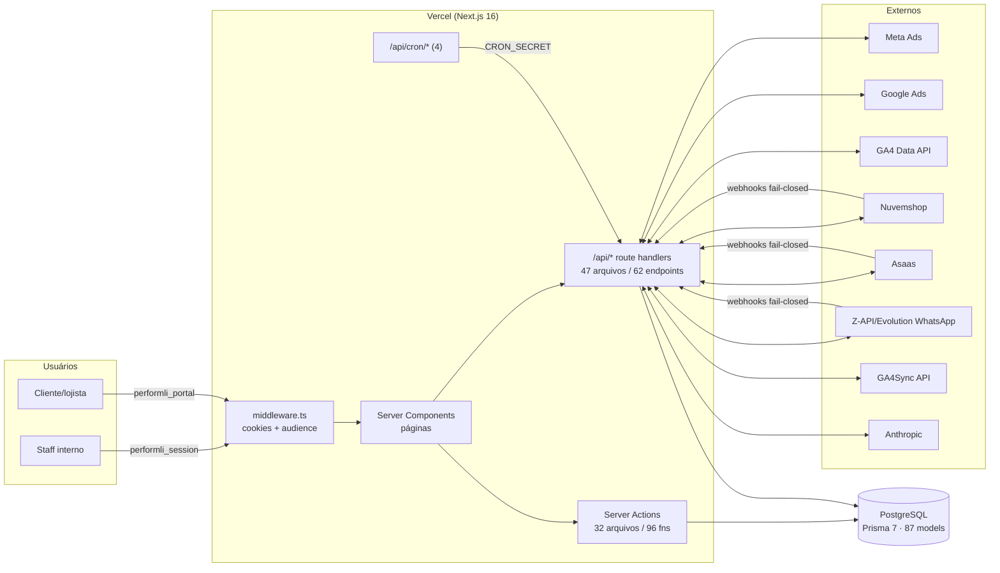
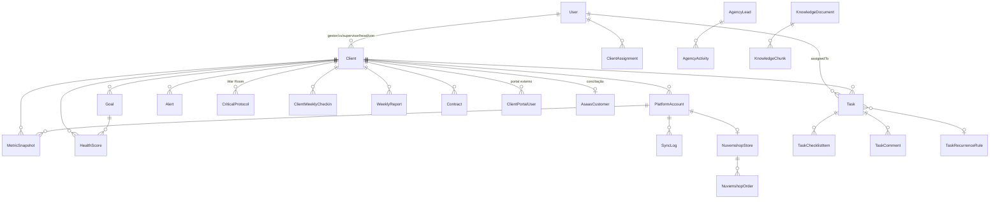

# DOSSIÊ TÉCNICO — PERFORMLI

> Fonte canônica do projeto. Consultar SEMPRE antes de integrar qualquer coisa nova.
> Última atualização: 2026-07-13 | Gerado a partir do commit: `cf74b39`
>
> **Regra de precisão:** todo o conteúdo foi extraído do código real (exploração forense
> multi-agente: banco, endpoints, auth/RBAC, integrações/crons, frontend/infra). O que não
> pôde ser confirmado no código está marcado com `⚠️ NÃO CONFIRMADO NO CÓDIGO — VERIFICAR`.
>
> **Números de verificação:** 87 models · 58 enums · 72 migrations · 47 arquivos `route.ts` ·
> 62 endpoints HTTP · 32 arquivos de server actions · 96 actions · 10 integrações externas ·
> 4 crons · 4 webhooks de entrada · 43 páginas.

---

## 1. VISÃO GERAL E PROPOSTA

**O que é.** O Performli é o sistema operacional interno da **Arkza** (agência de tráfego pago,
foco em e-commerce de moda e negócios locais, ~30 clientes ativos). Frase-guia: *"Arkza em
processo, não em memória"*. Visão final: o Marcos abre UMA única tela e entende a agência
inteira — o que está saudável, em atenção, crítico, e o que pode quebrar silenciosamente.

**Problema que resolve.** Tirar a operação da cabeça do Marcos e do WhatsApp/planilhas:
saúde de clientes, metas, tarefas recorrentes, check-ins, War Room, financeiro, CRM comercial
e alertas viram processo auditável dentro do sistema.

**Quem usa.**
- **Staff interno** (ADMIN, CS, supervisores/analistas/gestores de tráfego) — dashboard interno.
- **Clientes/lojistas** — portal externo `/portal` (namespace de auth totalmente separado).

**Contexto ClickUp.** O Performli está substituindo gradualmente o ClickUp como hub operacional
(diretriz completa no `CLAUDE.md`). O estado canônico vive no PostgreSQL; o ClickUp foi fonte
de migração (rastreabilidade via `externalId` em `User`, `Client`, `TaskList`).

**Módulos existentes (mapa de alto nível):**
| Módulo | Rotas principais |
|---|---|
| Cockpit / central de comando | `/cockpit`, `/dashboard` |
| Clientes (Client 360, saúde, metas) | `/clients`, `/clients/[slug]` |
| Tarefas / Central Operacional | `/operacional`, `/t/[taskId]`, `/meu-dia`, `/recorrencias`, `/validacoes`, `/processos` |
| Check-ins e relatórios | `/check-ins`, `/reports` |
| Anti-churn / War Room | `/anti-churn`, `/operations`, `/alerts` |
| Comercial (CRM + propostas) | `/comercial`, `/comercial/proposta`, `/pipeline` |
| Financeiro (Asaas, DRE) | `/financeiro` |
| Jurídico (contratos) | `/juridico` |
| Equipe / gestores | `/team`, `/managers`, `/agency` |
| Conhecimento (RAG) + IA | `/knowledge`, `/ai-agents` |
| Portal do cliente | `/portal` (externo), `/portal-acessos` (admin) |
| Configurações / integrações | `/settings`, `/canais` |

---

## 2. STACK TECNOLÓGICA

Pacote raiz: `"marcos"` v0.1.0, private. Versões exatas do `package.json`:

| Tecnologia | Versão | Função |
|---|---|---|
| Next.js | `16.2.1` | Framework (App Router, Server Components/Actions) |
| React / react-dom | `19.2.4` | UI |
| TypeScript | `^5` | Linguagem (`strict: true`) |
| Prisma (`prisma`, `@prisma/client`) | `^7.5.0` | ORM + migrations |
| `@prisma/adapter-pg` + `pg` | `^7.5.0` / `^8.20.0` | Driver adapter Postgres (serverless-friendly) |
| jose | `^6.2.2` | JWT HS256 (auth staff e portal) |
| bcryptjs | `^3.0.3` | Hash de senha (custo 12) |
| `@anthropic-ai/sdk` | `^0.80.0` | IA (chat, insights, relatórios, ingestão RAG) |
| resend | `^6.9.4` | E-mail |
| pdf-parse | `^2.4.5` | Parsing de PDF (knowledge) |
| recharts | `^3.8.0` | Gráficos |
| lucide-react | `^0.577.0` | Ícones |
| Radix UI (`@radix-ui/react-*`) | 11 primitivos | UI acessível (dialog, select, tabs, toast…) |
| `@hello-pangea/dnd` | `^18.0.1` | Drag-and-drop (kanban) |
| CVA / clsx / tailwind-merge | `0.7.1` / `2.1.1` / `3.5.0` | Composição de classes |
| Tailwind CSS | `^4` (devDep, via `@tailwindcss/postcss`) | Estilo (config via CSS, sem tailwind.config) |
| ESLint | `^9` (flat config, `eslint-config-next`) | Lint |
| tsx | `^4.21.0` | Runner de scripts (seed) |
| next-auth | `^5.0.0-beta.30` | ⚠️ Instalado, mas a auth em uso é JWT próprio (jose) — uso do next-auth NÃO CONFIRMADO NO CÓDIGO |

**Scripts npm:** `dev` · `build` = `prisma generate && migrate:deploy && next build` (migra no
build, com 2 retries por cold-start do banco) · `start` · `lint` · `seed` (`tsx prisma/seed.ts`).

**Sem** lib de estado global (zustand/redux/etc.), **sem** axios (fetch nativo), **sem** Prettier
configurado, **sem** runner de testes automatizado.

---

## 3. ARQUITETURA DO SISTEMA

### 3.1 Fluxo geral



### 3.2 Estrutura de pastas

```
src/
├─ app/
│  ├─ (auth)/login/           # Login staff (layout próprio)
│  ├─ (dashboard)/            # Sistema interno (~40 rotas + @modal paralelo)
│  │  ├─ @modal/(.)t/[taskId] # Drawer de tarefa (intercepting route)
│  │  └─ dev/components/      # Playground do design system (ADMIN)
│  ├─ portal/                 # Portal externo do cliente (auth separada)
│  ├─ actions/                # 32 arquivos de Server Actions ('use server')
│  ├─ api/                    # Route handlers: cron, sync, webhooks, settings, admin, ai…
│  └─ globals.css             # Tokens do design system (Tailwind v4 via @theme)
├─ components/                # 163 componentes .tsx por domínio (+ ui/ base)
├─ lib/                       # dal.ts (DAL), session.ts, rbac/, portal/, audit.ts,
│                             #   rate-limit.ts, cron-auth.ts, cron-heartbeat.ts, metas/, churn/…
└─ services/                  # Integrações (meta-ads, ga4, ga4sync, nuvemshop, asaas,
                              #   zapi, evolution, windsor, google-ads) + engines
                              #   (churn-scorer, recurrence-engine, warroom-monitor…)
```

### 3.3 Padrões e convenções
- **Leitura** via DAL (`src/lib/dal.ts`) quando aplicável; **mutação** valida autenticação +
  papel + posse (regras técnicas do `CLAUDE.md`).
- Server Components `async` por padrão; mutação por Server Actions; `/api/*` para cron, sync,
  webhooks, settings e consumo client-side.
- Erros para o usuário em **linguagem operacional pt-BR** (nunca "Erro"/"Pendente" sem porquê).
- `AuditLog` append-only para automações críticas; `SyncLog` + heartbeat para rotinas.
- Chamada externa sempre com timeout (`AbortSignal.timeout`).
- Path alias único: `@/*` → `./src/*`.

---

## 4. BANCO DE DADOS

**Fonte:** `prisma/schema.prisma` (1950 linhas) + `prisma/migrations/`.
**Números exatos: 87 models · 58 enums · 72 migrations.** Provider `postgresql`, sem
previewFeatures; conexão via driver adapter `@prisma/adapter-pg` (singleton em `src/lib/prisma.ts`).

### 4.1 Multi-tenant no nível de dados
- Tenant efetivo = **Client** (isolamento por `clientId`). Models com `clientId`: PlatformAccount,
  MetricSnapshot, CampaignSnapshot, Goal, HealthScore, ClientStatusStreak, ChurnRiskScore,
  CriticalProtocol, Alert, Task (opcional), ClientInteraction, ClientAssignment,
  ClientWeeklyCheckin, WeeklyReport, MonthlyReport, Contract, ClientProductChange,
  ClientPortalUser, ClientChat, ClientInsight, AuditLog (opcional), entre outros.
- Tenancy multi-workspace é **aditiva e parcial** (comentário no schema:665-667): tabelas novas
  nascem com `workspaceId`; `Task`/`Client`/`TaskList` ficam para fase posterior.
- **Portal externo:** isolamento duro staff × cliente — model próprio `ClientPortalUser`,
  cookie próprio, **nunca** adicionar `CLIENT` ao enum `Role`.

### 4.2 Models por domínio (resumo; campos-chave)

**AUTH/TEAM:** `User` (role, operationalRole, externalId ClickUp, hub de ~20 relações),
`Workspace`, `WorkspaceMember` (unique workspace+user).

**CLIENTES (núcleo):** `Client` — model central: `slug @unique`, `status` (ACTIVE/PAUSED/CHURNED
— PAUSED só silencia crons, não cancela contrato), `businessType` (ECOMMERCE/LOCAL/B2B),
`pipelineStage`, ficha CS manual (nps, curva, possivelChurn, salaDeGuerra,
fechouSemanaEmRisco), FKs de responsáveis (gestor/cs/supervisor/head/crm, SetNull), metas de
mídia (roasMinimo, investimentoMeta/Google/Tiktok, faturamentoEsperado), cache financeiro
desnormalizado (Contract é a fonte da verdade). `ClientPortalUser` (portal, lockout por
failedAttempts/lockedUntil), `ClientInteraction`, `ClientAssignment` (carteira do gestor),
`ClientStatusStreak`, `ClientProductChange`.

**PLATAFORMAS/MÉTRICAS:** `PlatformAccount` (`@@unique([clientId, platform, externalId])`,
tokens OAuth), `MetricSnapshot` (agregado diário, `@@unique([platformAccountId, date])`,
campos spend/clicks/conversions/conversionValue/roas/newUsers/addToCarts/checkoutsStarted…),
`CampaignSnapshot` (por campanha/adset), `SyncLog`, `NuvemshopStore` (`storeId @unique`),
`NuvemshopOrder` (status triplo + UTMs + match GA4).

**METAS/SAÚDE:** `Goal` (`@@unique([clientId, metric, period, startDate])`), `HealthScore`,
`ChurnRiskScore` (score 0-100 + factors Json, por semana).

**WAR ROOM:** `CriticalProtocol` — `exitCriteria` obrigatório por regra de negócio, escalação
para o Marcos em 3 semanas (idempotente via `escalatedAt`), documentos zod-validados
`diagnosticoGestor`/`decisoesCs`.

**AUDITORIA/ALERTAS:** `AuditLog` (append-only, actor SetNull, metadata Json), `Alert`
(20 tipos, SLA via `acknowledgedAt` distinto de `read`).

**TAREFAS (maior agregado):** `Task` (status customizável via `Status`/`StatusSet`, orderIndex
fracionário, SLA, `idempotencyKey @unique`, TaskCompletionGuard: requiresEvidence/
requiresReview/enforceChecklist trava conclusão, Hub de Suporte) + satélites
TaskAuxAssignee/Watcher/ChecklistItem/Comment/Attachment/Activity/Dependency/Approval/
CustomFieldValue; estrutura TaskArea/POPProcess/POPStep/TaskList/TaskTemplate(+Step/Field);
automação TaskRecurrenceRule (13 frequências; `archivedAt` nunca roda), TaskAutomationRule,
AutomationLog, TaskSavedView, OperationalRoutine, TaskSLA.

**CHECK-INS/RELATÓRIOS:** `WeeklyChecklist`, `ClientWeeklyCheckin` (workflow CS
PENDENTE→PREENCHIDO→APROVADO/REPROVADO, unique client+weekStart), `WeeklyReport` (funil
sentAt/deliveredAt/firstReplyAt — deliveredAt aguarda callback Z-API), `MonthlyReport`.

**IA/CONHECIMENTO:** `AIConversation`/`AIMessage`, `ClientInsight`, `ClientChat`/
`ClientChatMessage` (mentions[]), `KnowledgeDocument` (tags ALL/ECOMMERCE/LOCAL/CS) /
`KnowledgeChunk`.

**FINANCEIRO:** `AsaasCustomer` (conciliação via razaoSocial, `clientId @unique` SetNull),
`AsaasPayment`, `AsaasSubscription`, `AsaasTransfer`, `FinancialCategory`, `Expense` (DRE),
`IntegrationSetting` (KV de credenciais dinâmicas).

**CRM/CONTRATOS:** `AgencyLead` (UTMs, soft delete via deletedAt), `AgencyActivity`,
`Contract` (self-relation de renovação, noticeDays, autoRenew).

**CONVERSAS (CRM conversacional — Fase 1, fundação):** 16 models novos, todos com `clientId`
+ cascade (isolamento por tenant). Canal/contato/funil: `ConversationChannel` (credenciais
cifradas AES-256-GCM, unique client+type+phoneNumberId), `ConversationContact` (opt-in LGPD,
soft delete), `ConversationPipeline`/`ConversationStage`, `ConversationLead` (índice crítico
client+pipeline+stage; utm/ctwaClid/referral). Inbox: `Conversation` (índice crítico
client+lastMessageAt; janela 24h via lastInboundAt), `ConversationMessage` (`waMessageId
@unique` p/ idempotência de webhook). Ingestão outbox: `ChannelEvent` (`externalId @unique`,
status PENDING→PROCESSED/FAILED/DEAD). Automação: `ConversationAutomation`/
`ConversationAutomationRun` (reusa enum `AutomationLogStatus`). Bot: `BotFlow`/`BotSession`.
Broadcast: `ConversationTemplate`/`ConversationBroadcast`. Atribuição: `ConversionEvent`
(CAPI, `eventId @unique`), `ConversationNote`. Soft relations (String sem FK): pipelineId/
stageId/ownerUserId em Lead; leadId/assignedUserId em Conversation; `Task.conversationLeadId`.

**INFRA:** `RateLimit` (fixed-window serverless-safe).

### 4.3 Diagrama ER (agregados principais)



Relações "soft" (String sem FK, fora do ER): `Task.leadId`/`contractId`,
`AgencyLead.ownerId`/`convertedClientId`, `WeeklyReport.sentBy`.

### 4.4 Enums (58) — principais

`Role` (ADMIN, CS, SUPERVISOR_TRAFEGO, ANALISTA_TRAFEGO, GESTOR_TRAFEGO + legados deprecados
MANAGER/ANALYST) · `OperationalRole` (HEAD/SUPERVISOR/GESTOR/CRM/CS/ACOMPANHAMENTO — NÃO
governa autorização) · `ClientStatus` · `BusinessType` · `PipelineStage` · `Platform`
(META_ADS, GOOGLE_ADS, TIKTOK_ADS, GA4, NUVEMSHOP, GA4SYNC) · `MetricType` (25 valores: ROAS, CPL, CPA,
INVESTMENT, CONVERSIONS, SALES, CTR, CPC, IMPRESSIONS, REACH, FREQUENCY, CLICKS, SPEND,
FATURAMENTO, TICKET_MEDIO, TAXA_CONVERSAO, CPS, CPM, CAC, MENSAGENS, VISITAS_PERFIL,
LIGACOES, AGENDAMENTOS, LEADS, SEGUIDORES) · `GoalPeriod` · `HealthStatus` (OTIMO/REGULAR/RUIM)
· `AlertType` (20 valores) · `TaskStatus` (11) · `TaskType` (22) · `TaskOrigin` ·
`RecurrenceFrequency` (13) · `CheckinStatus` · `SyncStatus` · `CriticalProtocolStatus` ·
`WarRoomOutcome` · Asaas/Nuvemshop/CRM/Contract/Expense enums · **Conversas (13 novos):**
`ConversationChannelType`, `ConversationChannelStatus`, `ConversationOptIn`,
`ConversationLeadStatus`, `ConversationStatus`, `MessageDirection`, `ConversationMessageType`,
`MessageDeliveryStatus`, `ChannelEventStatus`, `ConversationTriggerType`, `BotSessionStatus`,
`TemplateMetaStatus`, `BroadcastStatus` (o run de automação reusa `AutomationLogStatus`). Lista
integral no schema (`prisma/schema.prisma`, contagem: 58 `^enum`).

### 4.5 Migrations
72 no total, baseline `20260321113638_init`. 5 mais recentes:
`20260713150000_conversas_foundation`, `20260713140000_platform_ga4sync`,
`20260706130000_client_portal_users`, `20260704120000_checkin_form_and_chat_mentions`,
`20260703220000_recurrence_clickup_migration_extensions`.
Regra do projeto: migrations preferencialmente **aditivas**.

---

## 5. API — CATÁLOGO COMPLETO DE ENDPOINTS

**Contagem: 47 arquivos `route.ts` · 62 handlers HTTP** (nenhum `PUT`).
Rotas `/api/*` **não passam pelo middleware** — cada rota se protege sozinha.

### 5.1 Cron (auth: `isCronAuthorized` — `CRON_SECRET` timing-safe, fail-closed)
| Método | Path | Descrição |
|---|---|---|
| GET, POST | `/api/cron/daily` | Master diário: Asaas → Meta → GA4 → Google Ads → Nuvemshop → metas → health → churn → watchdogs → alertas → relatórios → contratos (cada step em try/catch isolado) |
| GET, POST | `/api/cron/recurrences` | Motores de recorrência (templates por cliente + schedule por task); `?force=1` |
| GET, POST | `/api/cron/digest` | Digest WhatsApp + watchdog do daily |
| GET, POST | `/api/cron/resultados` | Resultado semanal (ROAS/GA4) + Etapa (segundas) |
| GET, POST | `/api/cron/conversas` | Drena o outbox de Conversas (ChannelEvent PENDING/FAILED, batch 50) a cada 1 min; retry + dead-letter; heartbeat `CRON_CONVERSAS_LAST_RUN` |

### 5.2 Sync (auth: `x-cron-secret` OU sessão; posse por atribuição p/ não-ADMIN)
| Método | Path | Descrição | Roles |
|---|---|---|---|
| POST | `/api/sync/meta` | Sync Meta Ads | ADMIN tudo; gestor só carteira |
| POST | `/api/sync/ga4` | Sync GA4 Data API | idem |
| POST | `/api/sync/google-ads` | Sync Google Ads | idem |
| POST | `/api/sync/nuvemshop` | Sync pedidos Nuvemshop | idem |
| POST | `/api/sync/health` | Recalcula HealthScores + alertas | idem |
| GET | `/api/sync/stream` | SSE sync geral (pool 6) | **ADMIN** |
| POST | `/api/asaas/sync` | Sync Asaas manual | **ADMIN** |

### 5.3 Webhooks de entrada (sem sessão; todos fail-closed)
| Método | Path | Validação | O que faz |
|---|---|---|---|
| POST | `/api/webhooks/whatsapp` | header `client-token` = `ZAPI_CLIENT_TOKEN` (503/401) | Mensagem de desconhecido vira `AgencyLead` + `AgencyActivity`; sempre 200 |
| POST | `/api/webhooks/whatsapp/test` | sessão **ADMIN** | Simula inbound |
| POST | `/api/asaas/webhook` | header `asaas-access-token` = `ASAAS_WEBHOOK_TOKEN` | Processa eventos PAYMENT_* (500 → Asaas reentrega) |
| POST | `/api/nuvemshop/webhooks` | HMAC-SHA256 body vs `x-linkedstore-hmac-sha256` | Upsert `NuvemshopOrder` + `MetricSnapshot` do dia |
| GET | `/api/webhooks/meta-whatsapp` | handshake `hub.verify_token`=`META_WA_VERIFY_TOKEN` (DB-first/env); 503 sem token, 403 sem match | Retorna `hub.challenge` (texto puro) |
| POST | `/api/webhooks/meta-whatsapp` | `X-Hub-Signature-256`=`sha256=`+HMAC do RAW body com `META_WA_APP_SECRET` (DB-first/env), timing-safe; 503 sem secret, 401 inválida | WhatsApp Cloud API: grava cada mensagem/status em `ChannelEvent` (outbox, dedup por externalId), 200 imediato, processa inline best-effort; cron drena o resto |

### 5.4 Nuvemshop OAuth
| Método | Path | Auth |
|---|---|---|
| GET | `/api/nuvemshop/auth` | sessão (gera state assinado HMAC) |
| GET | `/api/nuvemshop/callback` | sem sessão; exige `verifySignedState` (403 se inválido) |
| GET | `/api/nuvemshop/install` | público na entrada; efeitos só com state válido OU ADMIN |
| GET, POST | `/api/nuvemshop/reconciliation` | sessão; ADMIN ou atribuição |

### 5.5 Financeiro (todos **ADMIN only**)
| Método | Path | Descrição |
|---|---|---|
| GET | `/api/financeiro/summary` | KPIs do período |
| GET | `/api/financeiro/cashflow` | Fluxo mensal |
| GET, POST | `/api/financeiro/expenses` | Lista/cria despesa (zod) |
| PATCH, DELETE | `/api/financeiro/expenses/[id]` | Edita/remove despesa |

### 5.6 Settings de integração (todos **ADMIN only**)
| Método | Path | Descrição |
|---|---|---|
| GET, POST, DELETE, PATCH | `/api/settings/whatsapp` | Config Z-API + QR/status |
| GET, POST, DELETE | `/api/settings/asaas` | Config Asaas (chave mascarada; POST testa) |
| GET, POST, DELETE | `/api/settings/ga4sync` | Config GA4Sync (POST testa `/stores`) |

### 5.7 Comercial
| Método | Path | Auth/Roles |
|---|---|---|
| GET, POST | `/api/comercial/leads` | sessão (qualquer autenticado) |
| PATCH, DELETE | `/api/comercial/leads/[id]` | **ADMIN** |
| POST | `/api/comercial/leads/[id]/convert` | **ADMIN** |
| POST | `/api/comercial/activities` | sessão |
| POST | `/api/leads/capture` | **PÚBLICO** (captura de landing; CORS via `LEAD_CAPTURE_ALLOWED_ORIGINS`, default `*`) |

### 5.8 Clientes / equipe / IA / admin
| Método | Path | Auth/Roles |
|---|---|---|
| PATCH | `/api/clients/[clientId]/budget` | sessão + `can('update','clientes')` + posse |
| GET | `/api/team/members` | sessão |
| POST | `/api/ai/chat` | sessão (gestor com escopo de carteira) |
| POST | `/api/ai/dashboard-chat` | sessão |
| GET | `/api/ai/clients` | sessão (scopeClients) |
| GET | `/api/admin/knowledge` | **ADMIN** |
| POST | `/api/admin/knowledge/upload` | sessão (⚠️ checagem explícita de ADMIN não confirmada nas primeiras linhas — VERIFICAR) |
| DELETE | `/api/admin/knowledge/[id]` | **ADMIN** |
| POST | `/api/admin/contract-fee` | **ADMIN** |
| POST | `/api/admin/seed-contracts` | sessão (⚠️ role exato não confirmado — VERIFICAR) |
| POST | `/api/admin/seed-operacao` | **ADMIN** |
| POST | `/api/admin/trigger-digest` | **ADMIN** |
| POST | `/api/whatsapp/test-digest` | **ADMIN** |
| GET | `/api/whatsapp/groups` | **ADMIN** |
| POST | `/api/seed` | 404 em produção + `SEED_SECRET` (dev only) |

### 5.9 Server Actions (32 arquivos · 96 funções)
Padrão: `requireSession()` + `assertClientMutationAccess(session, clientId, { allowCS })` para
posse; RBAC fino via `can()`/`normalizeRole()`. Públicas apenas: `auth.ts` (login/logout staff)
e `portalAuth.ts` (portalLogin/portalLogout — lockout 5×15min, dummy bcrypt). `portalAccess.ts`
exige ADMIN. Detalhe por arquivo: tasks.ts (10 fns), operacional.ts (8), platformAccounts.ts
(9), updateClient.ts (6), warRoom.ts (5), contracts.ts (5), goals.ts (4), team.ts (4),
interactions.ts (4), recurrences.ts (4), weeklyReports.ts (4), alerts.ts (3), portalAccess.ts
(3), protocols.ts (3), checkin.ts (2), chat.ts (2), profile.ts (2), weeklyChecklist.ts (2),
portalAuth.ts (2), auth.ts (2), e 1 fn cada: progress, campaignInsights, fichaCs, clients,
antiChurn, task-recurrence, operations, search, suporte, assignments, insights, planoAcao.

---

## 6. AUTENTICAÇÃO, AUTORIZAÇÃO E RBAC

### 6.1 Fluxo de autenticação — staff
1. `login()` (`src/app/actions/auth.ts`): rate limit **10 tentativas/5min** por email+IP;
   `verifyCredentials` (bcrypt compare, usuário `active`); mensagem genérica.
2. `createSession` (`src/lib/session.ts`): JWT **HS256** (jose) com claims userId/name/email/
   role/operationalRole, **`aud: performli-staff`**, exp 7 dias → cookie **`performli_session`**
   (httpOnly, secure em prod, sameSite lax).
3. `middleware.ts` (edge): verifica assinatura + audience nos prefixos protegidos; redireciona
   `/login?callbackUrl=` (callback validado anti-open-redirect).
4. `getSession` valida audience + shape (userId/role) antes do cast.

### 6.2 Fluxo de autenticação — portal do cliente
1. `portalLogin` (action pública): lockout **5 tentativas / 15 min** (contadores no banco),
   mensagem única anti-enumeração, **dummy bcrypt** para tempo constante.
2. JWT com claims portalUserId/clientId, **`aud: performli-portal`**, cookie
   **`performli_portal`** (7 dias).
3. Guard **`getAuthorizedClient()`** no topo de toda página/action do portal: revalida no banco
   (usuário ativo + coerência clientId sessão↔registro); divergência destrói cookie e
   redireciona.
4. Middleware: só `/portal` e `/portal/*` (match preciso — `/portal-acessos` é rota de staff).

**Anti-confusão de token:** os dois namespaces compartilham `SESSION_SECRET`; o discriminador é
o claim `audience` verificado nos dois lados de cada namespace + validação de shape. Token de
um namespace é rejeitado no outro.

### 6.3 RBAC (policy engine `src/lib/rbac/`)
Composição: `normalizeRole` → `can` → `scope` → `stripSensitive` → `assertTaskPatchAllowed`.
**Deny-by-default.** 5 papéis canônicos (`ADMIN`, `SUPERVISOR_TRAFEGO`, `ANALISTA_TRAFEGO`,
`CS`, `GESTOR_TRAFEGO`); legados MANAGER≡GESTOR_TRAFEGO e ANALYST≡ANALISTA_TRAFEGO
normalizados na fronteira (`normalizeRole` lança em papel desconhecido).

**Matriz de permissões (fiel a `rbac/permissions.ts`):**

| Módulo | ADMIN | SUPERVISOR_TRAFEGO | ANALISTA_TRAFEGO | CS | GESTOR_TRAFEGO |
|---|---|---|---|---|---|
| tarefas | CRUD | CRUD | CRUD | CRUD | view + update_status_only |
| cockpit | view | view | view | view | view (carteira) |
| clientes | CRUD | CRUD | CRUD | CRUD | CRUD (carteira) |
| operacao | CRUD | CRUD | CRUD | CRUD | CRUD (carteira) |
| warRoom | CRUD | CRUD | CRUD | CRUD | CRUD (carteira) |
| comercial | CRUD | 🔒 | 🔒 | 🔒 | 🔒 |
| financeiro | CRUD | 🔒 | 🔒 | 🔒 | 🔒 |
| juridico | CRUD | 🔒 | 🔒 | 🔒 | 🔒 |
| gestaoEquipeVisaoGestor | CRUD | view | view | view | view (só o próprio) |
| gestaoEquipeMetas | CRUD | view (sem receita) | view (sem receita) | view (sem receita) | 🔒 |
| gestaoEquipeEquipe | CRUD | 🔒 | 🔒 | 🔒 | 🔒 |
| inteligencia | view | view | view | view | view (carteira) |

**Escopo (linhas):** `scopeClients`/`scopeTasks` — GESTOR filtra por `ClientAssignment`; demais
sem filtro (`{}` — nunca usar como única barreira de mutação, aviso no próprio código).
**Colunas sensíveis:** `stripSensitive` remove para não-ADMIN: `Client.contractValue/feeAmount/
billingDueDay`; `Contract`/`AsaasPayment`/`AsaasSubscription`/`Expense` inteiros; `Goal.targetValue`
quando métrica de receita (FATURAMENTO/TICKET_MEDIO/SALES/CAC). **Campo:** GESTOR só pode
alterar `status` em tarefas (`assertTaskPatchAllowed`). **Posse de mutação:**
`assertClientMutationAccess` (ADMIN/staff amplo; CS via allowCS; GESTOR só carteira).

### 6.4 Isolamento multi-tenant (mecanismo exato)
- **Staff:** recorte por carteira (`ClientAssignment`) aplicado na DAL em toda query relevante;
  `clientId`/`slug` da URL sempre refiltrado no banco com o scope.
- **Portal:** `clientId` SEMPRE da sessão assinada (JAMAIS de param/body/header), revalidado no
  banco a cada request; toda query do portal filtra `clientId` explicitamente; cache
  (`unstable_cache`) sempre com `clientId` na chave (`['portal-kpis', clientId, period]`,
  `['portal-ga4sync', resource, clientId, periodKey]`).

---

## 7. INTEGRAÇÕES EXTERNAS

**Total: 11.** Padrões de credencial: DB-first (`IntegrationSetting`) + fallback env →
Asaas, GA4Sync, Z-API, Evolution, WhatsApp Cloud API (verify token/app secret); token
por canal cifrado (AES-256-GCM) → `ConversationChannel.credentials`; só env → Meta
(system token), Google (Service Account),
GA4, Windsor, Nuvemshop (app), Anthropic; token por conta → `PlatformAccount.accessToken`
(Meta) e `NuvemshopStore.accessToken` (OAuth por loja).

| Integração | Propósito | Auth | Endpoints consumidos | Aterrissa em | Jobs |
|---|---|---|---|---|---|
| **Meta Ads** | Insights diários de anúncios | Token por conta / `META_SYSTEM_TOKEN` | Graph `v22.0` `/insights`, `/me/adaccounts`, `/debug_token` | MetricSnapshot, CampaignSnapshot | daily, sync/meta |
| **Google Ads** | Métricas por campanha (GAQL) | Service Account JWT + developer token | `googleads.googleapis.com/v17 :search` | snapshots | daily, sync/google-ads |
| **GA4** | Sessões, e-commerce, novos usuários | Service Account (fallback OAuth refresh) | Data API v1beta `:runReport` | MetricSnapshot | daily, sync/ga4 |
| **Windsor.ai** | Conector GA4 legado | `WINDSOR_API_KEY` em query | `connectors.windsor.ai/googleanalytics4` | snapshots | legado |
| **GA4Sync** | KPIs autoritativos de e-commerce Nuvemshop (canais/produtos/categorias/regiões/retenção) | Bearer `GA4SYNC_API_KEY` (DB-first) | `/stores`, `/stores/{id}/{recurso}` | live + cache 60s (portal) | portal (live) |
| **Nuvemshop** | Pedidos e loja | OAuth por loja (`NuvemshopStore`) | `/orders`, `/webhooks`, OAuth | NuvemshopOrder, MetricSnapshot | daily, sync/nuvemshop, webhook |
| **Asaas** | Financeiro (cobranças, DRE) | header `access_token` (DB-first) | `/payments`, `/customers`, `/subscriptions`, `/transfers`, `/finance/*` | Asaas* models | daily Step 0, webhook |
| **Z-API** | WhatsApp (digest, chat, leads) | instance/token/client-token (DB) | `/send-text`, `/qr-code`, `/status`, grupos | AgencyLead (webhook) | digest, webhook |
| **Evolution** | WhatsApp alternativo (Baileys) | `EVOLUTION_URL/KEY/INSTANCE` (DB) | `/instance/*`, `/message/sendText` | — | — |
| **WhatsApp Cloud API** (Meta) | CRM Conversas: inbox oficial por cliente + envio de texto (janela 24h) + CTWA→Lead | token por canal cifrado em `ConversationChannel.credentials`; webhook `META_WA_VERIFY_TOKEN`/`META_WA_APP_SECRET` (DB-first) | Graph `v23.0` ⚠️ TODO conferir doc `POST /{phone_number_id}/messages` | ChannelEvent → Conversation/ConversationMessage/ConversationContact/ConversationLead | webhook meta-whatsapp, cron conversas (1min) |
| **Anthropic** | IA: chat consultor, insights, relatórios, plano de ação, ingestão RAG | `ANTHROPIC_API_KEY` | Messages API (`claude-sonnet-4-6`, `claude-haiku-4-5-20251001` p/ PDF/insights) | AIConversation, ClientInsight, relatórios | daily (relatórios), api/ai/* |

**RAG é lexical, não vetorial:** `knowledge-search.ts` busca por palavras-chave (stopwords pt,
sem acentos) em `KnowledgeChunk` com filtro por tags; ingestão de PDF via Claude Haiku
(chunking ~850-900 chars). Não há embeddings.

**Pontos de falha conhecidos:** GA4Sync pode indisponibilizar (portal degrada em 4 estados
honestos); `ads` do GA4Sync pode vir `hasData=false` (depende do Windsor); Windsor é caminho
legado; `WeeklyReport.deliveredAt` aguarda callback Z-API (TODO no schema).

---

## 8. JOBS, CRONS E AUTOMAÇÕES

Agendamento no `vercel.json` (Vercel Cron = **UTC**; horários BRT nos comentários).
Auth: `CRON_SECRET` timing-safe fail-closed. Heartbeat: `CRON_<NAME>_LAST_RUN` em
`IntegrationSetting` (limiar de atraso 26h; banner no Cockpit via `getCronHealth`).

| Job | Agenda | TZ | O que faz | Dependências |
|---|---|---|---|---|
| daily | `0 11 * * *` (08:00 BRT) | UTC | Step 0 Asaas+conciliação+inadimplência → Meta → GA4 → Google Ads → Nuvemshop → weekly-goals (seg) → projeção de metas (dia 1) → health → oscilação → churn v1+v2 → watchdogs (anti-churn silencioso, retenção, paused-stale, SLA de alertas, radares) → entrega de relatórios → check-ins → follow-ups/atrasos/escalações → budget/critical/War Room → relatórios+checklists (dom) → rituais seg/ter/sex → contratos. Cada step em try/catch isolado | todas as integrações de dados |
| digest | `30 11 * * *` (08:30 BRT) | UTC | Watchdog do daily + digest WhatsApp por gestor | Z-API |
| recurrences | `0 10 * * *` (07:00 BRT) | UTC | 2 motores de recorrência (templates por cliente + schedule por task), idempotentes | Prisma, AutomationLog |
| resultados | `0 9 * * 1` (seg 06:00 BRT) | UTC | Resultado semanal ROAS/GA4 + Etapa (janela dom-sáb fechada, idempotente) | dados já sincronizados |
| conversas | `* * * * *` (cada 1 min) | UTC | Drena o outbox `ChannelEvent` (PENDING/FAILED, batch 50, ordem `receivedAt`); processa em série com try/catch por evento; retry até 5 tentativas → DEAD + AuditLog; heartbeat `CRON_CONVERSAS_LAST_RUN` | Postgres (sem fila externa — decisão R1) |

`maxDuration`: `api/sync/**` e `api/cron/**` 300s; `api/nuvemshop/**` 60s;
`api/admin/knowledge/**` 120s.

---

## 9. FRONTEND E DESIGN SYSTEM

**43 páginas** (38 no grupo `(dashboard)` incl. modal interceptado, 1 login staff, 2 portal,
1 raiz, 1 playground dev). **163 componentes** em ~26 pastas de domínio + `ui/` base.

**Design system "ARKZA · Central Operacional"** (direção Apple/iOS dark, tokens `--ak-*` em
`src/app/globals.css`, Tailwind v4 via `@theme inline`):
- **Superfícies:** `#0a0e13` (s0 app) · `#10151c` (s1 sidebar) · `#161d26` (s2 card) ·
  `#1e2832` (s3 elevado); fios rgba(255,255,255,.09/.055).
- **Texto:** `#f2f6fa` (hi) · `#a3b2c2` (mid) · `#647488` (low).
- **Marca:** ciano-petróleo `#22c2d6` / `#54e0ee` / deep `#0f7d8c`.
- **Status:** verde `#34c97a` · âmbar `#e3ad45` · vermelho `#ff5e6a` · laranja `#f0922b` ·
  violeta `#a98cff` (utilitários `bg-danger/warning/success/info`, `text-text-hi/mid/low`).
- **Paleta legada** (hex crus `#0A1E2C`, `#38435C`, `#95BBE2`, `#EBEBEB` etc.) retematizada por
  override; **lista congelada** — telas novas devem usar utilitários semânticos.
- **Tipografia:** SF Pro (system) + Inter fallback; base 13px, tracking negativo; mono tabular.
- **Liquid Glass:** blur só em superfícies fixas (`.lg-sidebar`, `.lg-topbar`, `.lg-overlay`);
  cards sem blur (perf); fallback `@supports`; `prefers-reduced-motion` respeitado.
- **Base UI:** Radix (11 primitivos), lucide-react, Recharts, @hello-pangea/dnd (kanban),
  button/card/badge/input/progress/Skeleton/EmptyState/Toast em `components/ui/`.
  Playground em `/dev/components` (ADMIN).
- **Estado:** Server Components + Server Actions; `useState` local; sem lib global.

**Regras de UX (CLAUDE.md):** toda tela responde às 6 perguntas (o que ver / o que está errado /
o que fazer agora / quem é o responsável / qual o prazo / qual o impacto); linguagem
operacional pt-BR; portal mobile-first (390px) com layout próprio.

---

## 10. SEGURANÇA

### 10.1 Práticas implementadas
- **Validação de input:** zod em 18 arquivos (actions e rotas); whitelists manuais
  (anti-open-redirect no login, whitelist de período no portal, guard de campos de tarefa).
- **Rate limiting:** helper `checkRateLimit` (fixed-window no Postgres, **fail-open** por
  decisão consciente); login staff 10/5min; portal lockout 5×15min + dummy bcrypt.
- **Timeouts:** `AbortSignal.timeout`/`AbortController` em TODOS os clients externos
  (15-30s); GA4Sync com retry/backoff só em 429/5xx respeitando `Retry-After`.
- **Webhooks fail-closed:** sem secret configurado → 503; token/HMAC inválido → 401.
- **Cron:** `CRON_SECRET` comparado com `crypto.timingSafeEqual`.
- **Headers globais** (`next.config.ts`): X-Frame-Options DENY, nosniff, Referrer-Policy,
  Permissions-Policy, HSTS preload; `poweredByHeader: false`.
- **Auditoria:** `writeAuditLog` append-only, nunca lança, usado em ~40 arquivos; senhas e
  chaves jamais em metadata/log; chaves de integração exibidas sempre mascaradas.
- **Senhas:** bcryptjs custo 12 em todos os fluxos. **Seed** bloqueado em produção.

### 10.2 Env vars e chaves (nome | propósito | onde — SEM valores)

| Nome | Propósito | Onde é usada |
|---|---|---|
| `SESSION_SECRET` | JWT staff **e** portal | lib/session.ts, lib/portal/session.ts, middleware.ts |
| `DATABASE_URL` | Postgres | lib/prisma.ts |
| `CRON_SECRET` | Auth de cron/sync | lib/cron-auth.ts, api/sync/* |
| `SEED_SECRET` / `VERCEL_ENV` / `NODE_ENV` | Seed dev-only / flags de prod | api/seed, cookies |
| `ANTHROPIC_API_KEY` | IA | api/ai/*, actions, services |
| `RESEND_API_KEY` / `FROM_EMAIL` | E-mail | lib/email.ts |
| `NEXT_PUBLIC_APP_URL` | Base URL pública | OAuth callbacks, e-mail |
| `META_SYSTEM_TOKEN` / `META_APP_ID` / `META_APP_SECRET` | Meta Ads | services/meta-ads |
| `GOOGLE_SERVICE_ACCOUNT_EMAIL` / `_KEY` | GA4 + Google Ads (SA) | services/ga4, google-ads |
| `GOOGLE_CLIENT_ID` / `_SECRET` / `GOOGLE_REFRESH_TOKEN` | GA4 OAuth fallback | services/ga4 |
| `GOOGLE_ADS_DEVELOPER_TOKEN` / `_LOGIN_CUSTOMER_ID` | Google Ads | services/google-ads |
| `WINDSOR_API_KEY` | Windsor.ai | services/windsor |
| `NUVEMSHOP_APP_ID` / `_APP_SECRET` / `_USER_AGENT` / `NUVEMSHOP_STATE_SECRET` | OAuth + HMAC Nuvemshop | services/nuvemshop, api/nuvemshop |
| `ASAAS_API_KEY` / `ASAAS_SANDBOX` / `ASAAS_WEBHOOK_TOKEN` | Asaas | services/asaas, webhook |
| `ZAPI_INSTANCE_ID` / `ZAPI_TOKEN` / `ZAPI_CLIENT_TOKEN` | Z-API | lib/whatsapp, webhook |
| `WHATSAPP_GROUP_ID` / `WHATSAPP_NOTIFY_NUMBERS` | Destinos do digest | lib/whatsapp, digest |
| `GA4SYNC_API_KEY` / `GA4SYNC_API_BASE` | API GA4Sync | services/ga4sync |
| `LEAD_CAPTURE_ALLOWED_ORIGINS` | CORS da captura de leads | api/leads/capture |
| `SENHA_TESTE_RBAC` | Seed de teste RBAC | services/seed-rbac-test |
| `CONVERSAS_ENCRYPTION_KEY` | Chave AES-256-GCM (32 bytes base64) p/ cifrar credenciais de canal | lib/conversas/crypto.ts |
| `META_WA_VERIFY_TOKEN` | Handshake GET do webhook Meta (fallback; DB-first em `IntegrationSetting`) | api/webhooks/meta-whatsapp |
| `META_WA_APP_SECRET` | Assinatura `X-Hub-Signature-256` do webhook Meta (fallback; DB-first) | api/webhooks/meta-whatsapp |

**Chaves em `IntegrationSetting` (DB, configuráveis em `/settings` sem redeploy):**
`ASAAS_API_KEY`, `ASAAS_SANDBOX`, `GA4SYNC_API_KEY`, `GA4SYNC_API_BASE`, `ZAPI_INSTANCE_ID`,
`ZAPI_TOKEN`, `ZAPI_CLIENT_TOKEN`, `EVOLUTION_URL/KEY/INSTANCE`, heartbeats `CRON_*_LAST_RUN`.

### 10.3 Riscos e débitos identificados (constatados no código)
1. `SESSION_SECRET` compartilhado entre staff e portal (mitigado por `audience` + shape check;
   comprometer o segredo derruba os dois namespaces).
2. Timing residual no login **staff**: usuário inexistente retorna sem bcrypt dummy (o portal
   tem dummy; o staff não) — enumeração por tempo, atenuada pelo rate limit.
3. Rate limit global **fail-open** (falha de DB desliga a proteção silenciosamente).
4. Sem rate limit em `/api/ai/*` (custo Anthropic), `/api/leads/capture` (público) e webhooks.
5. **CSP ausente** (backlog declarado em `next.config.ts`).
6. CORS da captura de leads default `*` quando `LEAD_CAPTURE_ALLOWED_ORIGINS` não setada.
7. Comparação de token de webhook Asaas/Nuvemshop com `!==` (não timing-safe; cron usa
   timingSafeEqual).
8. Middleware não cobre `/api/*` — rota nova sem guard próprio nasce desprotegida.
9. Portal sem troca de senha pelo cliente (senha definida pelo admin é permanente até reset).
10. `scopeClients` retorna `{}` para papéis amplos — jamais usar como única barreira.
11. Enum legado MANAGER/ANALYST exige `normalizeRole` em toda fronteira.
12. ⚠️ `getClientsList` usa `unstable_cache` com chave fixa `['getClientsList']` recebendo
    userId/role como args — VERIFICAR se o Next segrega o cache por argumentos (risco
    potencial de vazar lista entre gestores na janela de 30s).

---

## 11. INFRAESTRUTURA E DEPLOY

- **Hospedagem:** Vercel (crons + `maxDuration` no `vercel.json`). Domínio de produção:
  ⚠️ NÃO CONFIRMADO NO CÓDIGO (não hardcoded).
- **Build/deploy:** `prisma generate` → `prisma migrate deploy` (2 retries p/ cold-start) →
  `next build`. Sem GitHub Actions (`.github/workflows` inexistente) — CI é o build da Vercel.
- **Banco:** PostgreSQL via `DATABASE_URL`, driver adapter pg com singleton. Provedor
  compatível com Neon (retry de cold-start), mas ⚠️ provedor exato NÃO CONFIRMADO NO CÓDIGO.
- **Storage de arquivos:** inexistente (sem blob/S3/uploadthing); evidências são texto/link.
- **Monitoramento:** interno — `AuditLog`, `SyncLog`, heartbeats de cron (banner no Cockpit),
  watchdogs (cron-watchdog, alert-sla-watchdog, retention-watchdog). Sem Sentry/Datadog.
- **Testes:** sem runner; `tests/portal-tenant-isolation.test.md` é prova estática + roteiro
  manual.
- Serviço auxiliar externo: GA4Sync em `https://project-g09fp.vercel.app/api/v1`.

---

## 12. COMPORTAMENTO DO SISTEMA

### 12.1 Fluxos críticos ponta a ponta
- **Métrica → KPI → tela:** cron `daily` sincroniza Meta/GA4/Google/Nuvemshop →
  `MetricSnapshot` (agregado diário por conta) → `aggregateSnapshots` (health-scorer) é a
  **fonte única de "realizado"** → metas (`Goal` + `getRealizado`), `HealthScore`, dashboards
  internos e portal (`getPortalKpis`).
- **Meta mensal → semanal:** `upsertMonthlyGoals` → `syncWeeklyGoalsFromMonthly`; projeção
  automática no dia 1 (ecom +15%, local +20%).
- **Check-in semanal:** gestor preenche formulário (Q1-Q6) → status PREENCHIDO → CS revisa
  (APROVADO/REPROVADO) → relatório gerado → postado no chat do cliente mencionando a CS.
- **War Room:** alerta/critério ativa `CriticalProtocol` → plano com `exitCriteria`
  obrigatório → monitor diário → escalação ao Marcos em 3 semanas → encerramento com outcome.
- **Anti-churn:** churn-scorer v1+v2 semanais (score 0-100 + fatores) + radares/watchdogs de
  silêncio → alertas com dono e SLA.
- **Financeiro:** Asaas sync (Step 0) + webhook → conciliação automática com Task/Client via
  `razaoSocial` → inadimplência vira alerta/task.
- **Lead → cliente:** captura pública/WhatsApp → `AgencyLead` → pipeline → `convert` (ADMIN)
  → `Client`.
- **Portal do cliente:** login isolado → `getAuthorizedClient` → 10 KPIs + funil + projeção
  (MetricSnapshot) + quebras GA4Sync (live + cache 60s, degrade honesto em 4 estados).

### 12.2 Regras de negócio embutidas no código
- PAUSED silencia crons mas NÃO cancela contrato/financeiro.
- `exitCriteria` do War Room é obrigatório; escalação idempotente.
- `enforceChecklist`/`requiresEvidence` travam conclusão de tarefa (nenhuma tarefa "concluída"
  sem evidência mínima).
- Recorrência arquivada (`archivedAt`) nunca roda; motores idempotentes
  (`idempotencyKey`, `DUPLICIDADE_EVITADA`).
- Resultado semanal deriva Etapa (ESCALA/MONITORAMENTO/OTIMIZACAO) sobre janela dom-sáb fechada.
- `fechouSemanaEmRisco`: 1º feedback negativo da semana seguinte escala direto.
- Fuso canônico America/Sao_Paulo (`saoPauloDateString`/`saoPauloDayStart`);
  `MetricSnapshot.date` é `@db.Date`.
- Score de priorização 0.30 e 21 POPs: ver `CLAUDE.md`.

### 12.3 Bugs conhecidos e limitações atuais
- Dashboard/portal: "Atualizado em" usa hora da renderização, não do dado (cache pode servir
  dado mais antigo que o carimbo).
- Projeção run-rate subestima no início do dia corrente; cache da projeção sem mês na chave
  (stale de rótulo por até 15 min na virada de mês).
- Quebras GA4Sync incluem o dia corrente; KPIs de MetricSnapshot fecham em ontem (divergência
  documentada e deliberada).
- Tipos do GA4Sync modelados a partir do spec; conferência contra `/openapi.json` real
  pendente (egress bloqueado no ambiente de dev).
- `WeeklyReport.deliveredAt` aguarda callback Z-API.
- Faixa etária/gênero no portal: sem dado no schema (pendência de ingestão dimensional).
- Riscos de segurança listados na seção 10.3.

---

## 13. GUIA PARA NOVAS INTEGRAÇÕES

### 13.1 Checklist obrigatório ANTES de integrar
1. **Leia este dossiê** e o `CLAUDE.md` (regras inegociáveis).
2. Verifique se um dos **71 models existentes** serve — nenhum model novo sem justificar por
   que nenhum atende.
3. Credencial: `IntegrationSetting` DB-first + fallback env (padrão Asaas/GA4Sync). NUNCA
   hardcoded, NUNCA em log/URL; exibição sempre mascarada; card em `/settings` p/ ADMIN.
4. Client HTTP: fetch nativo + `AbortSignal.timeout` (15-30s); retry só em 429/5xx com
   `Retry-After`/backoff e teto de tentativas; erro tipado; log só host+recurso+status.
5. Direção da sincronização classificada (`x→performli`, `performli→x`, bidirecional) +
   estratégia de saída (diretriz ClickUp do CLAUDE.md).
6. Se tem cron: try/catch por cliente, `SyncLog`, heartbeat, step isolado no `daily` ou cron
   próprio no `vercel.json` + `isCronAuthorized`.
7. Se tem webhook: fail-closed (503 sem secret, 401 inválido), preferir HMAC, comparação
   timing-safe, sempre 200 p/ eventos ignoráveis.

### 13.2 Onde criar o quê
- Serviço externo: `src/services/<nome>/{config,types,client,sync}.ts`.
- Rota interna: `src/app/api/<domínio>/route.ts` — **toda rota nova DEVE ter guard próprio**
  (middleware não cobre `/api/*`): `getSession` + `can()` + posse, ou `isCronAuthorized`,
  ou token de webhook.
- Mutação de UI: server action em `src/app/actions/` com `requireSession` +
  `assertClientMutationAccess`.
- Portal: TODA página/action chama `getAuthorizedClient()` no topo; `clientId` só da sessão;
  query filtra `clientId`; cache com `clientId` na chave; KPIs só via `kpi-registry.ts`;
  dado inexistente NÃO é inventado (vira pendência documentada).
- UI: tokens semânticos do design system (sem hex cru novo — lista congelada); pt-BR
  operacional; 6 perguntas; mobile-first no portal.

### 13.3 Como manter este dossiê
**Após qualquer mudança estrutural (endpoint, model, role, integração, env var, cron), atualize
a seção correspondente deste dossiê no MESMO PR/commit.** Atualize também os números de
verificação do cabeçalho (models/endpoints/integrações) e a data/commit.

---

## 14. GLOSSÁRIO E REFERÊNCIAS

**Termos internos:**
- **POP** — Procedimento Operacional Padrão (21 no total, 7 áreas: CAP/ONB/OPE/CSX/WAR/CRM/FIN).
- **War Room** — protocolo de conta crítica (`CriticalProtocol`) com critério de saída.
- **Check-in** — formulário semanal do gestor por cliente, validado pela CS.
- **SINC / realizado** — fonte única de valor realizado (`aggregateSnapshots`/`getRealizado`).
- **Motor A / Motor B** — recorrência por template+regra (fan-out por cliente) / por task.
- **Carteira** — clientes atribuídos a um gestor (`ClientAssignment`).
- **Liquid Glass** — camada visual Apple/iOS (blur restrito a superfícies fixas).
- **GA4Sync** — API externa read-only de KPIs de e-commerce Nuvemshop (nosso microserviço).
- **DB-first** — credencial lida de `IntegrationSetting` com fallback em env.

**Docs internas relevantes:** `CLAUDE.md` (regras canônicas), `DECISIONS.md` (decisões D-001+),
`docs/AREA_CLIENTES.md` (portal), `docs/DIAGNOSTICO_AREA_CLIENTES.md`,
`docs/ux/PROMPT_UX_DESIGN_SYSTEM_ARKZA.md` (design system),
`tests/portal-tenant-isolation.test.md` (prova de isolamento), `MIGRATION_CLICKUP.md`.
⚠️ Docs de auditoria anteriores a 03/07 podem citar RBAC v1 (MANAGER/ANALYST) — o código e
este dossiê refletem o RBAC v2; em divergência, o código é a verdade.

**Dependências (docs oficiais):** Next.js · React · Prisma · Tailwind v4 · Radix UI ·
Recharts · jose · Anthropic SDK · Vercel Cron.

**Repositório:** `marcosliossi-del/performli-sistema-geral`.

---

## 15. HISTÓRICO DE MUDANÇAS

Registro cronológico de upgrades, correções e bugs. **Toda** mudança entra aqui
no mesmo PR (regra do topo deste dossiê e do `CLAUDE.md`). Correções derivadas
da `AUDITORIA-PERFORMLI.md` citam o ID do achado.

### 2026-07-13 — Fase 1 Conversas — fundação de dados (schema + migration + crypto + RBAC)
- **Schema** (`prisma/schema.prisma`): nova seção "CONVERSAS (CRM conversacional)" com 16
  models — `ConversationChannel`, `ConversationContact`, `ConversationPipeline`,
  `ConversationStage`, `ConversationLead`, `Conversation`, `ConversationMessage`,
  `ChannelEvent`, `ConversationAutomation`, `ConversationAutomationRun`, `BotFlow`,
  `BotSession`, `ConversationTemplate`, `ConversationBroadcast`, `ConversionEvent`,
  `ConversationNote` — e 13 enums novos. Todos com `clientId` + cascade. Índices críticos:
  `Conversation(clientId,lastMessageAt)`, `ConversationLead(clientId,pipelineId,stageId)`,
  `ConversationMessage.waMessageId @unique`, `ChannelEvent.externalId @unique`.
  `ConversationAutomationRun.status` reusa `AutomationLogStatus`. Client ganhou 10 relações
  inversas. Campo aditivo `Task.conversationLeadId String?` (soft, sem FK).
- **Migration** `20260713150000_conversas_foundation` — 100% aditiva (CREATE TYPE/TABLE/INDEX,
  FKs cascade, `ALTER TABLE "Task" ADD COLUMN`). Nada destrutivo.
- **Crypto** (`src/lib/conversas/crypto.ts`, novo, server-only): AES-256-GCM
  (`encryptSecret`/`decryptSecret`, formato `v1:<iv>:<tag>:<cipher>`), chave em
  `CONVERSAS_ENCRYPTION_KEY` (32 bytes base64). Nunca loga chave/plaintext.
- **RBAC** (`src/lib/rbac/permissions.ts`): módulo `'conversas'` — ADMIN/ANALISTA_TRAFEGO
  FULL_CRUD; SUPERVISOR_TRAFEGO/CS `[view,create,update]` (sem delete de histórico);
  GESTOR_TRAFEGO VIEW_ONLY (escopo de carteira via `scopeClients`). Discovery R4.
- Anti-escopo desta fatia: sem webhook/ingestão/UI/rotas (outras fatias). Números do
  cabeçalho atualizados: 87 models · 58 enums · 72 migrations.

### 2026-07-13 — Fase 1 Conversas (fatia B) — conector Cloud API + webhook + ingestão + cron
- **Cloud API client** (`src/services/conversas/cloud-api.ts`, novo, server-only): `sendTextMessage`
  (POST Graph `v23.0` `/{phoneNumberId}/messages`, Bearer decifrado de `channel.credentials` via
  `decryptSecret` — token NUNCA logado; `AbortSignal.timeout(15s)`; retorna wamid; erros tipados
  `ConversasApiError` code/status pt-BR). `getWindowState` puro (janela 24h a partir de
  `lastInboundAt` + minutos restantes). Guard: texto livre só com janela aberta. `sendTemplateMessage`
  com assinatura preparada mas não implementada (Fase 3). ⚠️ **Graph API v23.0 veio de memória do
  modelo — WebSearch/WebFetch indisponíveis no ambiente; conferir doc oficial da Meta antes do go-live.**
- **Webhook** (`src/app/api/webhooks/meta-whatsapp/route.ts`, novo): GET handshake
  (`hub.verify_token`=`META_WA_VERIFY_TOKEN` DB-first+env, fail-closed 503/403, challenge texto puro);
  POST valida `X-Hub-Signature-256` = `sha256=`+HMAC(raw body, `META_WA_APP_SECRET` DB-first+env) com
  `timingSafeEqual` (503 sem secret, 401 inválida); grava cada mensagem/status em `ChannelEvent`
  (dedup por `externalId` unique), responde 200 imediato, processa inline best-effort (try/catch que
  nunca derruba a resposta). Sempre 200 exceto auth. Rota independente do webhook Z-API.
- **Ingestão** (`src/services/conversas/ingest.ts`, novo): `processChannelEvent` idempotente — resolve
  canal ATIVO por `phone_number_id`; inbound → upsert Contact(clientId,phone)/Conversation(não-CLOSED)/
  Message(waMessageId dedup) + lastInboundAt/lastMessageAt/unreadCount; CTWA (referral em contato NOVO)
  → cria `ConversationLead` no pipeline default (seed lazy "Atendimento": Novo/Em atendimento/
  Qualificado/Ganhou(isWon)/Perdeu(isLost)) e linka `Conversation.leadId`; status update → atualiza
  `ConversationMessage.status` por waMessageId. Transições PROCESSED/FAILED(attempts+1)/DEAD(≥5) +
  `AuditLog` em DEAD (regra #8). clientId sempre derivado do canal.
- **Cron** (`src/app/api/cron/conversas/route.ts`, novo): `isCronAuthorized` fail-closed; drena
  `ChannelEvent` PENDING/FAILED (attempts<5, batch 50, ordem `receivedAt`) em série com try/catch por
  evento; `recordCronHeartbeat('CONVERSAS')`; resumo {processed,failed,dead}. `vercel.json`: cron
  `* * * * *` (coberto por `api/cron/** maxDuration 300`). `CronName` ganhou `'CONVERSAS'`.
- **Envio outbound (gate)** (`src/app/actions/conversas.ts`, novo): `sendConversationMessage` —
  `requireSession` + `can(role,'update','conversas')` + `assertClientMutationAccess(clientId da
  conversa, allowCS)` + guard janela 24h + `sendTextMessage` + cria `ConversationMessage` OUT
  (sentByUserId, status SENT) + `lastMessageAt` + `AuditLog`. clientId sempre da conversa.
- Env vars novas: `META_WA_VERIFY_TOKEN`, `META_WA_APP_SECRET` (DB-first em `IntegrationSetting`,
  fallback env). Sem migration (schema da fatia A já contempla tudo).

### 2026-07-13 — Validação zod permissiva de INPUT em rotas internas (AL-6, parcial)
- Adicionado `z.safeParse` **permissivo** (aceita exatamente o que já era aceito;
  rejeita só malformado com `400 { error: <pt-BR string> }`, sem `flatten()` cru —
  respeita F-04) nas rotas: `clients/[clientId]/budget` (PATCH, `value` coercível ≥0),
  `admin/contract-fee` (POST formData, `id`+`feeValue` coercível ≥0),
  `ai/chat` (POST, `agentType`+`messages[]`+`clientId?`),
  `ai/dashboard-chat` (POST, `question`+`context?` nullish),
  `sync/ga4|meta|google-ads|nuvemshop` (POST, `platformAccountId?`+`clientId?` opcionais),
  `sync/health` (POST, `clientId?`), `nuvemshop/reconciliation` (POST, `clientId`+`since?`+`until?`).
- **NÃO** tocado: auth/RBAC/posse, `isCronAuthorized`, comportamento de sucesso.
- **Pulado:** `admin/seed-operacao` — não lê JSON body; só query params (`phase`/`cursor`/
  `batch`/`lote`/`confirm`) já validados defensivamente (whitelist, clamp, fallthrough
  para `seed`). Apertar com enum mudaria o comportamento aceito (phase desconhecida hoje
  cai em `seed`). Webhooks/crons/financeiro fora de escopo desta fatia.
- Achado AL-6 permanece **parcial**: faltam as actions ADMIN (`goals.ts`, `updateClient.ts`).

### 2026-07-13 — Perf financeiro: cashflow e summary (ME-9)
- **`src/app/api/financeiro/cashflow/route.ts`**: `prisma.client.count({ ACTIVE })`
  era invariante mas rodava dentro do loop de meses — movido para 1× após o loop.
  O loop de N meses (pares de `aggregate` em série) foi paralelizado com
  `Promise.all` sobre os meses (ordem preservada via `map`/índice). Saída idêntica.
- **`src/app/api/financeiro/summary/route.ts`**: 5 queries independentes que rodavam
  em série (inadimplentes, inadimplenciaValue, entradasPrevistas, saidasPrevistas,
  churnedThisPeriod) agrupadas em um `Promise.all`. `prevPayments`/`prevExpenses`
  trocados de `findMany`+`reduce` por `aggregate({_sum:{value}})`. Removido `include`
  morto (`customer.name`) das `subscriptions`. ZERO mudança de números/shape.

### 2026-07-13 — DAL consome `aggregateSnapshots` para receita/ROAS (AL-2/F-01, fatia 2/2)
- **`src/lib/dal.ts`** deixou de recomputar receita/ROAS GA4-only inline. Todos os
  pontos de **FATURAMENTO/ROAS canônicos** passaram a chamar a fonte única
  `aggregateSnapshots(snaps, metric, businessType)` (health-scorer), que roteia
  por `businessType` (ECOMMERCE→GA4/GA4SYNC, LOCAL/B2B→Meta) e aplica a
  precedência GA4SYNC>GA4. Helper `toAgg` adapta snapshots de `select` reduzido
  ao shape `AggregatableSnapshot`.
- **Pontos migrados:** `getClientsOperationalTable` (roas), `_fetchClientsList`
  (monthRevenue/monthRoas), `getClientKPIs` (faturamento/roas canônicos),
  `getClientMetricHistory` (roas/ticketMédio por dia), `getClientDailyRevenue`
  (receita por dia), `_fetchMonthlyComparison` (receita/roas por mês),
  `getManagerStats` (receita/ROAS/prevSales por cliente), `getAgencyOverview`
  (receita/ROAS por cliente + rollups). `businessType` obtido do próprio
  `findMany`/`include` existente ou via `select` adicionado (sem N+1).
- **Mantidos inline de propósito** (documentado no código): `getClientCampaigns`
  (breakdown por campanha em `CampaignSnapshot`), `getClientSalesFunnel` (funil
  GA4, sem receita/ROAS) e o breakdown `roasMeta/roasGoogle/roasTiktok` do
  `getClientKPIs` (exibição por plataforma).
- **Sem mudança de número** para ECOMMERCE sem GA4Sync (retorna a mesma soma GA4);
  LOCAL/B2B passam a refletir Meta e ECOMMERCE com GA4Sync passa a refletir a loja.

### 2026-07-13 — Persistência da receita GA4Sync no MetricSnapshot (fatia 1/2)
- **Enum** `Platform` ganhou o valor `GA4SYNC` (migration aditiva/idempotente
  `20260713140000_platform_ga4sync`, `ALTER TYPE ... ADD VALUE IF NOT EXISTS`).
- **Novo serviço** `src/services/ga4sync/sync.ts`: `syncGa4SyncAccount(clientId)`
  (resolve storeId; sem loja → skip sem erro; upsert PlatformAccount GA4SYNC sem
  token; SyncLog RUNNING→SUCCESS/FAILED; upsert MetricSnapshot por dia com
  `conversionValue=revenue`, `conversions=orders`, `date` em meia-noite UTC) e
  `syncAllGa4SyncAccounts()` (clientes ACTIVE, try/catch por cliente, resumo
  synced/skipped/failed; se sem chave, log claro e retorno vazio — não quebra o cron).
- **Cron** `daily` ganhou Step 2c2 (`syncAllGa4SyncAccounts`), isolado em
  try/catch, após Nuvemshop/GA4, gravando `summary.ga4sync`.
- **Não** altera `aggregateSnapshots`/KPIs — o consumo da nova fonte é a fatia 2.
  ⚠️ Shape do timeline pende conferência contra `/openapi.json`.

### 2026-07-13 — Auditoria forense + primeira onda de correções (críticos)
- **Criado** `AUDITORIA-PERFORMLI.md` (33 achados; 4 críticos). Este dossiê passou
  a ser consultado antes de qualquer ação e atualizado após qualquer mudança.
- **CR-3 corrigido** — `GET/POST /api/comercial/leads` e `POST /api/comercial/activities`
  ganharam guard `session.role !== 'ADMIN'` (antes: qualquer autenticado lia/gravava
  o pipeline comercial). Fecha vazamento de dado comercial.
- **CR-4 corrigido** — `fetchMonthlyGoals` (`actions/goals.ts`) agora filtra por
  `scopeClients` (GESTOR só a carteira) e omite metas de receita para não-ADMIN
  (`isRevenueMetric`). Fecha vazamento cross-tenant de meta de FATURAMENTO/ROAS.
- **CR-2 corrigido** — `warroom/prefill.ts` passou a usar a fonte única
  `aggregateSnapshots` (roteia receita por `businessType`) em vez de somar
  `conversionValue` de todas as plataformas. Elimina o faturamento dobrado no
  diagnóstico do War Room quando o cliente tem GA4 + Nuvemshop.
- **AL-1 corrigido** — `resultado-engine.ts` agora loga mensagem específica
  ("sem meta de ROAS nem roasMinimo — não classificado") em vez do genérico
  "sem meta cadastrada" (que mentia quando existia meta de FATURAMENTO).
- **Aberto (estrutural):** CR-1 — faturamento e-commerce usa GA4-only (bruto) e
  descarta a receita real da Nuvemshop. Aguarda decisão de produto sobre a fonte
  de verdade (ver §12.3). AL-2/AL-3/AL-4 (fuso e divergência DAL) e demais
  achados médios/dívida seguem em aberto na auditoria.

### 2026-07-13 — ME-4 (churn) + B-04 residual (fuso na DAL)
- **ME-4** (CONFIRMADO): `churn-scorer.ts` contava "semanas consecutivas em RUIM"
  pelas semanas PRESENTES no Map (com HealthScore), sem checar adjacência de
  calendário — um buraco de dados (gap de sync / cliente novo) fazia semanas
  não-adjacentes contarem como consecutivas, inflando o Fator 1 (até 40 pts).
  Adicionada guarda: quebra a cadeia quando o intervalo entre semanas seguidas
  é > 8 dias. churn-scorer-v2 não tem o padrão (delega ao backtest).
- **B-04 residual**: os 4 `monthStart` inline (`new Date(y,m,1)`, fuso do
  runtime) do `dal.ts` (_fetchClientsList, getManagerStats, getAgencyOverview,
  getAssignmentsData) passaram a usar `getMonthRange(now).start` (SP-aware) —
  consistente com AL-4. Demais cópias de data/formatCurrency seguem pendentes.

### 2026-07-13 — AL-4: fronteira de semana/mês no fuso America/Sao_Paulo
- `getWeekRange`/`getMonthRange` (`src/lib/utils.ts`) passaram a derivar a
  fronteira do **dia-parede SP** (`saoPauloDateString`) e construir os bounds em
  **UTC-midnight** (casa com `@db.Date`). Antes usavam o fuso do runtime (UTC na
  Vercel), então entre 21:00–23:59 SP a semana/mês "virava" cedo: check-in de
  sábado à noite caía na semana seguinte, cliente aparecia falsamente "sem meta/
  sem check-in", MTD no mês errado. Fora dessa janela, resultado idêntico ao
  anterior. Fecha a raiz de AL-3 (SEMANA_FECHADA) e do bug "cliente sem check-in".
- `health-scorer.processGoals`: `today` do pro-rata ancorado no UTC-midnight do
  dia SP (consistente com periodStart), removendo drift de 1 dia na mesma janela.
- QA adversarial APROVADO (percorreu todos os consumidores: weekly-goals-sync,
  health-scorer, resultado-engine, checkin, realizado, dal). Resíduo B-04 (~5
  `new Date(y,m,1)` inline no dal.ts) fica para a onda de limpeza.

### 2026-07-13 — Onda média de correções da auditoria (7 achados)
- **AL-3**: `realizado.ts` MTD passou a usar bound UTC-midnight (`-01T00:00:00Z`)
  em vez de `saoPauloDayStart` (03:00Z) — o dia 1 do mês volta ao MTD. Ramo
  SEMANA_FECHADA (getWeekRange) segue com AL-4.
- **ME-3**: `computeAchievementPct` retorna null (em vez de Infinity) quando
  métrica de custo tem `actual<=0`; o call site pula a persistência do
  HealthScore (mantém a coluna não-nulável).
- **AL-5**: webhook Nuvemshop recalcula o snapshot do dia também em
  cancelamento/estorno (não só em PAID) — receita não fica inflada até o full-sync.
- **ME-10**: sync GA4 passou a atualizar `spend/cpc/roas/cpl` no re-sync (bloco
  update tinha paridade incompleta com o create).
- **ME-13**: `sync/ga4` e `sync/google-ads` usam `isCronAuthorized` (timing-safe),
  como `sync/meta` — fim da comparação crua de `CRON_SECRET`.
- **ME-11**: upload de conhecimento valida `application/pdf` + teto de 20 MB antes
  de bufferizar.
- **A-06**: `createClient` revalida `/clients` e `/cockpit` — cliente novo aparece
  na hora, sem esperar o TTL do cache.
- QA adversarial 7/7 APROVADO. **Aberto:** AL-4 (getWeekRange/getMonthRange no
  fuso do servidor) fica para PR isolada.

### 2026-07-13 — CR-1: faturamento e-commerce autoritativo via GA4Sync
- **Decisão de produto (Marcos):** para clientes que usam GA4Sync (têm loja
  Nuvemshop visível pela chave), o faturamento vem do GA4Sync; sem GA4Sync,
  continua vindo do GA4.
- **Schema:** valor `GA4SYNC` adicionado ao enum `Platform` (migration aditiva
  `20260713140000_platform_ga4sync`, `ADD VALUE IF NOT EXISTS`). Agora são
  **11 integrações** (soma GA4Sync como fonte que aterrissa no MetricSnapshot).
- **Sync:** `src/services/ga4sync/sync.ts` — por cliente ativo com loja
  resolvível, puxa `timeline` (série diária) do GA4Sync e faz upsert de
  `MetricSnapshot` (platform=GA4SYNC, date UTC, conversionValue=revenue,
  conversions=orders), com PlatformAccount própria, SyncLog, try/catch por
  cliente e heartbeat. Step isolado no cron `daily` (após Nuvemshop/GA4).
- **Agregação:** `aggregateSnapshots` (health-scorer) passou a aplicar
  precedência **GA4SYNC > GA4 POR DIA** para ECOMMERCE (FATURAMENTO/SALES/
  CONVERSIONS/TICKET_MEDIO/ROAS). Merge por-dia evita subcontagem em janelas que
  cruzam o limite de sync e elimina dupla contagem GA4+GA4SYNC no mesmo dia.
  Cliente ECOMMERCE sem GA4Sync fica idêntico ao anterior (GA4).
- **AL-2 corrigido junto:** a DAL parou de recomputar receita/ROAS GA4-only
  inline (8 funções) e passou a usar `aggregateSnapshots` — assim LOCAL/B2B
  passam a medir por Meta (alinhado ao Client 360) e ECOMMERCE reflete GA4Sync.
- **Ressalva:** o `timeline` do GA4Sync dá receita diária (não *net* por dia);
  a *netRevenue* líquida só existe no agregado de período (`kpis`). Se for
  necessária a líquida diária, é passo futuro (depende do GA4Sync expor).
- **Verificação:** 2 ciclos de QA adversarial (o 1º pegou subcontagem por
  cobertura parcial; corrigido com merge por-dia + propagação de `date`).
  Egress ao GA4Sync bloqueado no dev — build validado na Vercel; runtime quando
  o cron rodar em produção.

### 2026-07-13 — Dossiê técnico
- **Criado** `DOSSIE-PERFORMLI.md` por exploração forense do código real.

### 2026-07-13 — Redesign de IA (Fase 0) + hardening do middleware
- **Auditoria de navegação:** criado `docs/audit-ia-atual.md` (Fase 0 do
  redesign de arquitetura de informação; matriz 7 MANTER / 11 ADAPTAR /
  3 CRIAR; 5 status problemáticos reportados). Passou por autocrítica
  adversarial — 8 correções aplicadas (StatusSet é semi-ligado, não dark
  feature; rota órfã `/tasks`; camada middleware documentada). Aguarda
  aprovação do gate antes da Fase 1.
- **Fix de segurança (defesa em profundidade):** `/suporte`, `/recorrencias`
  e `/juridico` adicionados ao `PROTECTED_PREFIX` do `src/middleware.ts` —
  eram itens de menu sem cobertura do middleware (as páginas já tinham
  `requireSession()` interno; nenhum acesso indevido possível, mas a 1ª
  barreira estava furada).

### 2026-07-13 — Redesign de IA (Fase 1 — proposta)
- Decisões do Marcos sobre a Fase 0: (1) status = agrupamento visual dos 11 em
  6 grupos, zero migração; (2) StatusSet: aposentar a customização, manter
  StatusGroup como motor do agrupamento; (3) Pessoas/RH e NF descartados;
  (4) órfãs `/minha-semana` e `/tasks` serão removidas.
- Criado `docs/proposta-ia-performli.md` (árvores por papel, sem migrations,
  4 fatias de implementação). Aguarda aprovação do gate da Fase 1.

### 2026-07-13 — Redesign de IA (Fase 1, Fatia 1 — implementação)
- **Sidebar reagrupada** (`src/components/layout/Sidebar.tsx`): `navigation[]`
  reorganizado para a árvore da proposta §2. Fixos reduzidos a Meu Dia + Cockpit
  (Hub de Suporte → grupo Clientes; Central de Tarefas → 1ª leaf de Operação).
  Grupo NOVO "Risco" (War Room + Alertas). Grupo "Administrativo" consolida
  Financeiro/Jurídico/Metas/Equipe/Atribuições/Visão CEO/Visão Gestor.
  "Recorrências" renomeada p/ "Rotinas & Recorrências" (href `/recorrencias`
  inalterado). Nenhuma mudança em `permissions.ts` — visibilidade 100% via `can()`.
- **Badges em grupos colapsados:** `NavGroup` soma os contadores dos filhos
  visíveis quando FECHADO (cor de alerta se algum filho for `alert`); aberto, o
  badge do grupo some (cada leaf mostra o próprio — sem dupla contagem).
- **⌘K ampliado:** exportado `NAV_LINKS` (lista plana derivada do registry) do
  `Sidebar.tsx`; `CommandPalette.tsx` recebe `role` e gera os quick-links de
  todas as páginas do menu, filtrando por `can(role,'view',module)` — sem lista
  duplicada.
- **Rotas órfãs removidas:** deletados `src/app/(dashboard)/minha-semana/` e
  `src/app/(dashboard)/tasks/` (eram só redirects). `/minha-semana` e `/tasks`
  saíram do `PROTECTED_PREFIX` do middleware; `revalidatePath('/tasks')` órfão
  removido de `actions/tasks.ts` (regra 12 — remoção registrada na proposta §4).
